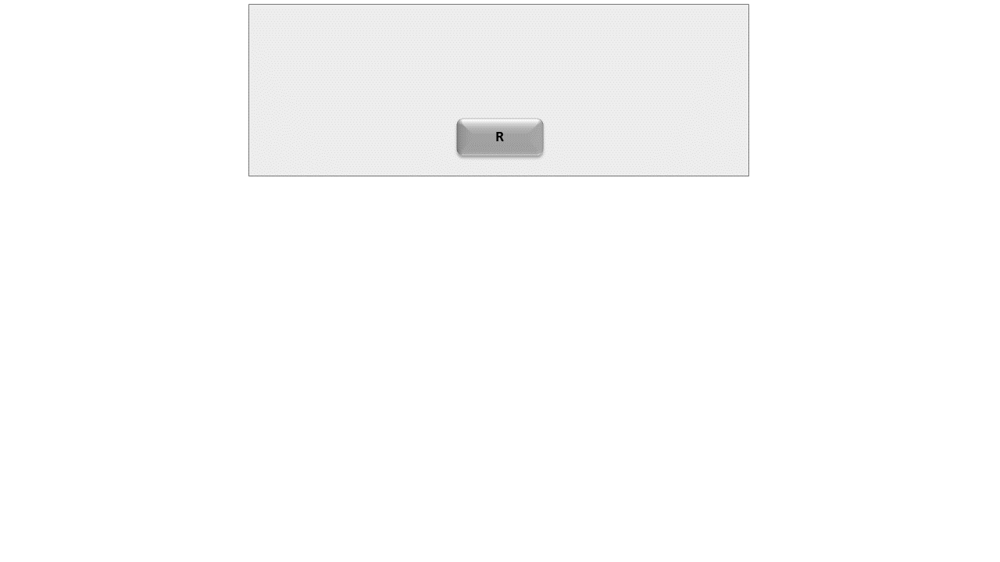
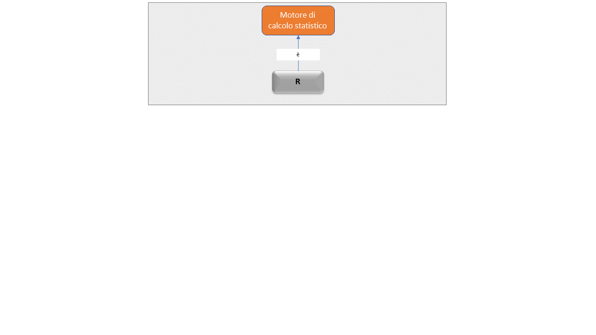
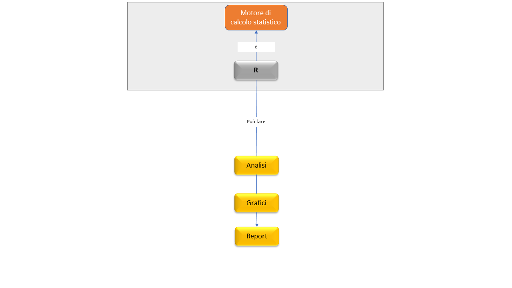
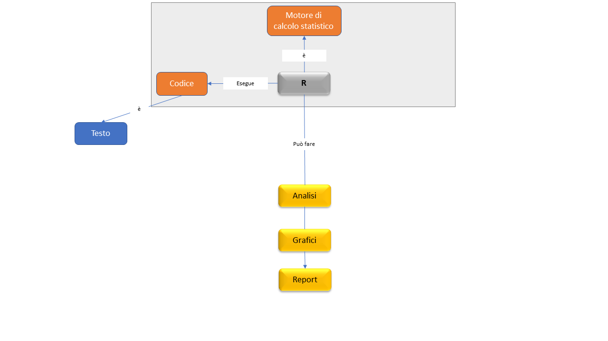
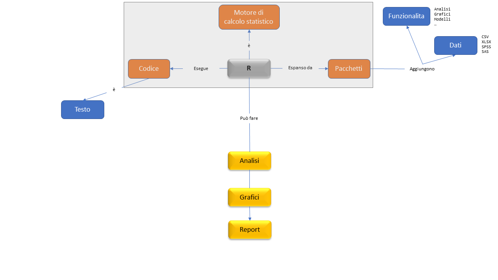
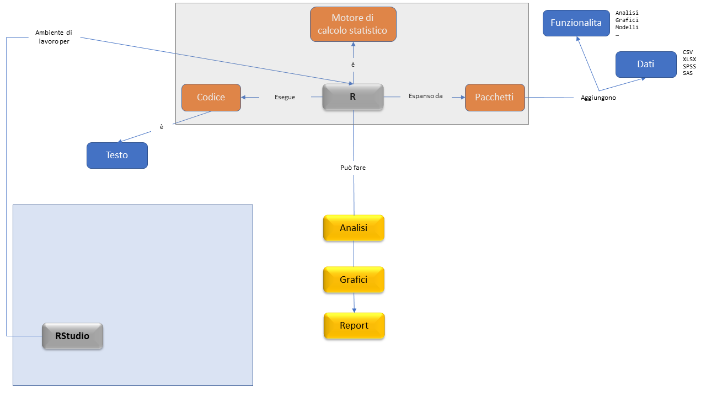
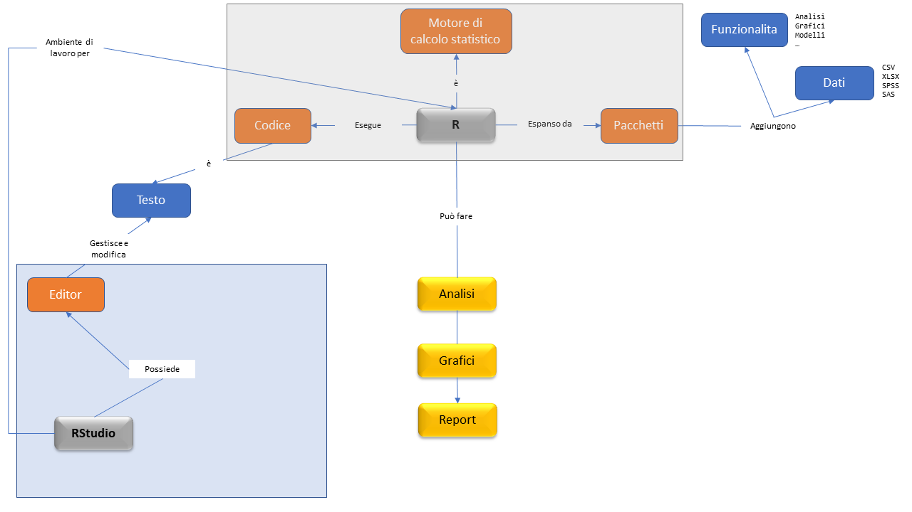
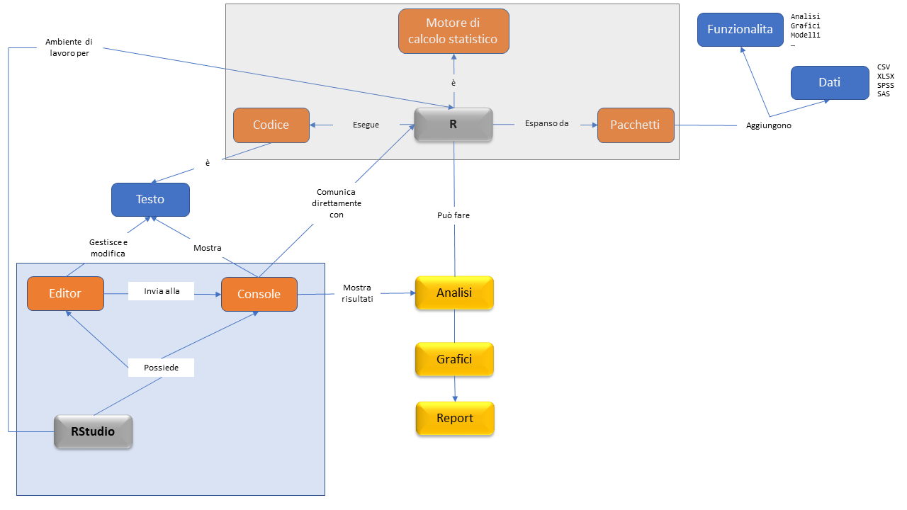
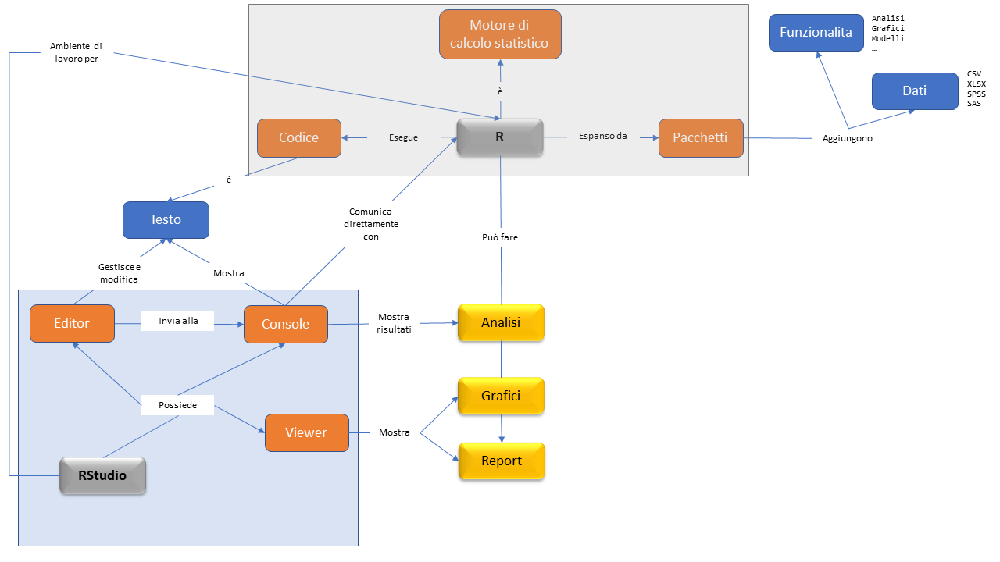
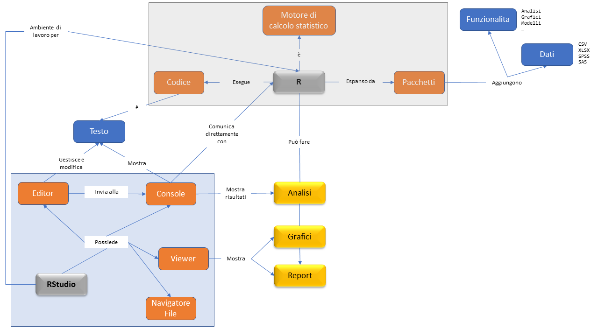

class: center, middle, bg_title, hide-count


```{r setup, include=FALSE}
options(htmltools.dir.version = FALSE)
knitr::opts_chunk$set(
  fig.retina = 3,
  warning = FALSE,
  message = FALSE,
  comment = "",
  out.width = "100%"
)
library(knitr)
library(xaringanExtra)
library(xaringanthemer)

library(tidyverse)
library(gridExtra)

library(countdown)
library(metathis)

options(width = 59) # fit into the right-column slides

```


```{r xaringans, echo=FALSE}
# https://github.com/gadenbuie/xaringanExtra
use_tachyons()
use_share_again()
use_panelset()
use_clipboard()
use_editable(expires = 1)
use_freezeframe()
use_extra_styles(
  hover_code_line = TRUE,         #<<
  mute_unhighlighted_code = TRUE  #<<
)
use_progress_bar(color = "#0051BA", location = "top")
```

```{r style-share-again, echo=FALSE}
style_share_again(
  share_buttons = c("twitter", "linkedin", "pocket")
)
```


```{r meta, echo=FALSE}
meta() %>%
  meta_general(
    description = "Modulo di STATISTICA MEDICA del corso in STATISTICA E SOCIOLOGIA GENERALE per il corso di laurea in TECNICHE DELLA PREVENZIONE NELL'AMBIENTE E NEI LUOGHI DI LAVORO",
    generator = "xaringan and remark.js"
  ) %>% 
  meta_name("github-repo" = "CorradoLanera/tpall") %>% 
  meta_social(
    title = "Statistica e Sociologia Generale",
    url = "https://corradolanera.github.io/tpall/#1",
    image = "https://github.com/CorradoLanera/tpall/raw/main/docs/img/cover.jpg",
    og_type = "website",
    og_author = "UBEP",
    twitter_card_type = "summary",
    twitter_creator = "@CorradoLanera"
  )
```

```{css, echo=FALSE}
.left-code {
  color: #777;
  width: 38%;
  height: 92%;
  float: left;
}
.right-code {
  color: #777;
  width: 55%;
  height: 92%;
  float: right;
  padding-top: 0.5em;
}
.left-plot {
  width: 43%;
  float: left;
}
.right-plot {
  width: 60%;
  float: right;
}
.hide-count .remark-slide-number {
  display: none;
}

.bg_title {
  position: relative;
  z-index: 1;
}

.bg_title::before {    
      content: "";
      background-image: url('img/bg1.png');
      background-size: contain;
      position: absolute;
      top: 0px;
      right: 0px;
      bottom: 0px;
      left: 0px;
      opacity: 0.3;
      z-index: -1;
}

```


```{r xaringan-themer, include=FALSE, warning=FALSE}
red <- "#f34213"
purple <- "#3e2f5b"
orange <- "#ff8811"
green <- "#136f63"
white <- "#FFFFFF"
pastel_orange <- "#F97B64"
blu_gray <- "#1F4257"
style_duo_accent(
    colors = c(
        red = red,
        purple = purple,
        orange = orange,
        green = green,
        white = white,
        pastel_orange = pastel_orange,
        blu_gray = blu_gray
    )
)
```


<br>
<br>
<br>

# **STATISTICA E SOCIOLOGIA GENERALE**<br>**.orange[STATISTICA MEDICA]**

-- Introduzione a R/RStudio --

(opzionale, fuori programma)
<br>
<br>

C.d.L. **Tecniche della prevenzione nell'ambiente e nei luoghi di lavoro**

Feltre, a.a. 2021/2022 - 20 ore (2 crediti)

Corrado Lanera | [**Unità di Biostatistica, Epidemiologia e Salute Pubblic**](https://www.unipd-ubep.it/)


---
class: inverse, hide-count


# Cosa faremo

Nella prossima ora vi fornirò un'introduzione all'uso di **R**, tramite **RStudio**. Vedremo **.orange[cosa sono]**, **.orange[a cosa servono]** (in cosa si differenziano) e come installarli.

L'obiettivo principale è quello di fornirvi gli elementi **base** per poter (se volete, vi fa piacere, o pensate possa esservi utile\*) seguire _anche_ la fase di codifica degli esempi interattivi ed esercitazioni che vi mostrerò nelle future lezioni. Questo, oltre a poterli utilizzare (seppur non richiesto!!) per svolgere l'esame.\*\*

Inoltre, ho messo a disposizione (**gratuitamente**) un ambiente di lavoro RStudio Cloud attivabile da ciascuno di voi (vedremo come), in modo che possiate usare R/Rstudio senza doverli installare, e con/su qualunque dispositivo vi troviate a operare.\*\*\*


<br><br><br><br>

<small>
.right[\* La mia opinione in merito, chiaramente, è: _si_ `r emo::ji("wink")`.]

.right[\*\* Una tale scelta **non comporterà valutazioni** di merito né demerito, e in alcun caso influenzerà la valutazione finale (se non in misura di un loro utilizzo corretto o errato nel produrre i risultati richiesti).]

.right[ \*\*\* Volendo, anche su smartphone e tablet, seppur piuttosto scomodo!]

</small>

---
class: inverse, middle, center

# Panoramica

---


<br>



---

<br>



---

<br>



---

<br>



---

<br>



---

<br>



---

<br>



---

<br>



---

<br>



---

<br>




---
class: inverse, middle, center, hide-count

```{r, echo=FALSE, out.width = "20%"}
knitr::include_graphics(c("img/R_logo.png"))
```


---
# Installazione

## Go to: https://cloud.r-project.org/

```{r, echo=FALSE}
knitr::include_url("https://cloud.r-project.org/")
```

---
# .orange[Algebra] elementare

In R possiamo operare tutte le operazioni algebriche di base, e anche di
più! Ottimo quindi anche come calcolatrice potenziata!

<small>
<small>
```{r algebra}
1 + 1  # sum

7 * 3  # product

abs(-2)  # absoulte value

3^2  # power
sqrt(9)  # squared root
```
</small>
</small>


---
# .orange[Vettori]

La struttura base dei dati in R è il vettore: sequenze di numeri

```{r vectors}
c(1, 2, 3, 7)  # concatenate

1:7  # sequence

seq_len(4)  # sequence

rep(2, 3)  # replicate

rev(c(1, 2, 3))  # reverse
```


---
# .orange[Assegnamento] ("memorizzazione")

Spesso può essere utile salvare il risultato di una operazione o della
chiamata di una funzione in un oggetto (che chiamiamo **variabile**) a
cui possiamo assegnare un nome.

```{r assignment}
first_vector <- 1:10
first_vector

first_vector + 5
```

---
# .orange[Confronti] (Booleani)

Possiamo fare confronti ottenendo dei risultati __logici__: `TRUE`/`FALSE`.

```{r logic_ord}
1 == 0
1 != 0
1 > 0
1 <= 0
```

---
# .orange[Logica] (Booleana)

Possiamo anche fare operazioni direttamente con vettori logici

```{r logic_bool}
TRUE & FALSE
TRUE | FALSE
!TRUE
```

---
# .orange[Logica] (Booleana, ... vettoriale)

```{r logic_vec}
c(TRUE, FALSE) & c(FALSE, FALSE)

c(1, 2, 3, 3, 2, 4) == 2
which(c(1, 2, 3, 3, 2, 4) == 2)

# WARNING  #<<
c(TRUE, FALSE, NA) & FALSE  #<<
c(TRUE, FALSE, NA) & TRUE  #<<
```


---
## .orange[Dataframe]

- ogni riga è una osservazione (es: un paziente, o una visita)
- ogni colonna è una variabile (es: il genere, o l'età)

```{r df}
first_df <- data.frame(
  id     = c(7, 12, 31),
  gender = factor(
      c('m', 'm', 'f'),
      levels = c('f', 'm', 'non-binary', 'unknown')
  ),
  city   = c('Gorizia', 'Viterbo', 'Napoli'),
  height = c(1.84, 1.70, 1.59),
  weight = c(115, 70, 51),
  overweight = c(TRUE, FALSE, FALSE)
)
first_df
```


---
background-image: url(img/culmen_depth.png)
background-position: 100% 0%
background-size: 26%

## .orange[Pacchetti]

Un pacchetto di espansione di R è una collezione di funzioni e/o di 
dati che possono essere "aggiunti" al proprio ambiente di lavoro.

Si installano una sola volta (in generale, salvo aggiornamenti) ma si caricano ogni volta (una sola volta) che si ricomincia a lavorare.

```{r pkgs, eval=FALSE}
library('tidyverse')
library('palmerpenguins')

ggplot(
    penguins,
    aes(x = bill_length_mm, y = bill_depth_mm, colour = species)
  ) +
  geom_point() +
  geom_smooth(method = lm) +
  facet_wrap(island~.) +
  labs(
    x = "Lunghezza becco (mm)",
    y = "Altezza becco (mm)",
    colour = "Specie",
    title = "Relazioni tra dimensioni del becco per specie di pinguino",
    subtitle = "Ogni riquadro riporta i dati dei un isola differente.",
    caption = "Dati: Palmer Archipelago (Antarctica) penguin."
  ) +
  theme_bw()

```

---

```{r pkgs, echo=FALSE, eval=TRUE, out.width = "80%"}
```


---
class: inverse, middle, center

```{r, echo=FALSE, out.width = "30%"}
knitr::include_graphics(c("img/RStudio-Logo-Flat.png"))
```


---
# Installazione

### Go to: https://rstudio.com/products/rstudio/download/

```{r, echo=FALSE}
knitr::include_url("https://rstudio.com/products/rstudio/download/")
```

---
class: middle, center, hide-count, inverse

# .orange[Vediamolo...<br>...sul _vostro_ cloud!]

[https://bit.ly/tpall22-feltre-rscloud](https://bit.ly/tpall22-feltre-rscloud)

---
class: inverse

# Risorse utili

- [**RStudio Cloud**](https://bit.ly/tpall22-feltre-rscloud): [https://bit.ly/tpall22-feltre-rscloud](https://bit.ly/tpall22-feltre-rscloud) gratis per voi per esplorare RStudio, le sue funzionalità, e allenarvi con R (link di iscrizione valido fino alla fine del corso). NOTA: a vostra scelta, è utilizzabile anche come _supporto_ durante l'esame.

- [**RStudio primers**](https://rstudio.cloud/learn/primers) ambiente gratuito dentro RStudio Cloud per l'apprendimento delle basi di analisi di dati con R tramite tutorial interattivi. Una volta registrati, oltre all'accesso al _nostro_ spazio di lavoro, avete accesso libero anche ai _Primers_.

- [**R 4 Data Science**](https://r4ds.had.co.nz/): libro gratuito (on-line) di [**Hadley Wickham**](http://hadley.nz/) e [**Garrett Grolemund**](https://rstudio.com/speakers/garrett-grolemund/)


---
class: middle, hide-count, inverse

# .center[.orange[Break]]

Consigli: 
- alzarsi
- sgranchirsi
- guardare _lontano_ (rilassare gli occhi)
- bere
- andare in bagno

```{r, echo = FALSE}
countdown(minutes = 30, warn_when = 5, play_sound = TRUE,
          left = "65%", bottom = "5%")
```


---
class: inverse, center, middle, hide-count


.bg-washed-green.b--dark-green.ba.bw2.br3.shadow-5.ph4.mt5[
.left[
_**Can** one be a .orange[good data analyst] **without** being a .orange[half-good programmer]?<br>The short answer to that is, 'No.'<br>The long answer to that is, 'No.'_
]

.tr[
—Frank Harrell<br>10/1999 - S-PLUS User Conference, New Orleans<br>
]
]

<br>


# .orange[Grazie] per l'attenzione!

<br>
<br>


Diapositive: [https://corradolanera.github.io/tpall](https://corradolanera.github.io/tpall)


[`r fontawesome::fa("link")`](https://www.unipd-ubep.it/) [**www.unipd-ubep.it**](https://www.unipd-ubep.it/) | 
[`r fontawesome::fa("mail-bulk")`](mailto:Corrado.Lanera@ubep.unipd.it) [**Corrado.Lanera@ubep.unipd.it**](mailto:Corrado.Lanera@ubep.unipd.it)

[`r fontawesome::fa("github")`](https://github.com/corradolanera)
[`r fontawesome::fa("twitter")`](https://twitter.com/corradolanera)
[`r fontawesome::fa("telegram-plane")`](https://telegram.me/CorradoLanera)
**@CorradoLanera** |
[`r fontawesome::fa("calendar-check")` ](https://calendly.com/corradolanera) [**calendly.com/corradolanera**](https://calendly.com/corradolanera)


