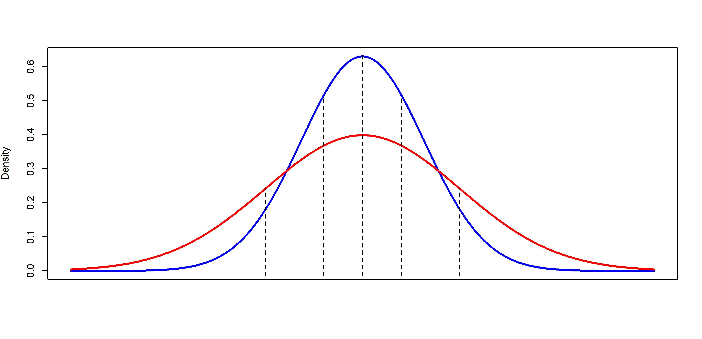
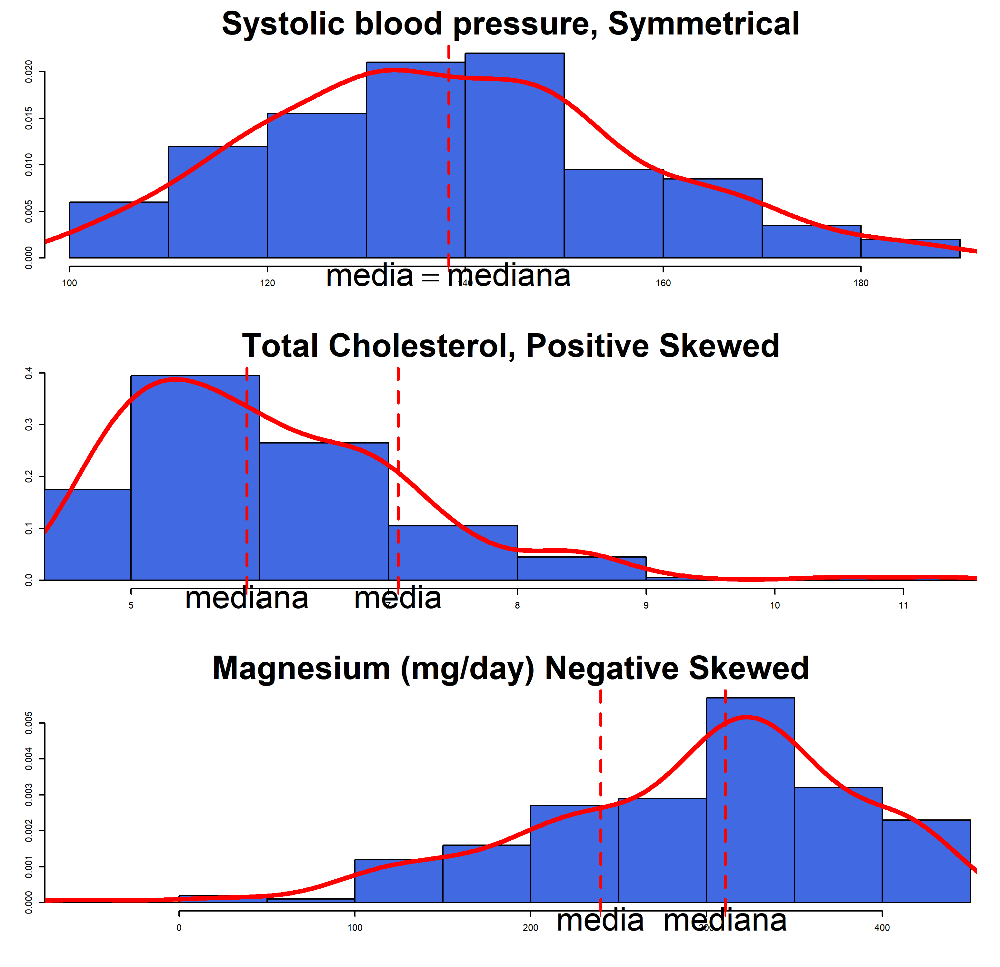
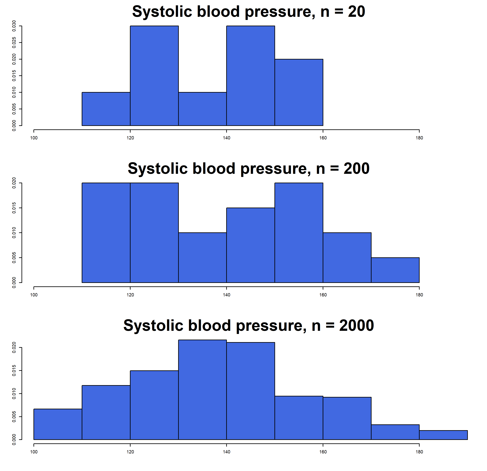
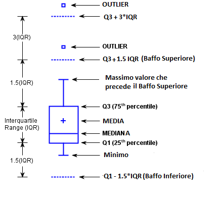

class: center, middle, bg_title, hide-count


```{r setup, include=FALSE}
options(
  htmltools.dir.version = FALSE,
  htmltools.preserve.raw = FALSE
)

knitr::opts_chunk$set(
  warning = FALSE,
  message = FALSE,
  comment = "",
  out.width = "100%"
)
library(knitr)
library(xaringanExtra)
library(xaringanthemer)

library(tidyverse)
library(here)
library(gridExtra)
library(rms)


library(countdown)
library(metathis)

options(width = 59) # fit into the right-column slides

```


```{r xaringans, echo=FALSE}
# https://github.com/gadenbuie/xaringanExtra
use_tachyons()
use_share_again()
use_panelset()
use_clipboard()
use_editable(expires = 1)
use_freezeframe()
use_extra_styles(
  hover_code_line = TRUE,         #<<
  mute_unhighlighted_code = TRUE  #<<
)
use_progress_bar(color = "#0051BA", location = "top")
```

```{r style-share-again, echo=FALSE}
style_share_again(
  share_buttons = c("twitter", "linkedin", "pocket")
)
```


```{r meta, echo=FALSE}
meta() %>%
  meta_general(
    description = "Modulo di STATISTICA MEDICA del corso in STATISTICA E SOCIOLOGIA GENERALE per il corso di laurea in TECNICHE DELLA PREVENZIONE NELL'AMBIENTE E NEI LUOGHI DI LAVORO",
    generator = "xaringan and remark.js"
  ) %>% 
  meta_name("github-repo" = "CorradoLanera/tpall") %>% 
  meta_social(
    title = "Statistica e Sociologia Generale",
    url = "https://corradolanera.github.io/tpall/#1",
    image = "https://github.com/CorradoLanera/tpall/raw/main/docs/img/cover.jpg",
    og_type = "website",
    og_author = "UBEP",
    twitter_card_type = "summary",
    twitter_creator = "@CorradoLanera"
  )
```

```{css, echo=FALSE}
.left-code {
  color: #777;
  width: 38%;
  height: 92%;
  float: left;
}
.right-code {
  color: #777;
  width: 55%;
  height: 92%;
  float: right;
  padding-top: 0.5em;
}
.left-plot {
  width: 43%;
  float: left;
}
.right-plot {
  width: 60%;
  float: right;
}
.hide-count .remark-slide-number {
  display: none;
}

.bg_title {
  position: relative;
  z-index: 1;
}

.bg_title::before {    
      content: "";
      background-image: url('img/bg1.png');
      background-size: contain;
      position: absolute;
      top: 0px;
      right: 0px;
      bottom: 0px;
      left: 0px;
      opacity: 0.3;
      z-index: -1;
}

```


```{r xaringan-themer, include=FALSE, warning=FALSE}
red <- "#f34213"
purple <- "#3e2f5b"
orange <- "#ff8811"
green <- "#136f63"
white <- "#FFFFFF"
pastel_orange <- "#F97B64"
blu_gray <- "#1F4257"
style_duo_accent(
    colors = c(
        red = red,
        purple = purple,
        orange = orange,
        green = green,
        white = white,
        pastel_orange = pastel_orange,
        blu_gray = blu_gray
    )
)
```


<br>
<br>

# **STATISTICA E SOCIOLOGIA GENERALE**<br>**.orange[STATISTICA MEDICA]**

-- Analisi esplorativa e statistiche descrittive --

<br>
<br>
<br>

C.d.L. **Tecniche della prevenzione nell'ambiente e nei luoghi di lavoro**

Feltre, a.a. 2021/2022 - 20 ore (2 crediti)

Corrado Lanera | [**Unità di Biostatistica, Epidemiologia e Salute Pubblic**](https://www.unipd-ubep.it/)


---
class: inverse, hide-count

# Cosa faremo

Prima di tutto richiameremo alcuni simboli, notazioni, oggetti
"matematici" che ci potranno tornare utili lungo la trattazione
dell'intero corso.

Andremo quindi a identificare quali sono gli **.orange[oggetti]** che ci
interessa analizzare, e di che **.orange[tipologie]** posso essere. 

Quindi vedremo come **.orange[localizzarli]**; ovvero, come (numericamente) avere
un'idea di dove si _collochino_ (rispetto a un dato riferimento o misura),
questo grazie all'individuazione di uno o più **.orange[punti di riferimento]**
(detti **centrali**) e una misura di quanto gli altri punti di interesse
siano **.orange[più o meno distanti]** da questi (**variabilità**).

Poiché **.orange[guardare]** numeri, a volte, può essere poco informativo, o
immediato, ci occuperemo di rappresentare i nostri dati **graficamente**,
individuando a seconda del tipo, quantità e interesse, il grafico più
opportuno tra quelli base, imparando anche a _leggere_ cosa
rappresentano.


---
class: hide-count

# .orange[Riconoscimenti]

- Le diapositive proposte sono state prodotte a partire anche da
  materiale generato da/con le seguenti persone gravitanti attorno
  l'UBEP*:
  
  + Danila Azzolina
  + Dario Gregori
  + Giulia Lorenzoni
  + Ileana Baldi
  + Luca Vedovelli
  + Matteo Martinato
  + Paola Berchialla

<br><br>
<small>
.right[\* In ordine alfabetico.]
</small>

<br><br>

> Un ringraziamento speciale a Cristiana Vettori e a Mariasole Rizzi per
l'aiuto e il supporto logistico e amministrativo che mi è stato offerto,
e ad Andrea Francavilla per avermi aiutato nella revisione del
materiale.


---
class: inverse, middle

# .center[**.orange[Panoramica]**]

**Oggetti in gioco**

**Localizzazione**

**Rappresentazione**


---
class: inverse, middle

# .center[**.orange[Oggetti] in gioco**]

**Notazioni di base**

**.orange[Unità] statistica e .orange[tipologie] di dati**


---
# .orange[Notazioni]: Sommatoria fino a N

Sia $I$ un insieme di indici $i$ con $N$ elementi, utile a identificare
(in modo univoco) ciascun elemento $x$ di un insieme $X$ composto da $N$
numeri. Allora, indichiamo in modo generico con $x_i$ l'i-esimo elemento
di $X$.

Per esempio, quando consideriamo $i = 1$, allora $x_i$ è $x_1$, ovvero
il primo elemento di $X$.

Con tale notazione, utilizzando il simbolo $\Sigma$ (Sigma, maiuscola:
la "S" greca), indichiamo brevemente con 

$$\sum_{i = 1}^N x_i = x_1 + x_2 + \cdots + x_{N-1} + x_{N}$$

la somma di tutti gli $x_i$, e lo leggiamo "Sommatoria per i che va da 1
a N degli x-con-i".


---
# .orange[Notazioni]: Sommatoria su I

In modo analogo, se $I$ non fosse numerico ma, per esempio, l'insieme
dei codici identificativi dei pazienti in uno studio, e $X$ fosse 
l'insieme dei pesi di tali pazienti, ipotizzando che $R43$ sia l'id di 
un paziente, allora quando $i = R43$ abbiamo che $x_i = x_{R43}$ è il
peso del paziente identificato dal codice $R43$.

Ricordando inoltre che indichiamo con $x\in X$ la relazione di
.orange[appartenenza insiemistica] per l'elemento $x$ nell'insieme $X$,
possiamo scrivere

$$\sum_{i\in I} x_i$$

Con il medesimo significato di prima, ovvero la somma di tutti i pesi di
tutti i pazienti i cui indici (ovvero ID) stanno nell'insieme
considerato $I$, e lo leggiamo "Sommatoria per gli i in I degli
x-con-i".

---
# Proprietà della sommatoria

Sia $C$ una generica costante numerica, allora 


$$\sum_{i\in I} (C * x_i) = C * \sum_{i\in I} x_i$$


$$\sum_{i = 1}^N C = N * C$$

Se $a$ e $b$ identificano lo stesso indice, ovvero $a = b$, allora

$$\sum_{i = a}^b x_i = x_a = x_b$$


---
# Esempio sommatoria
```{r epic, include=FALSE}
epic <- read_rds(here("docs/data/bain2015-epic.rds"))
ages <- (epic$age |> set_names(seq_along(epic$age)))[1:6]
```

Per esempio considerando
.left-column[
```{r sum_ages, echo = FALSE}
ages_db <- epic |> 
  mutate(I = row_number()) |> 
  select(I, age) |> 
  slice_head(n = 6) 

ages_db |> 
  kable(row.names = FALSE, caption = "Portion of \'EPIC-Norfolk cohort\' (Bain et al. 2015)")
```
]

.right-column[
Possiamo scrivere la somma di tutte le età 

```{r, echo = FALSE}
cat(paste(ages, collapse = " + "))
```


come $\sum_{i\in I} age_i =$ `r sum(ages)`.

in R
```{r}
set_of_number <- c(
  55.1, 62.9, 53.1, 76.3, 64.2, 53.3
)
sum(set_of_number)
```


]

---
# .orange[Unità] statistica

Il soggetto,la _riga_, **.orange[su cui vengono misurate]** le informazioni rilevate (chiamate **variabili**, **features**,**covariate**, ...). 

<small>

```{r, echo=FALSE, include=TRUE}
kable(epic |> slice_head(n = 10), row.names = FALSE, caption = 'Portion of "EPIC-Norfolk cohort" (Bain et al. 2015)')
```

</small>

.orange[Spesso], ma non sempre, si tratta dei pazienti (ma potrebbe essere "un minuto di un paziente, per esempio per dati raccolti da sensori in terapia intensiva").


---
# .orange[Tipologie] di dati

- .orange[Continue] --- (BMI)

- .orange[Discrete]
    + Categoriche
    
         - Binarie --- (Diabete: {"Si=1", "No=0"})
    
         - Nominali --- (Farmaci Anti-colesterolo: {No, Statine, Fibrati, Altro})
    
         - Ordinali --- (Attività fisica: {Mai, Una volta al mese, 1-2 volte a settimana, 3 Volte a                          settimana, Piu' di 3 volte a settimana})
    
    + Cardinali --- (Numero sigarette fumate in una settimana: {1, 2, 3, ...})


---
class: inverse, middle

# .center[**.orange[Localizzazione] (dati continui)**]

**Misure di .orange[centralità]**

**Misure di .orange[variabilità] (e confrontabilità)**

**Percentili**

**Accorpamenti, e misure ponderate**

```{r, echo=FALSE, fig.align = 'right', out.width="70%"}

```


---
# Misure di .orange[centralità]: media

Data una variabile $x$, misurata su $n$ soggetti, la media aritmetica
.orange[campionaria] è pari a
$$\bar{x} = \frac{1}{N}\sum_{i=1}^N x_i$$

È molto sensibile ai valori estremi, e in tal caso non è una buona
misura di centralità.

Essendo un operatore lineare, vale
$$\mbox{se} \quad y_i = c_1x_i+c_2 \quad \forall i \quad \mbox{allora} \quad \bar{y} = c_1\bar{x} + c_2$$

---
# Media (_.orange[estremamente]_ sensibile)

Riprendendo le età del nostro sotto-campione di soggetti, la loro media è

.left-column[
```{r smean_ages, echo = FALSE}
ages_db |> 
  kable(row.names = FALSE, caption = "Portion of \'EPIC-Norfolk cohort\' (Bain et al. 2015)")
```
]

.right-column[

.panelset[
.panel[.panel-name[Natural]
$\frac{1}{6}\sum_{i=1}^6 age_i =$ **`r round(mean(ages), 2)`**

<br><br>
La media è molto sensibile ai .orange[dati estremi]: sostituendo, per esempio, anche solamente il primo valore (55.1) con 20, la media cambia sensibilmente e diviene **`r round(mean(c(20, ages[-1])), 2)`**.
]

.panel[.panel-name[R Code]
```{r}
age <- c(55.1, 62.9, 53.1, 76.3, 64.2, 53.3)
sum(age) / length(age)
mean(age) |> round(2)

# cambiando il primo valore da 55.1 a 20
c(20, age[-1]) |> 
  mean() |> 
  round(2)
```
]
]
]


---
# Misure di .orange[centralità]: mediana

Ordiniamo ora le $N$ osservazioni. La mediana .orange[campionaria] è

- la $(\frac{N+1}{2})$-ma osservazione se $N$ è dispari (ovvero, **ha un centro**)
- la media aritmetica della $(\frac{n}{2})$-ma e la $(\frac{n}{2}+1)$-ma
osservazione se $N$ è pari (ovvero, **non ha un centro**)


---
# .orange[Mediana] (N pari)

Nel nostro esempio

.left-column[
```{r median_ages, echo = FALSE}
ages_db |> 
  arrange(age) |> 
  kable(row.names = TRUE, caption = "Portion of \'EPIC-Norfolk cohort\' (Bain et al. 2015)")
```
]

.right-column[

.panelset[
.panel[.panel-name[Natural]
Siccome $n$ è pari, la mediana è la media della 10-ma e 11-ma osservazione
(ordinate)
$$\mbox{Mediana} = \frac{55.1 + 62.9}{2} = 59$$
E anche modificando il primo valore (55.1) con 20, la mediana non cambia
per nulla, e **resta 59**.
]

.panel[.panel-name[R Code]
```{r}
# age_sorted <- c(53.1, 53.3, 55.1, 62.9, 64.2, 76.3)
age_sorted <- sort(age)
n <- length(age_sorted)
1/2 * (age_sorted[n / 2] + age_sorted[n / 2 + 1])

median(age)
median(c(20, age_sorted[-1]))
```
]
]

]

---
# .orange[Mediana] (N dispari)

.left-column[
```{r median_odd, echo=FALSE}
ages_db_dispari <- epic |> 
  mutate(I = row_number()) |> 
  select(I, age) |> 
  slice_head(n = 7) |> 
  arrange(age)

ages_db_dispari |> 
  kable(row.names = TRUE, caption = "Portion of \'EPIC-Norfolk cohort\' (Bain et al. 2015)")
```
]

.right-column[

.panelset[
.panel[.panel-name[Natural]
Nel casi in cui N sia dispari (prendiamo per esempio $N = 7$), prendiamo
direttamente il valore centrale, ovvero **62.9**.

]

.panel[.panel-name[R Code]
```{r}
age <- c(55.1, 62.9, 53.1, 76.3, 64.2, 53.3, 65.7)
age_sorted <- sort(age)
age_sorted
n <- length(age_sorted)
age_sorted[(n + 1) / 2]
median(age)
```

]
]

]


---
# .orange[Confronto] media e mediana

Definiamo l'indice di .orange[asimmetria] (**skewness**)

    Skewness = Media - Mediana

.pull-left[
La distribuzione dei dati sarà considerata:

- **simmetrica** se $Skewness \simeq 0$

- **asimmetrica** (sbilanciata) a destra se $Skewness > 0$ (la media è più grande, .orange[distorta in eccesso])

- **asimmetrica** (sbilanciata) a sinistra se $Skewness < 0$ (la media è più piccola, .orange[distorta in difetto])
]
.pull-right[
```{r, echo=FALSE, out.width="100%", fig.cap = "\'EPIC-Norfolk cohort\' (Bain et al. 2015)"}

```
]


---
# Misure di .orange[centralità]: Moda
Una moda di una variabile, è ciascuno dei suoi valori che si osserva con
**.orange[maggiore frequenza]** in un determinato campione.

Una distribuzione può essere *unimodale*, *bimodale*, *trimodale*, ...

<small>

.left-column[
Sigarette al giorno

```{r, echo = FALSE}
epic_sigarette <- epic |> 
  count(sigarette)

epic_sigarette |> 
  kable(caption = "Portion of \'EPIC-Norfolk cohort\' (Bain et al. 2015)")
```
]

.right-column[

.panelset[
.panel[.panel-name[Natural]

Moda di sigarette fumate al giorno
```{r echo=FALSE}
epic_sigarette |> 
  slice_max(n) |> 
  kable()
```
]

.panel[.panel-name[R code]
```{r}
tab_siga <- rep(
    epic_sigarette$sigarette,
    times = epic_sigarette$n
  ) |>
  table()
tab_siga

names(tab_siga)[tab_siga == max(tab_siga)]

```
]

.panel[.panel-name[R code - bimodale]
```{r}
tab_siga <- rep(
    epic_sigarette$sigarette,
    times = epic_sigarette$n
  ) |>
  c(rep(3, 48)) |> table()
tab_siga

names(tab_siga)[tab_siga == max(tab_siga)]

```
]
]
]
</small>

---
# Misure di .orange[variabilità]

Si considerino due campioni di misurazioni del colesterolo eseguite con
due tecniche, una autoanalitica e l'altra microenzimatica:

```{r, echo=FALSE}
colesterolo <- tibble(
  autoanalitica = c(177, 193, 195, 209, 226),
  microenzimatica = c(192, 197, 200, 202, 209)
)

kable(colesterolo)
```

Le media campionaria (nonostante l'evidente differenza di variabilità) resta identica:
```{r, echo=FALSE}
summarise(colesterolo, across(everything(), mean)) |> 
  kable()
```

---
# Misure di .orange[variabilità]: range

Il **range** è la differenza tra il valore massimo osservato e quello
più piccolo.

Simbolicamente:
$$range = max(x_i)-min(x_i)$$

```{r, echo=FALSE}
summarise(colesterolo, across(everything(), ~diff(range(.x)))) |> 
  kable()
```

È molto semplice da calcolare ma molto (e unicamente...) sensibile ai
valori estremi.

> Dipende dall'ampiezza campionaria $N$, e **tende ad aumentare** all'aumentare di $N$!


---
# .orange[Range] (dipendenza da $N$)

Si ri-campiona con reimmissione dalla, distribuzione della pressione sistolica, un campione di numerosità 20, 200, 2000 ottenendo le seguenti distribuzioni


```{r, echo=FALSE, fig.align='center', out.width="50%", fig.cap = "\'EPIC-Norfolk cohort\' (Bain et al. 2015)"}

```


---
# Misure di .orange[variabilità]: varianza campionaria

La varianza campionaria è definita come

$$s^2 = \frac{\sum_{i=1}^n (x_i-\bar{x})^2}{n-1}$$

Questa è una misura di quanto, in media, gli elementi del campione si 
discostano dalla loro media.

E un valore non confrontabile con i dati stessi in quanto con un altra
unità di misura. Si definisce quindi la **.orange[deviazione standard]** campionaria, come

$$s = \sqrt{s^2} = \sqrt{\frac{\sum_{i=1}^n (x_i-\bar{x})^2}{n-1}}$$

> Si noti che $\sum_{i=1}^n (x_i-\bar{x}) = 0$


---
# .orange[Varianza] campionaria: esempio

.left-plot[
```{r, echo=FALSE}
kable(colesterolo)
```

Medie:

```{r, echo=FALSE}
summarise(colesterolo, across(everything(), mean)) |> 
  kable()
```


]

.right-code[

.panelset[
.panel[.panel-name[Autoanalitica]
  $\begin{split}s^2& = \frac{(177-200)^2 + \ldots + (226-200)^2}{4}\\& = \frac{1360}{4} = 340\end{split}$
  
```{r}
auto <- colesterolo[["autoanalitica"]]
sum(
  (auto - mean(auto))^2
) / (length(auto) - 1)
```
  
  $s = \sqrt{340} = 18.4$
  

]

.panel[.panel-name[Microenzimatica]
  $\begin{split}s^2& = \frac{(192-200)^2 + \ldots + (209-200)^2}{4}\\& = \frac{158}{4} = 39.5\end{split}$
  
```{r}
micro <- colesterolo[["microenzimatica"]]
var(micro)
```
  $s = \sqrt{39.5} = 6.3$

```{r}
sd(micro)
```


]
]

]

---
# .orange[Varianza] (formula alternativa)

Se la media è già calcolata, allora può essere utile usare
$$s^2=\frac{(\sum_{i=1}^n x_i^2) - n\bar{x}^2}{n-1}$$

Per la tecnica autoanalitica si ha
$$\sum_{i=1}^5 x_i^2 = 177^2+\ldots+226^2=201360$$
$$s^2 = \frac{201360 - 5 \times 200^2}{4}= 1360/4=340$$
```{r}
n <- length(auto)
mean_auto <- mean(auto)
(sum(auto^2) - n * mean_auto^2) / (n - 1)
```


---
# Misure di .orange[variabilità]: coefficiente di variazione

Sebbene la deviazione standard sia della stessa unità di misura dei
dati, non permette di confrontare tra loro le variabilità di variabili con unità di misura differenti.

Il **coefficiente di variazione** $CV$ è definito come
$$CV = \frac{100s}{\bar{x}}$$
È una misura adimensionale, e quindi utilizzabile anche per confrontare variabili di natura differente. È anche insensibile alla scala, ovvero a trasformazioni del tipo $cx$

---
### .orange[CV] (non-effetto scala)
<small>
I valori di Colesterolo raccolti dai 200 pazienti del database Epic sono i seguenti:

```{r, echo=FALSE}
epic$cole.tot |> 
  paste(collapse = ", ") |> 
  str_replace_all("((.+?, ){15})", "\\1\n") |> 
  cat()
```

Partendo dai dati così espressi in mmol/L: $CV = 1.12/6.07 \times 100 \simeq 18\%$
```{r}
100 * sd(epic$cole.tot) / mean(epic$cole.tot)
```


e per gli stessi valori espressi in mg/dl (massa molare colesterolo: 386.65 g/mol) abbiamo:
$$CV = 43.35/234.83 \times 100 \simeq 18\%$$
</small>


---
# .orange[Percentili]

Il **percentile** $p$-esimo è un valore $V_p$ tale che il $p$\% del campione assume valori inferiori a esso.

Per un calcolo _a mano_, posto $k$ = "*l'intero più grande non superiore a $np/100$*", il percentile $p$-esimo è definito come

- la media delle osservazioni $k$-ma e $k + 1$-ma osservazione
(ordinata) se $np/100$ è un intero ( $=k$ ).

- la $(k+1)$-ma osservazione (ordinata) se $np/100$ non è un intero.

I **quartili** sono valori che dividono i dati in quattro gruppi contenenti un numero approssimativamente uguale di osservazioni. Il totale di 100% è diviso in quattro parti uguali: 25%, 50%, 75% 100%.

  + .orange[Primo] **quartile** (Q1) il minimo valore osservato tale che almeno il $25\% (=1/4)$ dei dati è minore o uguale a questo
  
  + .orange[Terzo] **quartile** (Q3) il minimo valore osservato tale che almeno il $75\% (=3/4)$ dei dati è minore o
  uguale a questo 


---
## .orange[Percentili] (esempio _intero_)
<small>
Si calcoli il $10$-mo e $90$-mo percentile del campione del BMI su 10 soggetti.

.left-column[

```{r, echo=FALSE, caption = "Portion of \'EPIC-Norfolk cohort\' (Bain et al. 2015)"}
epic_10 <- epic |> 
  slice_head(n = 10) |> 
  select(id, bmi) |> 
  arrange(bmi)

epic_10 |> 
  kable(row.names = TRUE)
```
]

.right-column[

1. Si calcola $np/100$, pari a:
  - 10-imo percentile (p/100 = 0.1): $10 \times 0.1 = 1$
  
  - 90-esimo percentile (p/100 = 0.9): $10 \times 0.9 = 9$

2. (Sono valori interi, quindi posti uguale a $k$ e) si calcola la media tra le osservazioni (**ordinate**):

.panelset[
.panel[.panel-name[Naturale]
  - 10-imo: posizioni 1 e 2 $\frac{23.3 + 24.9}{2} =$ `r mean(c(23.3, 24.9))`
  
  - 90-esimo: posizioni 9 e 10 $\frac{41.6 + 42.6}{2} =$ `r mean(c(41.6, 42.6))`
  
]
.panel[.panel-name[R Code]
```{r}
# default type = 7 (continuo in p)
quantile(epic_10[["bmi"]], probs = c(0.1, 0.9), type = 2)
```
]
]

]

</small>

---
# .orange[Percentili] (esempio _decimale_)
Si calcoli il $20$-mo percentile del campione del BMI su 9 soggetti.

.left-column[

```{r, echo=FALSE, caption = "Portion of \'EPIC-Norfolk cohort\' (Bain et al. 2015)"}
epic_bmi_p2 <- epic |> 
  slice_head(n = 9) |> 
  select(id, bmi) |> 
  arrange(bmi)

epic_bmi_p2 |> 
  kable(row.names = TRUE)

```
]

.right-column[

1. Si calcola $np/100$, pari a:
  - 20-imo percentile (p/100 = 0.2): $9 \times 0.2 = 1.8$

2. (È un valore decimale, quindi) Si trova il $k$-mo intero inferiore a 1.8:
  - 1 (il _primo_).

3. Il 20-esimo percentile è il $k+1$-esimo valore (ordinato!); ovvero quello in posizione $1 + 1 = 2$, il secondo; ovvero, **`r epic_bmi_p2$bmi[[2]]`**.

```{r}
# default type = 7 (per continuità in p)
quantile(epic_10[["bmi"]][-10], probs = 0.2, type = 2)
```

]


---
# .orange[Accorpamenti]

La struttura generale dei dati raggruppati è simile a


|Gruppi            | Media                       | Frequenza
|:----------------:|:---------------------------:|:---------:
| $[y_1, y_2)$     | $\frac{y_1+y_2}{2}$         | $f_1$ 
| $\vdots$         | $\vdots$                    | $\vdots$
| $[y_k, y_{k+1})$ | $\frac{y_k+y_{k+1}}{2}$ | $f_k$


---

# .orange[Accorpamenti]: Epic - magnesio

Intake giornaliero di magnesio (mg/day) per $N = 100$ soggetti

```{r, echo=FALSE, message=FALSE, warning=FALSE}
sort(epic$mag[101:200]) |> 
  paste(collapse = ", ") |> 
  str_replace_all("((.+?, ){11})", "\\1\n") |> 
  cat()
```

---
# .orange[Accorpamenti]: Epic - magnesio

Accorpati in 8 gruppi con approssimativamente la stessa quantità di 
soggetti in ciascun gruppo:

```{r, echo=FALSE, message=FALSE, warning=FALSE}
discr <- cut2(epic$mag[101:200], g = 8)
matches <- regmatches(names(table(discr)), gregexpr("[[:digit:]]+", names(table(discr))))

ind <- sapply(matches, function(x) mean(as.numeric(x)))

dt <- data.frame(
  Gruppi = names(table(discr)),
  m = ind,
  frequenze = unname(table(discr))
)
dt <- dt[, -3]
colnames(dt)[[3]] <- "Freq"

kable(dt, row.names = FALSE, caption = "\'EPIC-Norfolk cohort\' (Bain et al. 2015)")
```


---
# misure .orange[ponderate]: media artimetica ponderata

La media aritmetica campionaria ponderata è pari a
$$\bar{x}_g = \frac{\sum_{i=1}^k f_im_i}{\sum_{i=1}^k f_i}$$

Per il dataset accorpato sui dati di magnesio, è pari a
$$\bar{x}_g = \frac{13(106)+\ldots+12(352)}{13+\ldots+12}= 26389.5/100 = 263.895$$
```{r}
sum(dt$m * dt$Freq) / sum(dt$Freq)
weighted.mean(x = dt$m, w = dt$Freq)
```


---
## misure .orange[ponderate]: varianza ponderata

La varianza campionaria ponderata è pari a
$$s_g^2 = \frac{\sum_{i=1}^k f_i(m_i-\bar{x}_g)^2}{(\sum_{i=1}^k f_i)-1} \quad\rm{ovvero}\quad s_g^2 = \frac{(\sum_{i=1}^k f_im_i^2)-n\bar{x}_g^2}{n-1}$$


Per il caso del magnesio è pari a

.panelset[
.panel[.panel-name[Naturale]
$$\begin{align*}\bar{s}_g^2& = \frac{13(106 - 263.895)^2+\ldots+12(352 - 263.895)^2}{13 + \cdots + 12 - 1}\\& = 611446.1/99 = 6176.224\end{align*}$$
$$\begin{align*}\bar{s}_g^2& = \frac{[13(106)^2+\ldots+12(352)^2]-100(263.895^2)}{100-1}\\& = 611446.1/99 = 6176.224\end{align*}$$
]
.panel[.panel-name[R Code]

.pull-left[
```{r}
w_mean <- weighted.mean(
  x = dt$m,
  w = dt$Freq
)
n <- sum(dt$Freq)

sum(
  dt$Freq * (dt$m - w_mean)^2
) / (n - 1)
```
]

.pull-rigth[
```{r}
#
#
#
#
#
#
(
  sum(dt$Freq * dt$m^2) -
  n * w_mean^2
) / (n - 1)
```

]

]
]

---
class: inverse, middle

# .center[**.orange[Rappresentazione]**]

### **Dati .orange[continui]**
- Istogrammi
- Box-plot

### **Dati .orange[categorici]**
- Grafici a barre

<!-- ### **.orange[Coppie] di dati** -->
<!-- - continui - continui (scatter) -->
<!-- - continui - categorici (jitter) -->
<!-- - categorici - categorici (... count?! `r emo::ji("thinking")`) -->


---
# Dati continui: istogramma

Per il calcolo dell'istogramma, la tabella delle frequenze deve essere
estesa


|Gruppi            | Media                       | Frequenza| Ampiezza            | Densità
|:----------------:|:---------------------------:|:--------:|:-------------------:|:-------
| $[y_1, y_2)$     | $\frac{y_1+y_2}{2}$         | $f_1$    | $a_1 = y_2-y_1$     | $\frac{f_1}{a_1}$
| $\vdots$         | $\vdots$                    | $\vdots$ | $\vdots$            | $\vdots$
| $[y_k, y_{k+1})$ | $\frac{y_k+y_{k+1}}{2}$     | $f_k$    | $a_k = y_{k+1}-y_k$ | $\frac{f_{k+1}}{a_k}$


---
## Istogramma
<small>
L'istogramma è uno stimatore della distribuzione

.panelset[
```{r panelset = c(source = "ggplot2", output = "Plot"), out.width = "55%"}
epic |> 
  slice(101:200) |> 
  ggplot(aes(x = mag, y = ..density..)) +
  geom_histogram(
    fill = "royalblue",
    bins = 8,
    breaks = as.numeric(unique(unlist(matches))),
    closed = "left"
  ) + 
  xlab("Mag [mg/day]")

```
]
</small>

---
## Istogramma: autocalcolato
<small>

Se ampiezze tutte uguali, la _forma_ standardizzata ad area unitaria è
proporzionale a quella con barre di altezza le frequenze

.panelset[
```{r panelset = c(source = "ggplot2", output = "Plot"), out.width = "50%"}
epic |> 
  slice(101:200) |> 
  ggplot(aes(x = mag, y = ..density..)) +
  geom_histogram(fill = "royalblue") + 
  xlab("Mag [mg/day]")
```

```{r panelset = c(source = "ggplot2", output = "Plot count"), out.width = "50%"}
epic |> 
  slice(101:200) |> 
  ggplot(aes(x = mag)) +
  geom_histogram(fill = "royalblue") + 
  xlab("Mag [mg/day]")
```
]
</small>


---
# Dati continui: box-plot

Il .orange[box-plot] è un modo per rappresentare graficamente una distribuzione
rispetto a __centralità e variabilità__. Per un campione di ampiezza $N$

- Il segmento all'interno del box è la mediana.

- il __baffo inferiore__ (h) parte dal primo quartile (o 25º percentile)

- il __baffo superiore__ (H) parte dal terzo quartile (o 75º percentile)

- un valore __estremo__ è: un valore che si allontana dai baffi più di una volta
  e mezza la loro distanza (distanza inter-quartile), cioè
$$x > H + 1.5 \times (H-h)  \quad o \quad x < h - 1.5 \times (H-h)$$

- un __outlier__ è: un valore che si allontana dai baffi più di tre volte la
  loro distanza, cioè
$$x > H + 3 \times (H-h)  \quad o \quad x < h - 3 \times (H-h)$$

---
# Box-plot (calcolo)
Un' assunzione giornaliera di 43 mg/die di magnesio rappresenta un dato estremo

<small>
```{r, echo=FALSE, message=FALSE, warning=FALSE}
sort(epic$mag[101:200])
```


- $h$ è la media tra l'osservazione $(100 * 1/4)$ª e la $((100 * 1/4) + 1)$ª, ovvero
  $(215.3+215.4) / 2 = 215.35$
- $H$ è la media dell'osservazione $(100 * 3/4)$ª e la $((100 * 3/4) + 1)$ª, ovvero
  $(323.9+324) / 2 = 323.95$
- i limiti per i valori estremi sono quindi:
$$x > 323.95 + 1.5 (323.95 - 215.35) = 486.85$$
$$x < 215.35 - 1.5 * (323.95 - 215.35) = 52.45$$
- gli outlier sarebbero: 
$$x > 323.95 + 3 * (323.95 - 215.35) = 649.75$$
$$x < 215.35 - 3 * (323.95 - 215.35) = 0$$
</small>


---
# Box-plot (mag)

.panelset[
```{r panelset = c(source = "ggplot2", output = "Plot"), out.width = "60%"}
epic |> 
  slice(101:200) |> 
  ggplot(aes(y = mag)) +
  geom_boxplot() +
  geom_point(aes(x = 0, y = mean(mag)), shape = "+", size = 6) +
  labs(
    x = "",
    y = "Mag [mg/die]"
  ) +
  theme_bw() +
  theme(
    axis.ticks.x = element_blank(),
    axis.text.x = element_blank()
  )
```
]


---
# Boxplot (general)
.center[
```{r, echo=FALSE, out.width="70%"}

```
]


---
# Dati categorici: barre

Volendo rappresentare confronti tra conteggi, possiamo usare grafici a
barre.

> ATTENZIONE 1: istogramma rappresenta una distribuzione per i valori 
  di una variabile continua; un grafico a barre rappresenta i valori
  (conteggi) dei livelli di una variabile categorica!

> ATTENZIONE 2: in un grafico a barre, la base delle barre DEVE essere 
  sempre (ben!!) definita, ovvero deve SEMPRE iniziare dall'opportuno
  "zero" (per esempio da 1 per scale logaritimiche, da 0 per i conteggi
  classici)

---
# Dati categorici: plot

.panelset[
```{r panelset = c(source = "ggplot2", output = "Plot"), out.width = "50%"}
epic |> 
  ggplot(aes(att.fisica)) +
  geom_bar() +
  labs(
    x = "Attività fisica",
    y = "N (soggetti)"
  )
```
]

---
# Dati categorici: grouped

.panelset[
```{r panelset = c(source = "ggplot2", output = "Plot"), out.width = "50%"}
epic |> 
  ggplot(aes(att.fisica, fill = gender)) +
  coord_flip() +
  geom_bar(position = "dodge") +
  labs(
    x = "Attività fisica",
    y = "N (soggetti)",
    fill = "Genere"
  ) +
  theme_bw()
```
]


---

# Dati categorici: correct
.panelset[
```{r panelset = c(source = "ggplot2", output = "Plot"), out.width = "50%"}
epic |> 
  mutate(
    att.fisica = att.fisica |> 
      fct_collapse(
        `1-2/sett` = c("1-2 volte a sett.", "1-2 volte a sett"),
        `3/sett` = c("3 Volte a settimana", "3 Volte a sett."),
        `1/mese` = "Una volta al mese"
      ) |> 
      fct_infreq()
  ) |> 
  ggplot(aes(att.fisica)) +
  coord_flip() +
  geom_bar() +
  geom_bar(aes(fill = gender), position = "dodge") +
  labs(
    x = "Attività fisica",
    y = "N (soggetti)",
    fill = "Genere"
  ) +
  theme_bw()
```
]


<!-- --- -->
<!-- # Coppie di dati: continui-continui -->

<!-- --- -->
<!-- # Coppie di dati: continui-categorici -->

<!-- --- -->
<!-- # Coppie di dati: categorici-categorici -->


---
class: middle, center, hide-count, inverse

# .orange[link al _vostro_ cloud:]

[https://bit.ly/tpall22-feltre-rscloud](https://bit.ly/tpall22-feltre-rscloud)

---
class: inverse

# Risorse utili

- [**RStudio Cloud**](https://bit.ly/tpall22-feltre-rscloud): [https://bit.ly/tpall22-feltre-rscloud](https://bit.ly/tpall22-feltre-rscloud) gratis per voi per esplorare RStudio, le sue funzionalità, e allenarvi con R (link di iscrizione valido fino alla fine del corso). NOTA: a vostra scelta, è utilizzabile anche come _supporto_ durante l'esame.

- [**RStudio primers**](https://rstudio.cloud/learn/primers) ambiente gratuito dentro RStudio Cloud per l'apprendimento delle basi di analisi di dati con R tramite tutorial interattivi. Una volta registrati, oltre all'accesso al _nostro_ spazio di lavoro, avete accesso libero anche ai _Primers_.

- [**R 4 Data Science**](https://r4ds.had.co.nz/): libro gratuito (on-line) di [**Hadley Wickham**](http://hadley.nz/) e [**Garrett Grolemund**](https://rstudio.com/speakers/garrett-grolemund/)

- [**GGplot2 cheatsheet**](https://raw.githubusercontent.com/rstudio/cheatsheets/main/data-visualization.pdf) schema dei possibili grafici di base rappresentabili in R con il pacchetto `{ggplot2}`, molto utile anche per conoscere le tipologie di grafico, e il loro utilizzo.

- [An Introduction to Medical Statistics](https://global.oup.com/academic/product/an-introduction-to-medical-statistics-9780199589920) di [**Martin Bland**](https://www.york.ac.uk/healthsciences/our-staff/honoraryemeritus/martin-bland/), suggeriti capitoli 4 e 5.

- [Perché n − 1 nella formula della deviazione standard
campionaria?](http://rdossena.altervista.org/Articoli/Book-Perch%E9%20n-1.pdf) di [Riccardo Dossena](http://rdossena.altervista.org) Traduzione dell'articolo **Book, S.A.**: _Why n − 1 in the formula for the sample standard deviation?_, The Two-Year College Mathematics Journal 10(5), 330–333 (1979

---
class: inverse, center, middle, hide-count


.bg-washed-green.b--dark-green.ba.bw2.br3.shadow-5.ph4.mt5[
.left[
_Mathematical conventions are just that, conventions. They differ by field of mathematics. Don’t ask us why **matrix rows** **.orange[are numbered down]** but **graphs** **.orange[are numbered up]** the **y axis**, nor why **x .orange[comes before] y** but **row .orange[before] column**. But the matrix layout has always seemed illogical to me._
]

.tr[
—Brian D. Ripley<br>08/2004 - R-help<br>
]
]


Diapositive: [https://corradolanera.github.io/tpall](https://corradolanera.github.io/tpall)


[`r fontawesome::fa("link")`](https://www.unipd-ubep.it/) [**www.unipd-ubep.it**](https://www.unipd-ubep.it/) | 
[`r fontawesome::fa("mail-bulk")`](mailto:Corrado.Lanera@ubep.unipd.it) [**Corrado.Lanera@ubep.unipd.it**](mailto:Corrado.Lanera@ubep.unipd.it)

[`r fontawesome::fa("github")`](https://github.com/corradolanera)
[`r fontawesome::fa("twitter")`](https://twitter.com/corradolanera)
[`r fontawesome::fa("telegram-plane")`](https://telegram.me/CorradoLanera)
**@CorradoLanera** |
[`r fontawesome::fa("calendar-check")` ](https://calendly.com/corradolanera) [**calendly.com/corradolanera**](https://calendly.com/corradolanera)


