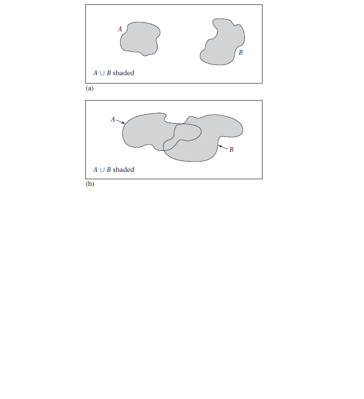
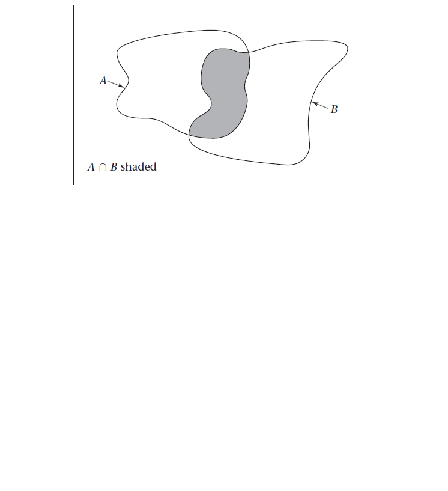
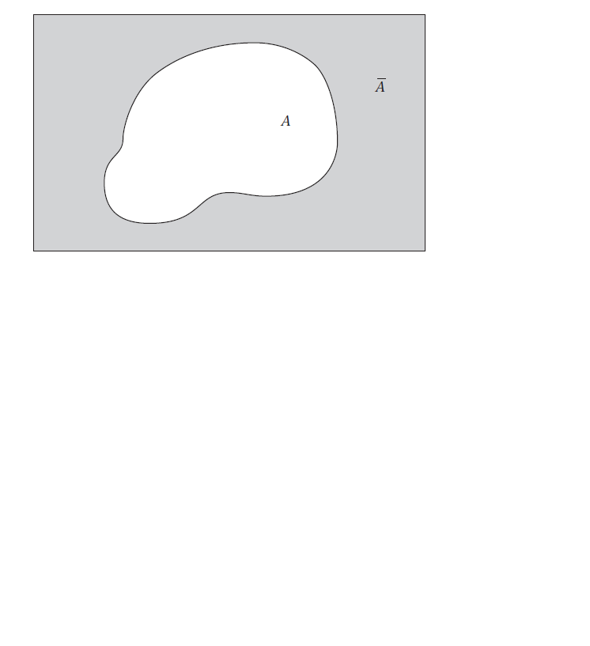
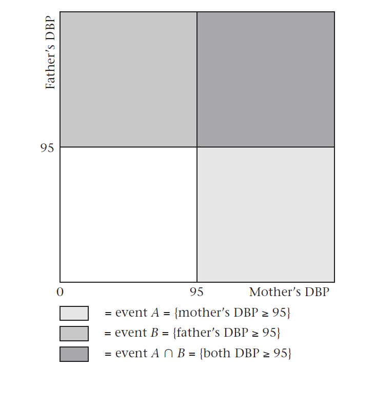
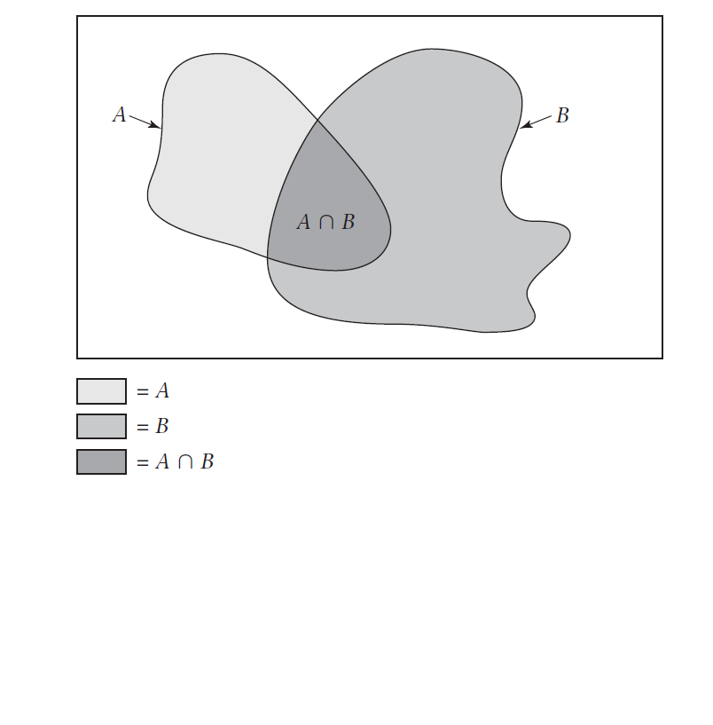
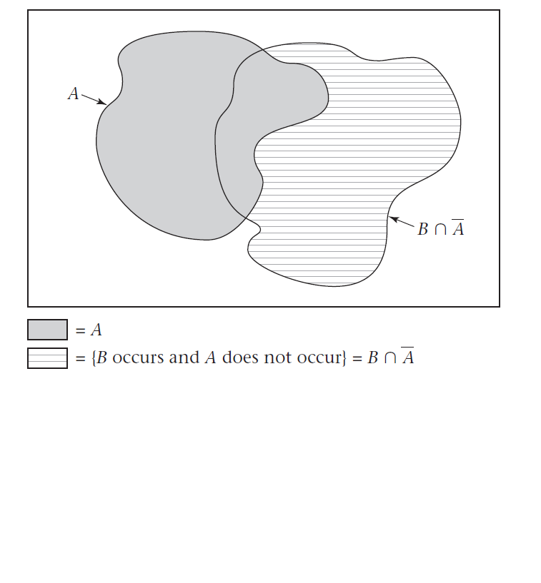

class: center, middle, bg_title, hide-count


```{r setup, include=FALSE}
options(
  htmltools.dir.version = FALSE,
  htmltools.preserve.raw = FALSE
)

knitr::opts_chunk$set(
  warning = FALSE,
  message = FALSE,
  comment = "",
  out.width = "100%"
)
library(knitr)
library(xaringanExtra)
library(xaringanthemer)

library(tidyverse)
library(here)
library(gridExtra)
library(rms)


library(countdown)
library(metathis)

options(width = 59) # fit into the right-column slides

```


```{r xaringans, echo=FALSE}
# https://github.com/gadenbuie/xaringanExtra
use_tachyons()
use_share_again()
use_panelset()
use_clipboard()
use_editable(expires = 1)
use_freezeframe()
use_extra_styles(
  hover_code_line = TRUE,         #<<
  mute_unhighlighted_code = TRUE  #<<
)
use_progress_bar(color = "#0051BA", location = "top")
```

```{r style-share-again, echo=FALSE}
style_share_again(
  share_buttons = c("twitter", "linkedin", "pocket")
)
```


```{r meta, echo=FALSE}
meta() %>%
  meta_general(
    description = "Modulo di STATISTICA MEDICA del corso in STATISTICA E SOCIOLOGIA GENERALE per il corso di laurea in TECNICHE DELLA PREVENZIONE NELL'AMBIENTE E NEI LUOGHI DI LAVORO",
    generator = "xaringan and remark.js"
  ) %>% 
  meta_name("github-repo" = "CorradoLanera/tpall") %>% 
  meta_social(
    title = "Statistica e Sociologia Generale",
    url = "https://corradolanera.github.io/tpall/#1",
    image = "https://github.com/CorradoLanera/tpall/raw/main/docs/img/cover.jpg",
    og_type = "website",
    og_author = "UBEP",
    twitter_card_type = "summary",
    twitter_creator = "@CorradoLanera"
  )
```

```{css, echo=FALSE}
.left-code {
  color: #777;
  width: 38%;
  height: 92%;
  float: left;
}
.right-code {
  color: #777;
  width: 55%;
  height: 92%;
  float: right;
  padding-top: 0.5em;
}
.left-plot {
  width: 43%;
  float: left;
}
.right-plot {
  width: 60%;
  float: right;
}
.hide-count .remark-slide-number {
  display: none;
}

.bg_title {
  position: relative;
  z-index: 1;
}

.bg_title::before {    
      content: "";
      background-image: url('img/bg1.png');
      background-size: contain;
      position: absolute;
      top: 0px;
      right: 0px;
      bottom: 0px;
      left: 0px;
      opacity: 0.3;
      z-index: -1;
}

```


```{r xaringan-themer, include=FALSE, warning=FALSE}
red <- "#f34213"
purple <- "#3e2f5b"
orange <- "#ff8811"
green <- "#136f63"
white <- "#FFFFFF"
pastel_orange <- "#F97B64"
blu_gray <- "#1F4257"
style_duo_accent(
    colors = c(
        red = red,
        purple = purple,
        orange = orange,
        green = green,
        white = white,
        pastel_orange = pastel_orange,
        blu_gray = blu_gray
    )
)
```


<br>
<br>
<br>

# **STATISTICA E SOCIOLOGIA GENERALE**<br>**.orange[STATISTICA MEDICA]**

-- Basi di probabilità --

<br>
<br>

C.d.L. **Tecniche della prevenzione nell'ambiente e nei luoghi di lavoro**

Feltre, a.a. 2021/2022 - 20 ore (2 crediti)

Corrado Lanera | [**Unità di Biostatistica, Epidemiologia e Salute Pubblic**](https://www.unipd-ubep.it/)


---
class: inverse, hide-count

# Cosa faremo


---
class: inverse, middle

# .center[**.orange[Panoramica]**]

**Definizioni**,  **proprietà** e **notazioni** fondamentali

**Operazioni** base tra eventi

**Condizionamento**, **rischio relativo**, e misure per **test di screening**

**Teorema di Bayes**


---
class: inverse, middle

# .center[**.orange[Definizioni], .orange[proprietà] e .orange[notazioni] fondamentali**]

- **Eventi** e **probabilità**

- Eventi **mutuamente esclusivi**

- **Intersezione**, **unione**, e **complemento**


---
# .orange[Definizione]: evento e probabilità

Lo __spazio degli eventi__ $\Omega$ è l'insieme di tutti i possibili risultati di un esperimento probabilistico.

Un __evento__ è un qualsiasi insieme dei risultati di un esperimento probabilistico.

La __probabilità__ di un evento è la .orange[frequenza relativa] dell'insieme di risultati di un esperimento probabilistico che lo definiscono, valutata su **infinite ripetizioni** dell'esperimento.

---
## .orange[Proprietà]: eventi mutuamente esclusivi

La probabilità di un evento $E$, indicata come $P(E)$, soddisfa .orange[sempre] la condizione

$$0 \leq P(E) \leq 1$$

Se i risultati di un esperimento probabilistico, indicati come $A$ e $B$ sono due eventi che .orange[non possono] verificarsi .orange[contemporaneamente], allora si ha che

$$P(\textrm{si verifichi } A \textrm{ o che si verifichi } B) = P(A) + P(B)$$

#### Esempio:

- $A$ l'evento DBP normale ( $\mbox{DBP} < 90$ )
- $B$ l'evento DBP borderline ( $90\leq \mbox{DBP} \leq 95$ )
- $C$ l'evento DBP $< 95$.

**Se**:
- $P(A)=0.7$
- $P(B)=0.1$

**Allora**: $P(C) = P(A) + P(B) = 0.7 + 0.1 = 0.8$.

---
## .orange[Proprietà]: eventi mutuamente esclusivi

Due eventi $A$ e $B$ si dicono **mutuamente esclusivi** se .orange[non possono] verificarsi .orange[contemporaneamente].

#### Esempio

**Siano**:
- $x$ la DBP.
- $C$ l'evento ( $x > 90$ )
- $D$ l'evento ( $75\leq x\leq 100$ ).

**Allora** in questo caso:

$C$ e $D$ **non** sono mutuamente esclusivi, in quanto entrambi si
verificano quando $90 \leq x \leq 100$.


---
# .orange[Notazione]: unione

- il simbolo $\{ \}$ si usa per indicare un evento
- il simbolo $\cup$ si usa come operatore per indicare l'evento unione $A \cup B$, ovvero tale per cui si verifichi $A$ o $B$ (o entrambi).

#### Esempio

**Sia** ( $x$ la DBP): 
- $A = \{x < 90 \}$
- $B = \{90 \leq x < 95 \}$
- $C = \{ \geq 90 \}$
- $D = \{75 \leq x \leq 100 \}$

**Allora**:

$$A \cup B = \{ x < 95 \}$$

$$C \cup D = \{ x \geq 75 \}$$

---
# .orange[Eventi e spazio] $\Omega$

```{r, echo=FALSE, out.width="100%"}

```


---
# .orange[Notazione]: intersezione

Il simbolo $\cap$ indica l'evento $A \cap B$, per cui sia $A$ che $B$ si verificano .orange[contemporaneamente].

#### Esempio

**Dati** ( $x$ la DBP):

- $C = \{x\geq 90\}$
- $D = \{75 \leq x \leq 100 \}$

**Allora**:

$$C \cap D = \{90 \leq x \leq 100  \}$$


---
# .orange[Intersezione] di eventi

```{r, echo=FALSE, out.width="100%"}

```


---
# .orange[Notazione]: complemento

Con $\bar{A}$ si indica l'evento per cui $A$ non si verifica e si chiama
.orange[complemento] di $A$.

Vale **sempre**:

$$P(\bar{A}) = 1-P(A)$$

#### Esempio


**Dati** ( $x$ la DBP):
- $A = \{x < 90 \}$
- $C =\{x \geq 90 \}$

**Allora**:

$$\bar{A}=C$$

**Da cui**:

$$P(C) = P(\bar{A}) = 1-0.7 = 0.3$$


---
# Evento .orange[complementare]

```{r, echo=FALSE, out.width="100%"}

```


---
class: inverse, middle

# .center[**.orange[Operazioni] di base**]

- **Prodotto** (e **indipendenza**)

- **Somma** (e **indipendenza**)


---
# .orange[Prodotto]: indipendenza

Due eventi sono .orange[indipendenti] se 

$$P(A \cap B) = P(A)P(B)$$

## Teorema del .orange[prodotto]

**Se**: $A_1, \ldots, A_k$ sono .orange[mutuamente indipendenti]

**Allora**: $P(A_1 \cap A_2 \cap \ldots \cap A_k) = P(A_1)P(A_2)\ldots P(A_k)$


---
# .orange[Prodotto]: esempio


Si considerino gli eventi
- $A=\{\mbox{DBP madre}\geq 95\}$ 
- $B=\{\mbox{DBP padre}\geq 95\}$

con probabilità
- $P(A \cap B) = 0.5$
- $P(A) = 0.1$
- $P(B) = 0.2$

**Allora**:

$$P(A \cap B) = 0.5 > 0.02 = P(A)P(B)$$

Per cui gli eventi **non sono indipendenti**, ovvero sono .orange[dipendenti].


---
# .orange[indipendenza]

```{r, echo=FALSE, out.width="60%"}

```


---
# Teorema della .orange[somma]


**Siano**:
- $A$ e $B$ due eventi .orange[qualsiasi]

**Allora*:

$$P(A \cup B) = P(A)+P(B)-P(A\cap B)$$

---
# .orange[Teorema della somma]: esempio

Due medici, $A$ e $B$, diagnosticano tutti i pazienti afferenti ad un centro per le malattie a trasmissione sessuale.

**Siano**:

- $A^+$ l'evento per cui il medico $A$ fa diagnosi .orange[positiva]
- $B^+$ l'evento per cui il medico $B$ fa diagnosi .orange[positiva]

con:

- $P(A^+)=0.1$
- $P(B^+)=0.17$
- $P(A^+ \cap B^+)=0.08$.

Si supponga che un paziente sia riferito per test laboratoristici supplementari se in presenza di **almeno una** diagnosi positiva.

La .orange[probabilità che] un paziente .orange[venga riferito] ai laboratori è

$$P(A^+ \cup B^+) = P(A^+) + P(B^+) - P(A^+ \cap B^+) = 0.1+0.17-0.08=0.19$$

---
# .orange[Somma]

```{r, echo=FALSE, out.width="100%"}

```


---
# .orange[Somma]: indipendenza

**Siano**: $A$ e $B$ due eventi **.orange[indipendenti]**

**Allora**:

$$\begin{split}P(A \cup B)& = P(A)+P(B)-P(A\cap B)\\& = P(A)+P(B)-P(A)P(B)\\& = P(A)+P(B)-P(B)P(A)\\& = P(A)+P(B)[1-P(A)]\\& = P(A)+P(B)P(\bar{A})\\& = P(A)+P(B \cap \bar{A})\end{split}$$

---
# Somma .orange[indipendente]

```{r, echo=FALSE, out.width="80%"}

```


---
## Somma eventi .orange[indipendenti]: esempio
Si considerino gli eventi
- $P(A)=P(\{\mbox{DBP madre}\geq 95 \})=0.1$ 
- $P(B)=P(\{\mbox{DBP padre}\geq 95 \})=0.2$

Si definisca come **famiglia ipertesa** quella in cui .orange[almeno uno] dei coniugi è iperteso.

**Allora** (ipotizzadno $A$ e $B$ indipendenti):

$$\begin{split} P(\{\mbox{famiglia ipertesa}\})& = P(A \cup B)\\& = P(A) +  P(B)[1-P(A)]\\& = 0.1 + (0.2)[1-0.1]\\& = 0.28\end{split}$$


---
class: inverse, middle

# .center[**.orange[Condizionamento],<br>.orange[rischio relativo],<br>misure per .orange[test di screening]**]

- **Condizionamento**

- **Rischio relativo**

- **Sensibilità**, **specificità** e **valori predittivi**


---
# .orange[Condizionamento]: definizione

La **.orange[probabilità condizionata]** $P(B|A)$ è definita come

$$P(B|A)=\frac{P(A \cap B)}{P(A)}$$

**Se** due eventi sono .orange[indipendenti], **allora**


$$P(B|A)=P(B|\bar{A})=P(B)$$

Al contrario, **se** due eventi sono .orange[dipendenti], **allora**

$$P(B) \neq P(B|A) \neq P(B|\bar{A}) \neq P(B)$$
$$P(A \cap B) \neq P(A)P(B)$$


---
# .orange[Condizionamento]: proprietà

Per qualsiasi evento $A$ e $B$, si ha che

$$P(B) = P(B|A)P(A)+P(B|\bar{A})P(\bar{A})$$


che si deriva considerando che

$$P(B) = P(B\cap A)+P(B \cap \bar{A})$$
e ricordando la definizione
$$P(B|A)=\frac{P(A \cap B)}{P(A)}$$

---
# .orange[Condizionamento]: esempio

Si supponga che l'1\% della popolazione abbia SKT positivo

**Si calcoli** la .orange[probabilità di tubercolosi (TB) nella popolazione] $P(TB)$

**Soluzione**
$$\begin{split}P(TB)& =P(TB|SKT^+)P(SKT^+) + P(TB|SKT^-)P(SKT^-)\\& = (0.01)(0.01) + (0.0001)(1-0.01)\\& = 0.000199\end{split}$$


---
# Teorema delle .orange[probabilità totali]

Un insieme di eventi $\mathscr{A} = \{A_1, \ldots, A_k\}$ è detto **.orange[esaustivo]** se almeno uno di tali eventi **deve** verificarsi.

**Sia** $\mathscr{A} = \{A_1, \ldots, A_k\}$ un insieme .orange[esaustivo] di eventi .orange[mutuamente esclusivi].

**Allora**, per qualunque evento $B$, la probabilità di $B$, $P(B)$, può essere scritta come la **somma pesata** delle probabilità condizionali di $B$ dato $A_i$, $P(B|A_i)$ per le corrispondenti probabilità degli $A_i$ al variare di $i$ tra $1$ e $k$:

$$\begin{split}P(B)& =\sum_{i=1}^k P(B|A_i)P(A_i)\\&\\&=\sum_{A\in \mathscr{A}} P(B|A)P(A)\end{split}$$


---
## .orange[Probabilità totali]: esempio problema

```{r, echo = FALSE}
countdown(minutes = 1, warn_when = 5, play_sound = TRUE,
          left = "70%", bottom = "10%")
```


.panelset[
.panel[.panel-name[Problema]


<small>
Si vuole pianificare uno studio sulla .orange[cataratta] in una popolazione di **5000 persone** di età superiore a 60 anni.

Dal censimento è noto che la probabilità di appartenere a una delle seguenti classi di età 60-64, 65-69, 70-74, $\geq 75$ è pari rispettivamente a 0.45, 0.28, 0.20, 0.07.

Dal Framingham Eye Study è noto che la probabilità di sviluppare una cataratta a 5 anni di distanza è pari, rispettivamente per le classi di età indicate, a 0.024, 0.046, 0.088, 0.153.

Si vuole conoscere **la percentuale di persone che potrebbe sviluppare una cataratta nei prossimi 5 anni**, e una stima del loro numero.

```{r, echo=FALSE}
catarrata <- tibble::tibble(
  classe = c("60-64", "65-69", "70-74", "75+"),
  p_classe = c(0.45, 0.28, 0.20, 0.07),
  p_catarrata5y_classe = c(0.024, 0.046, 0.088, 0.153)
)
knitr::kable(catarrata)
```
</small>


]
.panel[.panel-name[Soluzione]
La percentuale di popolazione (o probabilità, su tale popolazione) $P(B)$ per l'evento $B$ di sviluppare catarrata a 5 anni equivale, per il teorema delle .orange[probabilità totali], alla somma delle probabilità di svilupparla per ciascuna classe di età (che rappresentano un insieme **esaustivo** a elementi **mutuamente disgiunti**) pesate per la probabilità di appartenere in tali classi.
]
.panel[.panel-name[Conti Naturali]
<small>
```{r, echo=FALSE}
tibble::tibble(
  insieme = paste0("A_", 1:4),
  classe = c("60-64", "65-69", "70-74", "75+"),
  p_classe = c(0.45, 0.28, 0.20, 0.07),
  p_catarrata5y_classe = c(0.024, 0.046, 0.088, 0.153)
) |> 
  knitr::kable()
```


Per esempio:
- Probabilità di sviluppo cataratta a 5 anni **se** nella classe "60-64": $P(B|A_1) = 0.024$
- Probabilità di appartenere alla classe "60-64": $P(A_1) = 0.45$

$$\begin{split}P(B)& = \sum_{i=1}^4 P(B|A_i)P(A_i)\\& =
(0.024)(0.45)+\ldots+(0.153)(0.07)\\& \simeq 0.052\end{split}$$

e il numero stimato di persone con cataratta sarà: $5000 \times 0.052 \simeq 260$.
persone.
</small>
].panel[.panel-name[R Code]

```{r}
p_cataratta5y <- sum(
    catarrata$p_classe * catarrata$p_catarrata5y_classe
  ) |> 
  round(3)
p_cataratta5y

5000 * p_cataratta5y
```


]
]


---
# .orange[Rischio relativo]

Il rischio relativo (**RR**) di osservare, in una data popolazione, un evento $B$ su chi è esposto a un fattore $A$ rispetto a chi non ne è esposto ( $\bar{A}$ ) è definito, tramite .orange[probabilità condizionate], come

$$\frac{P(B|A)}{P(B|\bar{A})}$$
> NOTA:
>
> **Se**: $A$ e $B$ sono .orange[indipendenti]
> 
> **Allora**:  $RR = 1$ (infatti $P(B|A) = P(B|\bar{A}) = P(B)$ )

---
# .orange[Rischio relativo]: esempio

Si ipotizzi che:
- **1 persona su 100** con skin test (SKT) .orange[positivo] abbia la tubercolosi (TB)
- **1 persona ogni 10000** con SKT .orange[negativo] abbia la TB

Il rischio relativo di avere la TB nel caso di un test positivo rispetto a un test negativo è

$$RR=\frac{P(B|A)}{P(B|\bar{A})}=\frac{1/100}{1/10000}=\frac{0.01}{0.0001}=100$$

dove abbiamo indicato con $B$ l'evento di avere la TB, e con $A$ quello di avere un test positivo (ovvero con $\bar{A}$ di averlo negativo).


---
## .orange[Rischio relativo]: esempio problema

```{r, echo = FALSE}
countdown(minutes = 1, warn_when = 5, play_sound = TRUE,
          left = "70%", bottom = "5%")
```

.panelset[
.panel[.panel-name[Problema]

Per i dati sul centro delle malattie a trasmissione sessuale, si è 
interessati a calcolare:
- la probabilità che il medico $B$ faccia diagnosi positiva data la diagnosi del medico $A$
- il corrispondente rischio relativo.

Ricordando che

- $P(A^+) = 0.1$
- $P(B^+) = 0.17$
- $P(A^+ \cap B^+) = 0.08$

]

.panel[.panel-name[Soluzione $P(B^+|A^+)$ ]
Partendo da $P(A \cap B) = P(A|B)P(B)$ otteniamo:


.left-column[

- $P(A^+)=0.1$
- $P(B^+)=0.17$
- $P(A^+ \cap B^+)=0.08$

]

.rigth-column[.right[

$$\begin{split}P(B^+|A^+)& = \frac{P(B^+\cap A^+)}{P(A^+)}\\& = 0.08/0.1\\& = 0.8\end{split}$$
]]
]
.panel[.panel-name[Soluzione RR]

.left-column[.middle[
- $P(A^+)=0.1$
- $P(B^+)=0.17$
- $P(A^+ \cap B^+)=0.08$
- $P(B^+|A^+) = 0.8$


<br>
<br>
<br>
<br>
<br>
<br>
<br>
<br>

> Ricordiamo: $P(B^+)=P(B^+ \cap A^+)+P(B^+ \cap A^-)$

]]

.rigth-column[.rigth[

$$\begin{split}P(B^+|A^-)& = \frac{P(B^+\cap A^-)}{P(A^-)}\\& = \frac{P(B^+)-P(B^+\cap A^+)}
{P(A^-)}\\& =\frac{0.17-0.08}{0.9}\\& = 0.1\end{split}$$

.left[$$RR=\frac{P(B^+|A^+)}{P(B^+|A^-)}=\frac{0.8}{0.1}=8$$]

]]


]
]


---
# .orange[Test di screening]: valori predittivi


Il **valore predittivo positivo** (o anche **precisione**) $PV^+$ di un test di screening è la probabiliàche la persona abbia la malattia dato un test positivo

$$PV^+ = P(\mbox{malattia}|\mbox{test}^+)$$

Il **valore predittivo negativo** $PV^-$ di un test di screening è la probabilità che la persona **.orange[non]** abbia la malattia dato un test negativo

$$PV^- = P(\mbox{no malattia}|\mbox{test}^-)$$

Per esempio, nel caso della tubercolina si ha che

$$P(TB|SKT^+) = 0.01 = PV^+$$

$$P(\bar{TB}|SKT^-) = 1-P(TB|SKT^-) = 0.9999 = PV^-$$


---
## .orange[Test di screening]: sensibilità e specificità


La **sensibilità** (o anche **richiamo**) di un test o un sintomo è la probabilità di essere .orange[positivo] al test quando si è .orange[malati]

$$\mbox{sens} = P(\mbox{test}^+|\mbox{malattia})$$

La **specificità** di un test o un sintomo è la probabilità di essere .orange[negativo] al test quando si è .orange[sani]

$$\mbox{spec} = P(\mbox{test}^-|\mbox{no malattia})$$

Si definisce:
- **falso negativo** la persona .orange[malata] che ha un .orange[test negativo]
- **falso positivo** la persona .orange[sana] che ha un test .orange[positivo]


---
# .orange[Test di screening]: esempi
.pull-left[

Si ipotizzi che:
- la .orange[malattia] sia: il cancro al polmone

- il ".orange[test]" sia: il fumo di sigarette

- la probabilità di fumare per un soggetto .orange[malato] sia pari a: 0.90

- la probabilità di fumare per un soggetto .orange[sano] sia pari a: 0.50

**Allora**, per il _test_ fumo di sigarette rispetto al(la _malattia_) cancro polmonare:
- .orange[sensibilità] (o richiamo) = 0.90
- .orange[specificità] = 0.5 ( $1 - 0.5$ ) 
]

.pull-right[
Si ipotizzi che:
- la .orange[malattia] sia: il cancro al seno nelle donne
- il .orange[sintomo] sia la familiarità per tumore al seno (madre o sorella con il cancro al seno)
- la probabilità di avere familiarità per la malattia per una donna .orange[malata] sia pari a: 0.05
- la probabilità di avere familiarità per la malattia per una donna .orange[sana] sia pari a: 0.02

**Allora**, per il _sintomo_ familiarità rispetto al(la _malattia_) cancro al seno nelle donne:
- .orange[sensibilità] (o richiamo) = 0.05
- .orange[specificità] = 0.98 ( $1 - 0.02$ ) 
]


---
class: inverse, middle

# .center[Teorema di **Bayes**]

- **Enunciato** base con traccia di **derivazione** ed **esempi**

- Enunciato **generalizzato** ed esempi


---
# .orange[Teorema di Bayes]: base

$$(PV^+ = )\ P(M|T) = \frac{P(T|M)P(M)}{P(T)} = \frac{P(T|M)P(M)}{P(T|M)P(M)+P(T|\bar{M})P(\bar{M})}$$


**Siano**: $T$ _test positivo_ e $M$ _avere la malattia_

**Dati**: $\mbox{SENS} = P(T|M) \quad \mbox{SPEC} = P(\bar{T}|\bar{M})$

**Considerando che**: $\mbox{1 - SENS} = P(\bar{T}|M) \quad \mbox{1 - SPEC} = P(T|\bar{M})$

**Calcoliamo**: $PV^+ = P(M|T) \quad PV^-=P(\bar{M}|\bar{T})$

> Nota: $P(M)$ è la **prevalenza** della malattia nella popolazione di 
riferimento

$$PV^+=\frac{SENS\cdot prev}{(SENS\cdot prev) + (1- SPEC)\cdot(1 - prev)}$$
$$PV^-=\frac{SPEC\cdot(1 - prev)}{SPEC\cdot(1 - prev) + (1- SENS)\cdot prev}$$


---
# .orange[Teorema di Bayes]: derivazione

Dalla definizione di .orange[probabilità condizionata] si ha che

$$P(M|T) := \frac{P(M \cap T)}{P(T)} \quad\quad P(M \cap T) = P(T \cap M) = P(T|M)P(M)$$

Dal teorema delle .orange[probabilità totali] si ha che

$$P(T)=P(T|M)P(M)+P(T|\bar{M})P(\bar{M})$$
Sostituendo:

$$(PV^+ = )\ P(M|T) = \frac{P(T|M)P(M)}{P(T|M)P(M)+P(T|\bar{M})P(\bar{M})}$$


---
# .orange[Teorema di Bayes]: esempio


```{r, echo = FALSE}
countdown(minutes = 3, warn_when = 5, play_sound = TRUE,
          left = "70%", bottom = "5%")
```


.panelset[
.panel[.panel-name[Problema]

**Si ipotizzi** che:
- la probabilità che un iperteso sia .orange[correttamente classificato] come tale da una macchina per la misurazione automatica della pressione sia pari a 0.84
- la stessa sia pari a 0.23 per un normoteso.
- la prevalenza dell'ipertensione nella popolazione è del 20\%

**Si calcolino**: i valori predittivi (positivo e negativo) della macchina.
]
.panel[.panel-name[Soluzione PV+]

Dai dati:
- **sensibilità** = 0.84
- **specificità** = 1 - 0.23 = 0.77
- **prevalenza** = 0.2 (20\%)

Dal teorema di Bayes:


$$\begin{split}PV+& = \frac{SENS\cdot prev}{(SENS\cdot prev) + (1- SPEC)\cdot(1 - prev)}\\& =  \frac{(0.84)0.2}{(0.84)0.2 + (0.23)0.8}\\& = \frac{0.162}{0.352}\\& = 0.48\end{split}$$

]
.panel[.panel-name[Soluzione PV-]

Dai dati:
- **sensibilità** = 0.84
- **specificità** = 1 - 0.23 = 0.77
- **prevalenza** = 0.2 (20\%)

Dal teorema di Bayes:

$$\begin{split}PV^-& = \frac{SPEC\cdot(1 - prev)}{SPEC\cdot(1 - prev) + (1- SENS)\cdot prev}\\& = \frac{(0.77)0.8}{(0.77)0.8 + (0.16)0.2}\\& = \frac{0.616}{0.648}\\& = 0.95\end{split}$$

]
]

---
# .orange[Teorema di Bayes]: generalizzazione

**Siano**
- $M_1, \ldots, M_k$ un insieme .orange[esaustivo] (almeno uno deve verificarsi) di stati di malattia .orange[mutuamente esclusivi] (non possono verificarsi due stati allo stesso tempo)
- $T$ la presenza di un insieme di sintomi

**Allora**:

$$P(M_i|T) =\frac{P(T|M_i)P(M_i)}{\sum_{j=1}^k P(T|M_j)P(M_j)}$$


---
# .orange[Bayes generalizzato]: esempio

Si supponga che un uomo di età pari a 60 anni, non fumatore, presenti dei 
sintomi come tosse cronica e affanno occasionale.

Il medico prescrive una biopsia polmonare, il cui risultato è consistente con varie patologie, quali il tumore polmonare, la sarcoidosi, una malattia polmonare non fatale, ovvero

$$\mbox{sintomi}=A=\{\mbox{tosse cronica},\mbox{biopsia}\}$$

$$\mbox{stati patologici} = B = \{\mbox{normale},\mbox{cancro},\mbox{sarcoidosi}\}$$

sia inoltre

$$ P(A|B_1)=0.001 \:\:\: P(A|B_2)=0.9 \:\:\: P(A|B_3)=0.9$$
$$P(B_1)=0.99 \:\:\: P(B_2)=0.001 \:\:\: P(B_3)=0.009$$


---
# .orange[Bayes generalizzato]: esempio

Si vuole conoscere le probabilità degli stati patologici dati i sintomi

$$
\begin{eqnarray*}
P(B_1|A)&=\frac{P(A|B_1)P(B_1)}{\sum_{j=1}^3 P(A|B_j)P(B_j)}\\
&=\frac{0.001(0.99)}{0.001(0.99)+0.9(0.001)+0.9(0.009)}=0.099
\end{eqnarray*}
$$


$$P(B_2|A)= \frac{0.9(0.001)}{0.001(0.99)+0.9(0.001)+0.9(0.009)}=0.090$$

$$P(B_3|A)=
\frac{0.9(0.009)}{0.001(0.99)+0.9(0.001)+0.9(0.009)}=0.811$$


---
# .orange[Bayes generalizzato]: esempio

Si supponga ora che lo stesso paziente sia fumatore di due pacchetti di 
sigarette al giorno per 40 anni. Si abbia quindi che in questo gruppo di persone

$$P(B_1)=0.98 \:\:\: P(B_2)=0.015 \:\:\: P(B_3)=0.005$$

la probabilità degli stati patologici è

$$P(B_1|A)=
\frac{0.001(0.98)}{0.001(0.98)+0.9(0.015)+0.9(0.005)}=0.052$$

$$P(B_2|A)=
\frac{0.9(0.015)}{0.001(0.98)+0.9(0.015)+0.9(0.005)}=0.711$$

$$P(B_3|A)=
\frac{0.9(0.005)}{0.001(0.98)+0.9(0.015)+0.9(0.005)}=0.237$$


---
class: middle, center, hide-count, inverse

# .orange[Vediamolo...<br>...sul _vostro_ cloud!]

[https://bit.ly/tpall22-feltre-rscloud](https://bit.ly/tpall22-feltre-rscloud)

---
class: inverse

# Risorse utili

- [**RStudio Cloud**](https://bit.ly/tpall22-feltre-rscloud): [https://bit.ly/tpall22-feltre-rscloud](https://bit.ly/tpall22-feltre-rscloud) gratis per voi per esplorare RStudio, le sue funzionalità, e allenarvi con R (link di iscrizione valido fino alla fine del corso). NOTA: a vostra scelta, è utilizzabile anche come _supporto_ durante l'esame.

- [**RStudio primers**](https://rstudio.cloud/learn/primers) ambiente gratuito dentro RStudio Cloud per l'apprendimento delle basi di analisi di dati con R tramite tutorial interattivi. Una volta registrati, oltre all'accesso al _nostro_ spazio di lavoro, avete accesso libero anche ai _Primers_.

- [**R 4 Data Science**](https://r4ds.had.co.nz/): libro gratuito (on-line) di [**Hadley Wickham**](http://hadley.nz/) e [**Garrett Grolemund**](https://rstudio.com/speakers/garrett-grolemund/)

- [**GGplot2 cheatsheet**](https://raw.githubusercontent.com/rstudio/cheatsheets/main/data-visualization.pdf) schema dei possibili grafici di base rappresentabili in R con il pacchetto `{ggplot2}`, molto utile anche per conoscere le tipologie di grafico, e il loro utilizzo.

- [An Introduction to Medical Statistics](https://global.oup.com/academic/product/an-introduction-to-medical-statistics-9780199589920) di [**Martin Bland**](https://www.york.ac.uk/healthsciences/our-staff/honoraryemeritus/martin-bland/), suggeriti capitoli 4 e 5.

---
class: inverse, center, middle, hide-count


.bg-washed-green.b--dark-green.ba.bw2.br3.shadow-5.ph4.mt5[
.left[
_Mathematical conventions are just that, conventions. They differ by field of mathematics. Don’t ask us why **matrix rows** **.orange[are numbered down]** but **graphs** **.orange[are numbered up]** the **y axis**, nor why **x .orange[comes before] y** but **row .orange[before] column**. But the matrix layout has always seemed illogical to me._
]

.tr[
—Brian D. Ripley<br>08/2004 - R-help<br>
]
]

<br>


# **.orange[Grazie]** per l'attenzione!

... e buona settimana.

<br>
<br>


Diapositive: [https://corradolanera.github.io/tpall](https://corradolanera.github.io/tpall)


[`r fontawesome::fa("link")`](https://www.unipd-ubep.it/) [**www.unipd-ubep.it**](https://www.unipd-ubep.it/) | 
[`r fontawesome::fa("mail-bulk")`](mailto:Corrado.Lanera@ubep.unipd.it) [**Corrado.Lanera@ubep.unipd.it**](mailto:Corrado.Lanera@ubep.unipd.it)

[`r fontawesome::fa("github")`](https://github.com/corradolanera)
[`r fontawesome::fa("twitter")`](https://twitter.com/corradolanera)
[`r fontawesome::fa("telegram-plane")`](https://telegram.me/CorradoLanera)
**@CorradoLanera** |
[`r fontawesome::fa("calendar-check")` ](https://calendly.com/corradolanera) [**calendly.com/corradolanera**](https://calendly.com/corradolanera)


