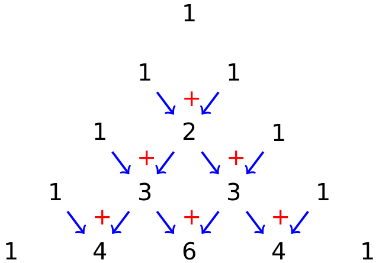

class: center, middle, bg_title, hide-count


```{r setup, include=FALSE}
options(
  htmltools.dir.version = FALSE,
  htmltools.preserve.raw = FALSE
)

knitr::opts_chunk$set(
  warning = FALSE,
  message = FALSE,
  comment = "",
  out.width = "100%"
)
library(knitr)
library(xaringanExtra)
library(xaringanthemer)

library(tidyverse)
library(here)
library(gridExtra)
library(rms)


library(countdown)
library(metathis)

options(width = 59) # fit into the right-column slides

```


```{r xaringans, echo=FALSE}
# https://github.com/gadenbuie/xaringanExtra
use_tachyons()
use_share_again()
use_panelset()
use_clipboard()
use_editable(expires = 1)
use_freezeframe()
use_extra_styles(
  hover_code_line = TRUE,         #<<
  mute_unhighlighted_code = TRUE  #<<
)
use_progress_bar(color = "#0051BA", location = "top")
```

```{r style-share-again, echo=FALSE}
style_share_again(
  share_buttons = c("twitter", "linkedin", "pocket")
)
```


```{r meta, echo=FALSE}
meta() %>%
  meta_general(
    description = "Modulo di STATISTICA MEDICA del corso in STATISTICA E SOCIOLOGIA GENERALE per il corso di laurea in TECNICHE DELLA PREVENZIONE NELL'AMBIENTE E NEI LUOGHI DI LAVORO",
    generator = "xaringan and remark.js"
  ) %>% 
  meta_name("github-repo" = "CorradoLanera/tpall") %>% 
  meta_social(
    title = "Statistica e Sociologia Generale",
    url = "https://corradolanera.github.io/tpall/#1",
    image = "https://github.com/CorradoLanera/tpall/raw/main/docs/img/cover.jpg",
    og_type = "website",
    og_author = "UBEP",
    twitter_card_type = "summary",
    twitter_creator = "@CorradoLanera"
  )
```

```{css, echo=FALSE}
.left-code {
  color: #777;
  width: 38%;
  height: 92%;
  float: left;
}
.right-code {
  color: #777;
  width: 55%;
  height: 92%;
  float: right;
  padding-top: 0.5em;
}
.left-plot {
  width: 43%;
  float: left;
}
.right-plot {
  width: 60%;
  float: right;
}
.hide-count .remark-slide-number {
  display: none;
}

.bg_title {
  position: relative;
  z-index: 1;
}

.bg_title::before {    
      content: "";
      background-image: url('img/bg1.png');
      background-size: contain;
      position: absolute;
      top: 0px;
      right: 0px;
      bottom: 0px;
      left: 0px;
      opacity: 0.3;
      z-index: -1;
}

```


```{r xaringan-themer, include=FALSE, warning=FALSE}
red <- "#f34213"
purple <- "#3e2f5b"
orange <- "#ff8811"
green <- "#136f63"
white <- "#FFFFFF"
pastel_orange <- "#F97B64"
blu_gray <- "#1F4257"
style_duo_accent(
    colors = c(
        red = red,
        purple = purple,
        orange = orange,
        green = green,
        white = white,
        pastel_orange = pastel_orange,
        blu_gray = blu_gray
    )
)
```


<br>
<br>
<br>

# **STATISTICA E SOCIOLOGIA GENERALE**<br>**.orange[STATISTICA MEDICA]**

-- Distribuzioni di probabilità --


<br>
<br>

C.d.L. **Tecniche della prevenzione nell'ambiente e nei luoghi di lavoro**

Feltre, a.a. 2021/2022 - 20 ore (2 crediti)

Corrado Lanera | [**Unità di Biostatistica, Epidemiologia e Salute Pubblic**](https://www.unipd-ubep.it/)


---
class: inverse, hide-count

# Cosa faremo

Quello di cui ci interesseremo in questa lezione è di introdurre le 
principali distribuzioni di probabilità per eventi discreti, quali 
.orange[processi binomiali], utili per rappresentare il numero di
successi per eventi dicotomici con una data probabilità p di esito
positivo, e .orange[processi di Poisson] utili a modellizzare
il numero di eventi che è probabile osservare in un lasso di tempo
stabilito. Inoltre ci occuperemo anche delle distribuzioni utili a
descrivere eventi continui, con particolare attenzione alle
distribuzioni .orange[normale] e .orange[normale standard].

Per ciascuna, oltre a qualche rapido cenno teorico, vedremo come
calcolare .orange[media] e .orange[varianza], .orange[percentili] 
(per le distribuzioni continue), oltre che qualche esempio concreto.

---
class: hide-count

# .orange[Riconoscimenti]

- Le diapositive proposte sono state prodotte a partire anche da
  materiale generato da/con le seguenti persone gravitanti attorno
  l'UBEP*:
  
  + Danila Azzolina
  + Dario Gregori
  + Giulia Lorenzoni
  + Ileana Baldi
  + Luca Vedovelli
  + Matteo Martinato
  + Paola Berchialla

<br><br>
<small>
.right[\* In ordine alfabetico.]
</small>

<br><br>

> Un ringraziamento speciale a Cristiana Vettori e a Mariasole Rizzi per
l'aiuto e il supporto logistico e amministrativo che mi è stato offerto,
e ad Andrea Francavilla per avermi aiutato nella revisione del
materiale.

---
class: inverse, middle

# .center[**.orange[Panoramica]**]

**Modello** probabilistico per variabili discrete: massa, valore atteso e varianza 

Distribuzione **binomiale** (ovvero per variabili con due soli possibili esiti)

Distribuzione di **Poisson** (ovvero per varibili _conteggio_) e approssimazione della binomiale

**Modello** probabilistico per variabili continue: densità

Distribuzione **normale**, localizzazione, forma, simmetria, percentili, trasformazioni

**Approssimazioni** alla Normale


---
class: inverse, middle

# .center[Modelli (probabilistici) **.orange[discreti]**]

- **Massa**

- **Valore atteso**

- **Varianza**


---
# Richiamo: .orange[Variabile casuale]

Una variabile casuale è una quantità che assume **valori differenti** con **specifiche probabilità**

- una variabile casuale che assume un .orange[insieme discreto] di valori con probabilità specificata à detta variabile casuale **discreta**

- una variabile casuale che assume un .orange[insieme continuo] (e infinito) di valori, in modo che **gli intervalli** di tali valori abbiano probabilità specificata è detta variabile casuale continua

<br>
<br>
<br>
<br>
<br>

> Nota: una funzione di una variabile casuale **è** una variabile casuale

 

> Nota 2: **funzione**: una qualunque mappa/regola che associa **a ogni elemento** di un insieme (detto .orange[dominio] della funzione) **un unico elemento** di un insieme (detto .orange[codominio] della funzione).


---
# .orange[Modelli discreti]

Obiettivo è determinare il modello probabilistico adatto ai dati
che si vuole trattare, ovvero individuare eventi con la stessa struttura probabilistica

- distribuzione .orange[binomiale], in cui l'evento di interesse ha due possibili esiti 

- distribuzione di .orange[Poisson], in cui l'evento di interesse è definito dal conteggio di eventi


---
# .orange[Modelli discreti]: massa

.panelset[
.panel[.panel-name[Definizione]

Una funzione di (distribuzione di) .orange[massa] di probabilità è una relazione matematica, o regola, che assegna **ad ogni possibile valore** $r$ di una variabile casuale discreta $X$ **la (sua) probabilità** $P(X=r)$.

Questa regola è definita per tutti i valori $r$ che hanno probabilità positiva.

<br>
<br>
<br>
<br>

> Importante: Valgono sempre:
>
>  - $0\leq P(X=r) \leq 1$
>
>  - $\sum P(X=r) = 1$

]
.panel[.panel-name[Esempio]


Un medico inizia a controllare lo stato ipertensivo di 4 suoi pazienti con farmaci antiipertensivi.

**Sia**: $X$ è il numero di pazienti complianti

**Allora**:

```{r, echo=FALSE}
ipertensione <- tibble::tibble(
  r = c(0, 1, 2, 3, 4),
  `P(X=r)` = c(0.008, 0.076, 0.265, 0.411, 0.240)
)

knitr::kable(ipertensione)
```

]


.panel[.panel-name[Distr. Cumulativa]

La distribuzione cumulativa di una variabile casuale discreta è indicata come $F(x)$ ed è pari a $P(X\leq x)$
]

.panel[.panel-name[Esempio]

$$F(x) = P(X\leq x)$$
.left-column[
```{r, echo=FALSE}
ipertensione |> 
  dplyr::mutate(
    `F(x)` = cumsum(.data[["P(X=r)"]])
  ) |> 
  knitr::kable()
```
]

.right-plot[

```{r, echo=FALSE, out.width="80%"}
ipertensione |> 
  dplyr::mutate(
    `F(x)` = cumsum(.data[["P(X=r)"]])
  ) |> 
  ggplot(aes(r, `F(x)`)) +
  geom_step(colour = "blue") + 
  geom_point(aes(y = .data[["P(X=r)"]]), colour = "red") +
  theme_bw() +
  ggtitle(
    "Distribuzione Cumulativa Empirica",
    subtitle = "In rosso la massa di probabilità per ciascun corrispondente possibile valore."
  )
```

  
]

]

]
---
# .orange[Modelli discreti]: valore atteso

.panelset[
.panel[.panel-name[Definizione]

Il valore atteso di una variabile casuale discreta è definito come

$$E(X)=\sum_{i\in  I}x_iP(X=x_i)$$

dove $x_i$ sono i valori che la variabile casuale $X$ assume con probabilità positiva
]
.panel[.panel-name[Esempio]


Per la variabile $X =$ _pazienti complianti al controllo dell'ipertensione_

```{r, include=FALSE}
media_ipertensione <- sum(
  ipertensione[["r"]] * ipertensione[["P(X=r)"]]
)
```

$$E(X)=0(0.008)+1(0.076)+2(0.265)+3(0.411)+4(0.240) = `r media_ipertensione`$$

```{r, echo=FALSE}
knitr::kable(ipertensione)
```

```{r}
sum(
  ipertensione[["r"]] * ipertensione[["P(X=r)"]]
)
```


]
]

---
# .orange[Valore atteso]: esempio


.panelset[
.panel[.panel-name[Problema]


**Sia**: $X$ il **numero** di episodi di otiti **nei primi due anni di vita**, con la seguente rispettiva massa di probabilità:

```{r, echo=FALSE}
otiti <- tibble::tibble(
  r = c(0, 1, 2, 3, 4, 5, 6),
  `P(X=r)` = c(0.129, 0.264, 0.271, 0.185, 0.095, 0.039, 0.017)
)
knitr::kable(otiti)
```

Determinare il numero atteso di episodi di otite nei primi due anni di vita

]

.panel[.panel-name[Soluzione]
```{r, include=FALSE}
atteso_otiti <- sum(
  otiti[["r"]] * otiti[["P(X=r)"]]
)
```

il numero atteso di episodi di episodi di otite nei primi due anni di vita è:


$$\begin{split}E(X) =\ &0(0.129)\ + \\&1(0.264)\ + \\& 2(0.271)\ + \\&3(0.185)\ + \\&4(0.095)\ + \\&5(0.039)\ + \\& 6(0.017) =\\& `r atteso_otiti` \end{split}$$

]

.panel[.panel-name[R Code]

```{r}
sum(otiti[["r"]] * otiti[["P(X=r)"]])
```

]
]

```{r, echo = FALSE}
countdown(minutes = 1, warn_when = 1, play_sound = TRUE,
          left = "70%", bottom = "15%")
```


---
# .orange[Modelli discreti]: varianza

.panelset[
.panel[.panel-name[Definizione]

La varianza di una variabile casuale discreta $X$ è pari a

$$\mbox{var}(X)=\sum_{i=1}^k(x-\mu)^2P(X=x_i)=\sigma^2$$

vale anche

$$\sigma^2=E(X-\mu)=\left(\sum_{i=1}^kx_i^2P(X=x_i)\right)-\mu^2$$
]
.panel[.panel-name[Esempio]

```{r, include=FALSE}
var_otiti <- sum(
    otiti[["r"]]^2 * otiti[["P(X=r)"]]
  ) - atteso_otiti^2
```

La varianza della variabile casuale episodi di otite è pari a

$$0^2(0.129)+\ldots+36(0.017)-2.038^2=`r round(var_otiti,3)`$$

]

.panel[.panel-name[R Code]

```{r}
sum(otiti[["r"]]^2 * otiti[["P(X=r)"]]) - atteso_otiti^2
```

]
]


---
class: inverse, middle

# .center[Distribuzione **.orange[binomiale]**]

- Struttura e **.orange[distribuzione]**

- Valore **.orange[atteso]** e **.orange[varianza]**

- Grafici

---
# .orange[Binomiale]: struttura

Una variabile binomiale rapresenta la **.orange[quantità]** di esiti **positivi** di un possibile esperimento con due soli risultati possibili (**dicotomico**), che possono avvenire con date **.orange[probabilità costanti]** (complementari a 1).

Si caratterizza quindi da:

- $n$ prove **indipendenti**

- **due** possibili outcomes di ogni prova, .orange[successo] o .orange[insuccesso]

- la probabilità di successo, $p$ è .orange[costante] in ogni prova (quella di insuccesso è pari a $1-p = q$)

Ed è utile Utile per:

- valutare la probabilità di $k$ successi in $n$ prove


---
# .orange[Coefficiente binomiale]
Il numero di combinazioni di $n$ oggetti presi $k$ alla volta è pari a

$$_nC_k=\binom{n}{k}=\frac{n(n-1)\ldots (n-k+1)}{k!}$$

moltiplicando numeratore e denominatore per $(n-k)!$ si ottiene

$$_nC_k=\binom{n}{k}=\frac{n!}{k!(n-k)!}$$

>Note:
- $n! := n\cdot (n-1)\cdot \cdots \cdot (2)\cdot 1$
- convenzione: $\binom{n}{0}=1$
- vale la simmetria: $\binom{n}{k}=\binom{n}{n-k}$


---
## Distribuzione .orange[Binomiale]: probabilità

la probabilità che $k$ successi avvengano in $n$ prove, con le rimantenti $n-k$ tutte insuccessi è pari a

$$p^k(1-p)^{n-k}$$

Tenendo conto che i $k$ successi posso ottenerli in $_nC_k$ modi diversi, si ha che

$$P(X=k)=\binom{n}{k}p^k(1-p)^{n-k}$$

che è la distribuzione di probabilità binomiale

---
### Coefficiente binomiale: .orange[Triangolo di Tartaglia]

```{r, echo=FALSE, out.width="80%", fig.cap="http://matematicamente.it/6981-algebra-1-manuale-completo-per-il-primo-anno-della-secondaria-di-secondo-grado"}



```


---
# Distribuzione .orange[Binomiale]

.panelset[
.panel[.panel-name[Descrizone]

La distribuzione binomiale, di parametri $n$ e $p$ si indica come

$$P(S=k)=\binom{n}{k}p^k(1-p)^{n-k} \:\:\:\: k=0,1,\ldots,n$$

vale la simmetria

$$P(S=k)=\binom{n}{k}p^k(1-p)^{n-k} = \binom{n}{n-k}p^{n-k}(1-p)^{k}=P(S=n-k)$$
]

.panel[.panel-name[Esempio]

Quale è la probabilità di ottenere 2 bambini maschi da 5 nati se la probabilità di un maschio è pari a 0.51, indipendente dal sesso dei bambini nati prima?
```{r, include=FALSE}
pbin <- dbinom(
  x = 2,
  size = 5,
  prob = 0.51
)
```

Si usa la distribuzione binomiale

$$P(S=2)=\binom{5}{2}0.51^2(0.49)^{5-2}=\frac{5 \times 4}{2 \times 1}0.51^2(0.49)^{5-2}=`r round(pbin,3)`$$

```{r}
dbinom(x = 2, size = 5, prob = 0.51)

pbinom(q = 2, size = 5, prob = 0.51) -
  pbinom(q = 1, size = 5, prob = 0.51)
```


]


]


---
## .orange[Binomiale]: Valore atteso e varianza

Per definizione si ha che: $E(S) = \sum_{i\in I}x_iP(X=x_i)$

Da cui: $E(S) =\sum_{k=0}^n k\binom{n}{k}p^kq^{n-k}$

Del resto, Se $S$ è la somma degli esiti dei singoli lanci (che possimo indicare come variabile casuale $X$), allora per linearità

$$E(S) = E\left(\sum_{i=1}^n X_i\right) = \sum_{i=1}^nE(X_i) = \sum_{i=1}^np=np$$

Sempre per definizione, la varianza sarà: $\mbox{var}(S)=\sum_{k=0}^n (k-np)^2 \binom{n}{k}p^kq^{n-k}$

Che possiamo calcolare per linearità più semplicemente come

$$var(S) = var\left(\sum_{i=1}^n X_i\right) = \sum_{i=1}^nvar(X_i) =^*  \sum_{i=1}^npq=npq$$
<br>

.right[*= Se interessa, dimostrarlo per esercizio.]


---
## .orange[Singolo esperimento]: grafico

.panelset[
```{r, panelset = TRUE, out.width="60%"}

db <- tibble(
  p = seq(0, 1, by = 0.001),
  q = 1 - p,
  pq = p*q
)

ggplot(db, aes(x = p, y = pq)) +
  geom_point() +
  theme_bw() +
  ggtitle("Attesa e Varianza per distribuzione Binomiale con n = 1",
        subtitle = "(Nota anche come distribuzione Bernulli)")

```

]


---
## .orange[10 esperimenti]: grafico

.panelset[
```{r, panelset = TRUE, out.width="60%"}
n <- 10
k <- seq_len(n)
p <- c(0.05, 0.5, 0.95)


db <- crossing(p, k, n) |> 
  mutate(
    `P(S=k)` = dbinom(x = k, size = n, prob = p),
    p = factor(p)
  )

ggplot(db, aes(x = k, y = `P(S=k)`,fill = p)) +
  geom_col() +
  facet_grid(p~., scales = "free") +
  theme_bw() +
  theme(legend.position = "none") +
  ggtitle("Distribuzioni Binomiali con n = 10 e diversi valori di p")

```


]


---
class: inverse, middle

# .center[Distribuzione di **.orange[Poisson]**]

- Struttura e **.orange[distribuzione]**

- Valore **.orange[atteso]** e **.orange[varianza]**

- Grafici


---
# .orange[Poisson]: struttura

Dato un intervallo di tempo $\Delta t$, si ha che

- la probabilità di osservare un evento è direttamente proporzionale alla lunghezza dell'intervallo di tempo $\Delta t$, ovvero, per una qualche costante $\lambda$, abbiamo:

$$P(\mbox{1 evento})\sim \lambda\,\Delta t$$


- la probabilità di osservare $0$ eventi nell'intervallo $\Delta t$ è approssimativamente $1-\lambda\Delta t$

- la probabilità di osservare più di un evento nell'intervallo è sostanzialmente $0$

- .orange[Stazionarietà]: il numero di eventi per unità di tempo è lo stesso in tutto l'intervallo di tempo $t$ (no trend)

- .orange[Indipendenza]: se si verifica un evento nell'intervallo di tempo considerato, questa non modifica la probabilità di osservarne un secondo nell'intervallo successivo.


---
## Distribuzione di .orange[Poisson]: probabilità

La probabilità di osservare $k$ eventi in un periodo di tempo $t$ per una variabile aleatoria di Poisson di parametro $\lambda$ è pari a

$$P(X=k)=\frac{e^{-\mu}\mu^k}{k!}$$

dove $\mu=\lambda t$ ed $e$ è pari approssimativamente a 2.71828 è la costante di Nepero.

---
## Distribuzione di .orange[Poisson]

.panelset[
.panel[.panel-name[Esempio]

Si supponga che il numero di morti attribuite alla febbre tifoide in un anno sia una Poisson con parametro $\mu = 4.6$. Si cerca la distribuzione di probabilità su un periodo di 6 e 3 mesi

Dalla definizione si ha che $\mu = 4.6 \times 1$, quindi $\lambda = 4.6$.

Su 6 mesi si ha allora che $\mu=4.6 \times 0.5 = `r round(4.6*0.5,3)`$


$$P(X=0) = e^{-2.3} = `r round(ppois(0, lambda=2.3),3)` \:\:\:\: P(X\geq6) = 1-P(X<6)=`r round(1-sum(dpois(0:5, lambda=4.6*0.5)),3)`$$

Su 3 mesi si ha allora che $\mu=4.6 \times 0.25 = `r round(4.6*0.25,3)`$

$$P(X=0) = e^{-1.15} = `r round(ppois(0, lambda=1.15),3)` \:\:\:\: P(X\geq6) = 1-P(X<6)=`r round(1-sum(dpois(0:5, lambda=4.6*0.25)),3)`$$

]

.panel[.panel-name[R Code]
```{r, eval=FALSE}
lambda = 4.6
mesi = c(3, 6)
t <- mesi / 12
mu <- lambda * t
n <- 0:6

db <- crossing(mu, n) |> 
  mutate(
    `P(X=n)` = dpois(n, mu),
    mu = factor(mu)
  )

ggplot(db, aes(n, `P(X=n)`, fill = mu)) +
  geom_col(alpha = 0.6) +
  facet_grid(mu~., scales = "free") +
  scale_fill_(
    labels = paste0(lambda, " * ", t),
    values = c("blue", "red")
  ) +
  theme_bw()
```

]

.panel[.panel-name[Grafici]
```{r, echo=FALSE, out.width="60%"}
lambda = 4.6
mesi = c(3, 6)
t <- mesi / 12
mu <- lambda * t
n <- 0:6

db <- crossing(mu, n) |> 
  mutate(
    `P(X=n)` = dpois(n, mu),
    mu = factor(mu)
  )

ggplot(db, aes(n, `P(X=n)`, fill = mu)) +
  geom_col(alpha = 0.6) +
  facet_grid(mu~., scales = "free") +
  scale_fill_manual(
    labels = paste0(lambda, " * ", t),
    values = c("blue", "red")
  ) +
  theme_bw()
```
]
]


---
# .orange[Poisson]: valore atteso e varianza

Per una distribuzione di Poisson con parametro $\mu$, la media e la varianza sono entrambi pari a $\mu$


---
# .orange[Poisson]: Polio

Si consideri numero di morti per polio negli anni 1968-76

.pull-left[
```{r,echo=FALSE}
tibble(
Anno = c(68, 69, 70, 71, 72, 73, 74, 75 , 76),
Morti = c(24, 13, 7, 18, 2, 10, 3, 9, 16)
) |> 
  knitr::kable()
```
]

.pull-right[
La media è pari a $11.3$ e la varianza a $51.5$.

Probabilmente vi è un effetto di clustering rispetto a certi periodi temporali e a certe aree geografiche.

]


---
# .orange[Poisson]: cibo cancerogeno


In uno studio sul possibile effetto cancerogneo di EDB (etilene dibromide), osservando la mortalità di 161 operai bianchi, occupati presso due fabbriche, Texas e Michigan, 1940-1975 [Ott \em et al., B J Ind Med, 1980:37, 163-8]

Si sono osservate 7 morti per cancro. In base ai dati di mortalità degli USA, si sarebbero attese in quel periodo 5.8 morti per cancro.

Si cerca quindi la probabilità di osservare almeno 7 morti  secondo una Poisson di parametro $\mu=5.8$.

$$\begin{align}P(X \geq 7) &= 1 - P(X\leq 6)\\& = 1-(e^{-5.8}5.8^0/0!)+ \ldots + (e^{-5.8}5.8^6/6!)\\& = `r round(1-sum(dpois(0:6, lambda=5.8)),3)`\end{align}$$

```{r,echo=FALSE}
1 - sum(dpois(0:6, lambda = 5.8))
```


per cui le morti non sembrano in eccesso in questo gruppo di lavoratori.


---
# .orange[Poisson]: Approssimazone

La distribuzione Binomiale con $n$ grande e $p$ piccolo può essere accuratamente approssimata da una distribuzione di Poisson con parametro $\mu=np$

La motivazione è data dalla maggiore semplicità computazionale della distribuzione di Poisson

Una regola approssimativa è di usare l'approssimazione quando $n\geq 100$ e $p\leq 0.01$

.pull-left[

```{r,eval=FALSE}
n <- 100
p <- 0.01
tibble(
  k = 0:6,
  bin = dbinom(k, n, p),
  pois = dpois(k, n*p) 
)
```

]

.pull-right[

```{r,echo=FALSE}
n <- 100
p <- 0.01
tibble(
  k = 0:6,
  bin = dbinom(k, n, p),
  pois = dpois(k, n*p) 
) |> 
  kable()
```

]


---
# .orange[Poisson]: tumore al seno

Si studia la suscettibilità genetica per il cancro alla mammella, trovando che 4 donne su 1000 tra i 40 e i 49 anni le cui madri hanno avuto un cancro al seno, lo sviluppano nell'anno successivo di vita.

In base a studi di popolazione, si pensa che in queste classi di età si dovrebbe avere circa 1 cancro al seno su 1000 donne.

Secondo la probabilità binomiale, con $n=1000$ e $p=1/1000$ si ha che
$$\begin{split}
P(X\geq 4)& = 1 - P(X\leq 3)\\& = 1- \left [\binom{1000}{0} (.001)^0(.9999)^{1000}+\ldots+\binom{1000}{3} (.001)^3(.9999)^{997}  \right ]\\&\end{split}$$

Secondo la probabilità di Poisson, con $\mu = 1$, si ha che

$$\begin{split}P(X\geq 4)& = 1- [e^{-1}1^0/0! + \ldots + e^{-1}1^3/3!]\\&= 1- 0.9810\\& = `r round(1-sum(dpois(0:3, lambda=1)),3)`\end{split}$$

Un valore sufficientemente piccolo da far pensare ad una suscettibilità genetica.


---
class: middle, hide-count, inverse

# .center[.orange[Break]]

Consigli: 
- alzarsi
- sgranchirsi
- guardare _lontano_ (rilassare gli occhi)
- bere
- andare in bagno

```{r, echo = FALSE}
countdown(minutes = 15, warn_when = 3, play_sound = TRUE,
          left = "65%", bottom = "5%")
```


---
class: inverse, middle

# .center[Modello probabilistico per variabili **.orange[continue]**]

- **densità**

---
# .orange[Modelli **continui**]

La distribuzione di .orange[densità] di probabilità di una variabile casuale $X$ è una **curva** tale per cui:

- l'**area** sotto la curva, **compresa tra due punti** $a$ e $b$ è pari alla probabilità che la variabile casuale $X$ assuma valore nell'intervallo $(a,b)$

- l'**area totale** sotto la curva è pari ad 1.

---
# .orange[Esempi]

.panelset[
.panel[.panel-name[Ipertensione]

<small>
Densità di probabilità per la DBP in un uomo di età 35-44. A, B, C sono rispettivamente Borderline, Moderatamente iperteso e Iperteso.

```{r, echo=FALSE, fig.height=6, fig.width=12, fig.align='center', message=FALSE, warning=FALSE}

x   <- seq(0,250,length=1000)
y   <- dnorm(x,mean=80, sqrt(144))
plot(x,y, type="l", lwd=2,xlim=c(40,120), col="blue",ylab=expression(Density),xlab = "Diastolic bp")

lines(c(80,80),c(-0.1, dnorm(80,mean=80, sqrt(144))),lty=2)

lines(c(90,90),c(-0.1, dnorm(90,mean=80, sqrt(144))),lty=2)

lines(c(95,95),c(-0.1, dnorm(95,mean=80, sqrt(144))),lty=2)
lines(c(95,95),c(-0.1, dnorm(95,mean=80, sqrt(144))),lty=2)
text(85,0.005,"A",cex=2)
text(93,0.005,"B",cex=2)
text(97,0.005,"C",cex=2)

```


</small>
]
.panel[.panel-name[Trigliceridi]

La ditribuzione dei trigliceridi è asimmetrica, con skewness positivo

```{r, echo=FALSE, fig.height=6, fig.width=12, fig.align='center', message=FALSE, warning=FALSE}

plotGamma <- function(shape=2, rate=0.5, to=0.99, p=c(0.1, 0.9), cex=1, ...){
  to <- qgamma(p=to, shape=shape, rate=rate)
  curve(dgamma(x, shape, rate), from=0, to=to, n=500, type="l", 
        main=sprintf("Serum Tryglicerides (mg/dl)", shape, rate),yaxt="n",
        bty="n", xaxs="i", yaxs="i", col="blue", xlab="", ylab="", 
        las=1, lwd=2, cex=cex, cex.axis=cex, cex.main=cex, ...)
  gx <- qgamma(p=p,  shape=shape, rate=rate)
  gy <- dgamma(x=gx, shape=shape, rate=rate)
  
}
plotGamma(2, 0.1)

```


]
]


---
# .orange[Probabilità **cumulativa**]

La distribuzione di probabilità cumulativa di una variabile casuale $X$ valutata in un punto $a$ è pari alla probabilità che $X$ prenda valori in $\leq a$.

Rappresenta l'area sotto la curva alla sinistra di $a$


### Esempio
<small>
La distribuzione cumulativa del peso alla nascita (once) valutata in 0.88 once è pari a $P(X\leq 88)$ ed è pari all'area sotto la curva a sinistra di 88 once.
Questo valore è usato come limite per possibili outcomes sfavorevoli nel primo anno di vita

```{r, echo=FALSE, fig.height=3.5, fig.width=12, fig.align='center', message=FALSE, warning=FALSE}

x   <- seq(0,250,length=1000)
y   <- dnorm(x,mean=120, 30)
plot(x,y, type="l", lwd=2,xlim=c(0,250), col="blue",ylab=expression(Density),xlab = "Birt weigth")

lines(c(88,88),c(-0.1, dnorm(88,mean=120, 30)),lty=2)

text(67,0.0005,"P(X < 88)",cex=1.2)

```

</small>

---
# Valore .orange[atteso] e .orange[varianza]

Il valore atteso, indicato con $E(X)$, o $\mu$ è la **media** dei valori della variabile aleatoria $X$

<br>

La **varianza**, indicata con $\mbox{Var}(X)$ o $\sigma^2$, è la media della distanza al quadrato di ogni valore della variabile aleatoria $X$ dal suo valore atteso.

<br>

La **deviazione standard** è pari alla radice quadrata della varianza.


---
class: inverse, middle

# .center[Distribuzione **.orange[normale]**]

- **localizzazione**
- **forma**
- **simmetria**
- **percentili**
- **trasformazioni**


---
# Distribuzione .orange[Normale]: definizione


La distribuzione normale è definita dalla sua distribuzione di densità di probabilità, pari a:

$$f(x) = \frac{1}{\sqrt{2\pi\sigma}}e^{-\frac{1}{2\sigma^2}(X-\mu)^2} \:\:\:\: -\infty<x<\infty$$


```{r, echo=FALSE, fig.height=5, fig.width=12, fig.align='center', message=FALSE, warning=FALSE}

x   <- seq(-3,3,length=1000)
y   <- dnorm(x,mean=0, sqrt(1))
plot(x,y, type="l", lwd=2,xlim=c(-3,3), col="blue",ylab=expression(Density),xlab = "Normal distributiion",xaxt="n")

lines(c(-1,-1),c(-0.1, dnorm(-1,mean=0, sqrt(1))),lty=2)

lines(c(1,1),c(-0.1, dnorm(1,mean=0, sqrt(1))),lty=2)

lines(c(0,0),c(-0.1, dnorm(0,mean=0, sqrt(1))),lty=2)


axis(1, at=0, expression(mu),cex.axis=1.5)
axis(1, at=-1, expression(mu-sigma),cex.axis=1.5)
axis(1, at=1, expression(mu+sigma),cex.axis=1.5)

# text(-0.5,0.1,expression(sigma),cex = 2)
# text(0.5,0.1,expression(sigma),cex = 2)

```


---
# Distribuzione Normale: .orange[localizzazione]

Una distribuzione normale con media $\mu$ e varianza $\sigma^2$ si indica come $N(\mu, \sigma^2)$.

I suoi parametri modellano la locazione e la forma della distribuzione
```{r, echo=FALSE, fig.height=5, fig.width=12, fig.align='center', message=FALSE, warning=FALSE}
x   <- seq(-7,3,length=1000)
y   <- dnorm(x,mean=0, sqrt(1))
y1   <- dnorm(x,mean=-3, sqrt(1))


plot(x,y, type="l", lwd=2,xlim=c(-6,3), col="blue",ylab=expression(Density),xlab = "Normal distributiion",xaxt="n")
points (x, y1, type="l", lwd=2, col="blue")


lines(c(-1,-1),c(-0.1, dnorm(-1,mean=0, sqrt(1))),lty=2)
lines(c(0,0),c(-0.1, dnorm(0,mean=0, sqrt(1))),lty=2)
axis(1, at=0, expression(mu[2]),cex.axis=1.5)
axis(1, at=-1, expression(mu[2]-sigma),cex.axis=1.5)

lines(c(-4,-4),c(-0.1, dnorm(-4,mean=-3, sqrt(1))),lty=2)
lines(c(-3,-3),c(-0.1, dnorm(-3,mean=-3, sqrt(1))),lty=2)
axis(1, at=-3, expression(mu[1]),cex.axis=1.5)
axis(1, at=-4, expression(mu[1]-sigma),cex.axis=1.5)

```


---
# Distribuzione Normale: .orange[forma]


```{r, echo=FALSE, fig.height=5, fig.width=12, fig.align='center', message=FALSE, warning=FALSE}
x   <- seq(-3,3,length=1000)
y   <- dnorm(x,mean=0, sqrt(1))
y1   <- dnorm(x,mean=0, sqrt(0.4))


plot(x,y1, type="l", lwd=2,xlim=c(-3,3), col="blue",ylab=expression(Density),xlab = "Normal distributiion",xaxt="n")
points (x, y, type="l", lwd=2, col="blue")


lines(c(1,1),c(-0.1, dnorm(-1,mean=0, sqrt(1))),lty=2)
lines(c(-1,-1),c(-0.1, dnorm(-1,mean=0, sqrt(1))),lty=2)
lines(c(0,0),c(-0.1, dnorm(0,mean=0, sqrt(0.4))),lty=2)
lines(c(0.4,0.4),c(-0.1, dnorm(0.4,mean=0, sqrt(0.4))),lty=2)
lines(c(-0.4,-0.4),c(-0.1, dnorm(-0.4,mean=0, sqrt(0.4))),lty=2)


axis(1, at=0, expression(mu),cex.axis=1.5)
axis(1, at=-1, expression(mu-sigma[2]),cex.axis=1.5)
axis(1, at=1, expression(mu+sigma[2]),cex.axis=1.5)
axis(1, at=-0.4, expression(mu-sigma[1]),cex.axis=1.5)
axis(1, at=0.4, expression(mu-sigma[1]),cex.axis=1.5)
```


---
# Distribuzione Normale .orange[Standard]


Una distribuzione normale con media 0 e varianza 1 si indica come distribuzione normale standard $N(0,1)$ (o anche solo **Standard**)

$$f(x) = \frac{1}{\sqrt{2\pi}}e^{-\frac{1}{2}x^2} \:\:\:\: -\infty<x<\infty$$

<br>
<br>
<br>
<br>

> Memo: distribuzione Normale (generale):
>
> $$f(x) = \frac{1}{\sqrt{2\pi\sigma}}e^{-\frac{1}{2\sigma^2}(X-\mu)^2} \:\:\:\: -\infty<x<\infty$$


---
# Distribuzione Standard: .orange[simmetria]


La distribuzione $N(0,1)$ è simmetrica intorno allo $0$, avendo $f(x) = f(-x)$
```{r, echo=FALSE, fig.height=5, fig.width=12, fig.align='center', message=FALSE, warning=FALSE}
x   <- seq(-3,3,length=1000)
y   <- dnorm(x,mean=0, sqrt(1))


plot(x,y, type="l", lwd=2,xlim=c(-3,3), col="blue",ylab=expression(Density),xlab = "Standard Normal distributiion",xaxt="n")
axis(1, at=0, expression(0),cex.axis=1.5)
lines(c(0,0),c(-0.1, dnorm(0,mean=0, sqrt(1))),lty=2)

```


---
## Distribuzione Standard: valori notevoli

- circa il 68% dell'area cade tra $+1$ e $-1$
- circa il 95% dell'area cade tra $+2$ e $-2$
- circa il 99% dell'area cade tra $+2.5$ e $-2.5$

```{r, echo=FALSE, fig.height=5, fig.width=12, fig.align='center', message=FALSE, warning=FALSE}
plot(x,y, type="l", lwd=2,xlim=c(-3,3), col="blue",ylab=expression(Density),xlab = "Standard Normal distributiion",xaxt="n")
axis(1, at=0, expression(0),cex.axis=1.5)
axis(1, at=-1,-1,cex.axis=1.5,col.axis="blue")
axis(1, at=1,1,cex.axis=1.5,col.axis="blue")
axis(1, at=-1.96,-1.96,cex.axis=1.5,col.axis="red")
axis(1, at=1.96,1.96,cex.axis=1.5,col.axis="red")
axis(1, at=2.576,2.576,cex.axis=1.5,col.axis="green")
axis(1, at=-2.576,-2.576,cex.axis=1.5,col.axis="green")
```

> (Spoiler: percentili?...)

---
## Distribuzone Standard: cumulativa

La distribuzione cumulativa di una normale standard è indicata da

$\Phi(x) = P(X\leq x)$

dove $X$ segue una distribuzione $N(0,1)$

```{r, echo=FALSE, fig.height=5, fig.width=12, fig.align='center', message=FALSE, warning=FALSE}
x   <- seq(-3,3,length=1000)
y   <- dnorm(x,mean=0, sqrt(1))
plot(x,y, type="l", lwd=2,xlim=c(-3,3),ylab=expression(Density),xlab = "Standard Normal distributiion",xaxt="n")
cord.x <- c(1.2,seq(1.2,-3,-0.01),-3) 
cord.y <- c(0,dnorm(seq(1.2,-3,-0.01)),0) 
polygon(cord.x,cord.y,col="grey90")

text(0,0.2, "Pr(X <= x)",cex = 2)
axis(1, at=1.2,"x",cex.axis=1.5)
```


---
# Distribuzione cumulativa Standard: applicazione

La rappresentazione cumulativa può aiutare a calcolare le probabilità di una $N(0,1)$

Si calcoli $P(X \leq 1.96)$ e $P(\leq 1)$
si ha che

.pull-left[
$$\Phi(1.96) = 0.975 \:\:\:\:  \Phi(1) = 0.8413$$

]
.pull-right[
```{r}
pnorm(c(1.96, 1))
```
]

.center[
```{r, echo=FALSE, fig.height=4, fig.width=12, fig.align='center', message=FALSE, warning=FALSE}
x   <- seq(-3,3,length=1000)
y   <- pnorm(x,mean=0, sqrt(1))
plot(x,y, type="l", lwd=2,xlim=c(-3,3), col="blue",ylab=expression(Phi[x]),xlab = " CDF Standard Normal distributiion",xaxt="n")
axis(1, at=0, 0,cex.axis=1.5)
axis(1, at=-1,-1,cex.axis=1.5)
axis(1, at=1,1,cex.axis=1.5)
axis(1, at=0.5,0.5,cex.axis=1.5)
axis(1, at=-0.5,-0.5,cex.axis=1.5)
# axis(1, at=-1.96,-1.96,cex.axis=1.5)
axis(1, at=1.96,1.96,cex.axis=1.5)
lines(c(-1,-1),c(-0.1,pnorm(-1,mean=0, sqrt(1))),lty=2)
lines(c(1,1),c(-0.1,pnorm(1,mean=0, sqrt(1))),lty=2)
lines(c(0,0),c(-0.1,pnorm(0,mean=0, sqrt(1))),lty=2)
lines(c(0.5,0.5),c(-0.1,pnorm(0.5,mean=0, sqrt(1))),lty=2)
lines(c(0.5,0.5),c(-0.1,pnorm(0.5,mean=0, sqrt(1))),lty=2)
lines(c(-0.5,-0.5),c(-0.1,pnorm(-0.5,mean=0, sqrt(1))),lty=2)
lines(c(1.96,1.96),c(-0.1,pnorm(1.96,mean=0, sqrt(1))),lty=2)
text(-1.3,0.02,round(pnorm(-1,mean=0, sqrt(1)),2),cex = 1.5)
text(-0.8,0.02,round(pnorm(-0.5,mean=0, sqrt(1)),2),cex = 1.5)
text(-0.2,0.02,round(pnorm(0,mean=0, sqrt(1)),2),cex = 1.5)
text(0.2,0.02,round(pnorm(0.5,mean=0, sqrt(1)),2),cex = 1.5)
text(0.8,0.02,round(pnorm(1,mean=0, sqrt(1)),2),cex = 1.5)
text(1.64,0.02,round(pnorm(1.96,mean=0, sqrt(1)),3),cex = 1.5)

```

]

---
### Distribuzione Standard: strategia simmetrica

Per la simmetria si ha che

$$\Phi(-x)=P(X\leq -x) = P(X \geq x) = 1-P(X\leq x) = 1-\Phi(x)$$

```{r, echo=FALSE, fig.height=6, fig.width=12, fig.align='center', message=FALSE, warning=FALSE}
x   <- seq(-3,3,length=1000)
y   <- dnorm(x,mean=0, sqrt(1))


plot(x,y, type="l", lwd=2,xlim=c(-3,3), col="blue",ylab=expression(f(x)),xlab = "Standard Normal distributiion",xaxt="n")
axis(1, at=0, expression(0),cex.axis=1.5)
axis(1, at=-1,"-x",cex.axis=1.5)
axis(1, at=1,"x",cex.axis=1.5)
lines(c(1,1),c(-0.1,dnorm(1,mean=0, sqrt(1))),lty=2)
lines(c(-1,-1),c(-0.1,dnorm(-1,mean=0, sqrt(1))),lty=2)
text(-2,0.2,expression(Phi(-x)),cex = 1.5)
text(2,0.2,expression(1-Phi(x)),cex = 1.5)
cord.x <- c(-1,seq(-1,-3,-0.01),-3) 
cord.y <- c(0,dnorm(seq(-1,-3,-0.01)),0) 
polygon(cord.x,cord.y,col="grey90")
cord.x <- c(1,seq(1,3,0.01),3) 
cord.y <- c(0,dnorm(seq(1,3,0.01)),0) 
polygon(cord.x,cord.y,col="grey90")

```


---
### Strategia: esempio

Per calcolare $P(X \leq -1.96)$ si ha che:


$$\Phi(-1.96) = P(X\geq 1.96) = 1 - P(X\leq 1.96) = 0.0250$$

```{r}
pnorm(1.96)
1 - pnorm(1.96)
pnorm(-1.96)
```

---
### Normale Standard: .orange[FVC]
<small>

La **capacità vitale forzata** (FVC) è una misura di funzionalità polmonare ed è misurata dalla quantità d'aria che una persona riesce ad espellere in 6 secondi.

Si fa riferimento ad una FVC standard per ovviare a elementi di confondimento (età, fumo, ...).

Un bambino è considerato a rischio se con un a FVC a più di 1.5 deviazioni standard inferiore alla media.

Allora, **sotto l'ipotesi che lo scarto dalla FVC si distribuisca come una Normale Standard**, possiamo calcolare con quel probabilità posiamo trovare valori più estremi, ovvero:

$$P(X \leq -1.5) = P(X \geq 1.5) = 0.0668$$

Ovvero, possiamo ipotizzare che circa il 7% dei bambini siano in condizioni polmonari compromesse


.panelset[
.panel[.panel-name[Problema]
Di prassi, un bambino sarà considerato con un sistema polmonare _normale_ se presenta una FVC entro un range di 1.5 deviazioni standard dalla media standardizzata.

> Con quale probabilità potremmo incontrare bambini con un sistema polmonare _normale_?

]
.panel[.panel-name[Soluzione]
$$\begin{split}P(-1.5 \leq X \leq 1.5)& = 1 - (P(-1.5 \leq X) + P(X \geq 1.5))\\& = 1 - 2*P(X \leq -1.5)\\& = 1 - 2 * 0.0668\\& = 0.8664\end{split}$$

]
.panel[.panel-name[R Code]

```{r}
1 - 2 * pnorm(-1.5)
```

]

]


```{r, echo = FALSE}
countdown(minutes = 2, warn_when = 30, play_sound = TRUE,
          left = "65%", bottom = "5%")
```


<small>


---
# Distribuzione Normale: .orange[percentili]

Il $100-p$ percentile di una normale standard è indicato con $z_p$ ed è definito dalla relazione

$$P(X < z_p)=p$$

```{r, echo=FALSE, fig.height=5, fig.width=12, fig.align='center', message=FALSE, warning=FALSE}
x   <- seq(-3,3,length=1000)
y   <- dnorm(x,mean=0, sqrt(1))


plot(x,y, type="l", lwd=2,xlim=c(-3,3), col="blue",ylab=expression(f(x)),xlab = "Standard Normal distributiion",xaxt="n")
axis(1, at=1,expression(z[p]),cex.axis=1.5)
axis(1, at=0,0,cex.axis=1.5)
lines(c(1,1),c(-0.1,dnorm(1,mean=0, sqrt(1))),lty=2)

cord.x <- c(1,seq(1,-3,-0.01),-3) 
cord.y <- c(0,dnorm(seq(1,-3,-0.01)),0) 
polygon(cord.x,cord.y,col="grey90")
lines(c(0,0),c(-0.1,dnorm(0,mean=0, sqrt(1))),lty=2)


text(0,0.2,expression(Area==p),cex = 1.5)


```


---
# Percentili Standard: .orange[calcolo]

Per trovare $z_p$ si deve trovare l'area $p$ e quindi trovare il valore che corrisponde a tale area.

Se $p < 0.5$ ( $z_p < 0$ ) è utile usare la .orange[simmetria della distribuzione] per ottenere $z_p = -z_{1-p}$, dove $1-p > 0.5$ ($z_{1-p} > 0$ ) può essere spesso ottenuto dai valori comuni/noti come per esempio:

$$z_{.975}=1.96 \:\:\:\: z_{.95}=1.645 \:\:\:\: z_{.5}=0 \:\:\:\: z_{.025}=-1.96$$


---
## Normale Standard: .orange[trasformazioni]

.panelset[
.panel[.panel-name[Analiticamente]

**Se**: 
- $X \sim N(\mu, \sigma^2)$
- $Z = \frac{X-\mu}{\sigma}$


**Allora**: $Z \sim N(0,1)$

**E vale dunque**:

$$\begin{split}P(a \leq X \leq b)& = P \left ( \frac{a-\mu}{\sigma} \leq Z \leq \frac{b-\mu}{\sigma}\right )\\& = P \left (Z \leq \frac{b-\mu}{\sigma}\right ) - P \left ( \frac{a-\mu}{\sigma} \leq Z\right )\\& = \Phi[(b-\mu)/\sigma]-\Phi[(a-\mu)/\sigma]\end{split}$$

]
.panel[.panel-name[Graficamente]

```{r, echo=FALSE, fig.height=7, fig.width=12, fig.align='center', message=FALSE, warning=FALSE}
par(mfrow=c(2,1))
x   <- seq(-3,3,length=1000)
y   <- dnorm(x,mean=1, sqrt(0.31))


plot(x,y, type="l", lwd=2,xlim=c(-3,3), col="blue",ylab=expression(f(x)),xlab = "Normal distributiion",xaxt="n")
axis(1, at=1.5,expression(a),cex.axis=1.5)
axis(1, at=1,expression(mu),cex.axis=1.5)
axis(1, at=2.5,expression(b),cex.axis=1.5)
text(1.96,0.55,expression(P(paste(a<X)<b)),cex = 1.5)

text(2.0,0.65,expression(X%~%N(mu,sigma)),cex = 1.5)


cord.x <- c(1.5,seq(1.5,2.5,0.01),2.5) 
cord.y <- c(0,dnorm(seq(1.5,2.5,0.01),mean=1, sqrt(0.31)),0) 
polygon(cord.x,cord.y,col="grey90",lty=2)
lines(c(1,1),c(-0.1,dnorm(1,mean=1, sqrt(0.31))),lty=2)

x   <- seq(-3,3,length=1000)
y   <- dnorm(x,mean=0, sqrt(1))

par(mgp = c(0, 2.5, 0))
plot(x,y, type="l", lwd=2,xlim=c(-3,3), col="blue",ylab=expression(f(x)),xlab = "Standard Normal distributiion",xaxt="n")
axis(1, at=1,expression(frac((a-mu),sigma)),cex.axis=1)
axis(1, at=1.5,expression(frac((b-mu),sigma)),cex.axis=1)

axis(1, at=0,expression(0),cex.axis=1.5)
# text(1.96,0.2,expression(P(paste(frac(a-mu,sigma)<X)>frac(b-mu,sigma))),cex = 1.5)
text(2.2,0.2,expression(P~bgroup("(",paste(frac((a-mu),sigma)<Z)<frac((b-mu),sigma),")")),cex = 1.2)

text(1.3,0.34,expression(Z%~%N(0,1)),cex = 1.5)

cord.x <- c(1,seq(1,1.5,0.01),1.5) 
cord.y <- c(0,dnorm(seq(1,1.5,0.01)),0) 
polygon(cord.x,cord.y,col="grey90",lty=2)
lines(c(1,1),c(-0.1,dnorm(1,mean=0, sqrt(1))),lty=2)

```
]
]

---
# Caso di studio: .orange[ipertensione]

.panelset[
.panel[.panel-name[Problema]
Una persona borderline per ipertensione è definita come una DBP compresa tra 90 e 95 mm Hg. Nei maschi tra i 35 ed i 44 anni la DBP è distribuita normalmente con media 80 e varianza 144
Si vuole la probabilità di essere borderline per un maschio in quella classe di età
]

.panel[.panel-name[Soluzione]

$$\begin{split}P(90 < X < 95)& = P \left ( \frac{90-80}{12} \leq Z \leq \frac{95-80}{12}\right )\\& = \Phi[1.25]-\Phi[0.83]\\& = 0.8944-0.7967\\& = 0.098\end{split}$$
]

.panel[.panel-name[R Code]
```{r}
pnorm(c(1.25, 0.83))

pnorm(1.25) - pnorm(0.83)

```
]
]


```{r, echo = FALSE}
countdown(minutes = 2, warn_when = 30, play_sound = TRUE,
          left = "65%", bottom = "5%")
```


---
# Caso di studio: .orange[diametri del tronco]
.panelset[
.panel[.panel-name[Problema]
Si supponga che i diametri di alcuni arbusti siano distribuiti normalmente con media 8 cm e deviazione standard 2 cm.

La probabilità per un arbusto di avere un diametro eccezionalmente grande ( $> 12 cm$ ) è pari a?

]

.panel[.panel-name[Soluzione]

$$\begin{split}P(X > 12)& = 1 - P \left ( Z < \frac{12-8}{2}\right )\\& = 1-\Phi[`r (12-8)/2`]\\& = 1-`r round(pnorm(2),3)`\\& = `r round(1-pnorm(2),3)`
\end{split}$$
]

.panel[.panel-name[R Code]
```{r}
zp <- (12 - 8) / 2
zp # > 0.5
pnorm(zp)
1 - pnorm(zp)
```
]
]

```{r, echo = FALSE}
countdown(minutes = 2, warn_when = 30, play_sound = TRUE,
          left = "65%", bottom = "5%")
```


---
# Caso di studio: .orange[pressione vascolare cerebrale]

.panelset[
.panel[.panel-name[Problema]
Nella popolazione generale la pressione vascolare cerebrale CBF é distribuita con media 75 e deviazione standard 17. Un paziente é definito a rischio di stroke se ha una CBF $<$ 40.

La probabilità di essere a rischio è pari a?
]

.panel[.panel-name[Soluzione]
$$\begin{split}P(X < 40)& = P \left ( Z < \frac{40-75}{17}\right )\\&= \Phi[`r round((40-75)/17,3)`]\\& = 1-\Phi[`r round(-((40-75)/17),3)`]\\& = 1-`r round(pnorm(-((40-75)/17)),3)`\\& = `r round(1-pnorm(-((40-75)/17)),3)`\end{split}$$
]

.panel[.panel-name[R Code]

```{r}
zp <- (40 - 75) / 17
zp # < 0
1 - pnorm(-zp)
```

]
]


```{r, echo = FALSE}
countdown(minutes = 2, warn_when = 30, play_sound = TRUE,
          left = "65%", bottom = "5%")
```


---
# Caso di studio: .orange[glaucoma]


.panelset[
.panel[.panel-name[Problema]

Il glaucoma è una malattia che si presenta con una pressione intraoculare eccessiva. Nella popolazione generale, la pressione intraoculare è normale con media 16 mm Hg e dieviazione standard 3 mm Hg.

Se il range di normalità è tra i 12 ed i 20 mm Hg, la probabilità di essere normali è pari a?
]

.panel[.panel-name[Soluzione]
$$\begin{split}P(12 < X < 20)& = P \left (\frac{12-16}{3}< Z < \frac{20-16}{3}\right )\\& = \Phi[4/3]-\Phi[-4/3]\\& = \Phi[1.33]-(1-\Phi[1.33])\\& = `r pnorm(4/3)-(1-pnorm(4/3))`\end{split}$$
]

.panel[.panel-name[R Code]

```{r}
zp_high <- (20 - 16) / 3
zp_low <- (12 - 16) / 3
zp_low # < 0 (zp_low = -zp_high)

pnorm(zp_high) - (1 - pnorm(zp_high))
pnorm(zp_high) - pnorm(zp_low)
```


]

.panel[.panel-name[grafico]
```{r, echo=FALSE, fig.height=7, fig.width=12, fig.align='center', message=FALSE, warning=FALSE}
par(mfrow=c(2,1))
x   <- seq(-3,3,length=1000)
y   <- dnorm(x,mean=0, sqrt(1))

par(mgp = c(0, 1, 0))

plot(x,y, type="l", lwd=2,xlim=c(-3,3), col="blue",ylab=expression(f(x)),main = "Normal distributiion",xaxt="n")
axis(1, at=2.2,expression(20),cex.axis=1.5)
axis(1, at=0,expression(16),cex.axis=1.5)
axis(1, at=-2.2,expression(12),cex.axis=1.5)
text(0,0.1,expression(P(paste(12<X)<20)==0.818),cex = 1.5)


plot(x,y, type="l", lwd=2,xlim=c(-3,3), col="blue",ylab=expression(f(x)),main = " Standard Normal distributiion",xaxt="n")
axis(1, at=2.2,expression(1.33),cex.axis=1.5)
axis(1, at=0,expression(0),cex.axis=1.5)
axis(1, at=-2.2,expression(-1.33),cex.axis=1.5)
text(0,0.1,expression(P(paste(-1.33<Z)<1.33)==0.818),cex = 1.5)

```
]
]


```{r, echo = FALSE}
countdown(minutes = 2, warn_when = 30, play_sound = TRUE,
          left = "65%", bottom = "5%")
```


---
class: inverse, middle

# .center[**.orange[Approssimazioni]** alla distribuzione normale]


---
# Approssimazione alla Normale: Binomiale


.panelset[
.panel[.panel-name[Approssimazione]

Se $X$ è una variabile aleatoria binomiale di parametri $n$ (successi) e $p$ (probabilità di successo), allora $P(a \leq X\leq b)$ è approssimata dall'area sotto una curva normale $N(np, npq)$ tra $a-1/2$ e $b+1/2$.


La regola implica che per il caso speciale $P(X=a)$ la probabilità binomiale è approssimata dall'area sotto la curva normale tra $a-1/2$ e $a+1/2$.

Unica eccezione il caso $P(X=0)$ e $P(X=n)$ in cui queste probabilità sono approssimate dall'area sotto la curva normale alla sinistra di $1/2$ e alla destra di $n-1/2$

> NOTA: La distribuzione normale di media $np$ e varianza $npq$ si può usare per approssimare una binomiale con analoghi parametri quando
> $$npq \geq 5$$


]

.panel[.panel-name[Grafico]


```{r, echo=FALSE, fig.height=6, fig.width=12, fig.align='center', message=FALSE, warning=FALSE}
x <- seq(0,100,by=1)
y <- dbinom(x,100,0.01)
y1 <- dbinom(x,100,0.99)
y2 <- dbinom(0:5,5,.3)
y3 <- dbinom(0:25,25,.4)


par(mfrow=c(2,2))
plot(x,y,type ="h",main="p=0.01, n=100",xlim=c(0,6),ylab=expression(P(X==x)),lwd=2,col="blue",cex.lab=1.2,yaxt="n",xlab="")
plot(x,y1,type ="h",main="p=0.99, n=100",xlim=c(95,100),ylab=expression(P(X==x)),lwd=2,col="blue",cex.lab=1.2,xlab="")
plot(0:5,y2,type ="h",main="p=0.3, n=5",ylab=expression(P(X==x)),lwd=2,col="blue",cex.lab=1.2,xlab="")
plot(0:25,y3,type ="h",main="p=0.4, n=25",ylab=expression(P(X==x)),lwd=2,col="blue",cex.lab=1.2,xlab="")

```

]
]


---
# Approssimazione alla Normale: somma di v.a.

Se $N$ è grande, allora la somma di $N$ v.a. qualsiasi è .orange[approssimativamente normale]

### Esempio

Una v.a. di Bernoulli è una v.a. Binomiale con parametro $p$ ed $n = 1$

In questo caso, $X_1, \ldots, X_n$ sono il risultato di $n$ prove di Bernoulli. Il valore atteso del numero di successi in $n$ prove è pari a

$$E(X)=E(\sum_{i=1}^n X_i)= p+\ldots+p=np$$

$$\mbox{var}(X_i)=pq+\ldots+pq=npq$$
Ovvero attesa e varianza della binomiale (si distribuisce come una $N(np, npq)$)


---
# Approssimazione alla Normale: esempio

.panelset[
.panel[.panel-name[Problema]

**Si supponga che**:
- $X$ sia Binomiale di parametro $n=25$ e $p=0.4$

**Si calcoli**:  
- $P(7 \leq X \leq 12)$

]
.panel[.panel-name[Soluzione]

Si ha che $np = 25 * 0.4 = 10$, $npq = 25 * 0.4 * 0.6 = 6$, quindi la distribuzione approssimante è una normale $N(10,6)$. Si vuole allora calcolare l'area sotto la curva da $6.5$ a $12.5$.

$$\begin{split}P(6.5 \leq Y \leq 12.5)& = \Phi\left(\frac{12.5-10}{\sqrt{6}} \right)-\Phi\left(\frac{6.5-10}{\sqrt{6}} \right)\\& = \Phi(1.02)-\Phi(-1.43)\\& = \Phi(1.02)-[1-\Phi(1.43)]\\& = \Phi(1.02)+\Phi(1.43)-1\\& = 0.8463 + 0.9235 - 1\\& = 0.770\end{split}$$
]
.panel[.panel-name[R Code]

```{r}
n <- 25
p <- 0.4
np <- n * p
npq <- np * (1 - p)
sigma <- sqrt(npq)
  
yp_high <-  12 + 0.5
yp_low <-  7 - 0.5

zp_high <- (yp_high - np) / sigma
zp_low <- (yp_low - np) / sigma
zp_low # < 0

pnorm(zp_high) - (1 - pnorm(-zp_low))
```


]
.panel[.panel-name[Grafico]
```{r, echo=FALSE, fig.height=5, fig.width=13, fig.align='center', message=FALSE, warning=FALSE}

x   <- seq(0,25,length=1000)
y   <- dnorm(x,mean=10, sqrt(6))
plot(x,y, type="l", lwd=2,xlim=c(0,25),ylim = c(0,0.2), col="blue",ylab=expression(f(y)),xlab = expression(y))

lines(c(6.5,6.5),c(-0.1, dnorm(6.5,mean=10, sqrt(6))),lty=2)

lines(c(12.5,12.5),c(-0.1, dnorm(12.5,mean=10, sqrt(6))),lty=2)


text(6,0.07,"6.5",cex = 2)
text(13,0.12,"12.5",cex = 2)
text(10,0.18, "P(7 <= X <= 12) = P(6.5 <= Y <= 12.5)",cex = 2)
text(20,0.15,expression(Y%~%N(10, 6)),cex = 2)


```

]

]


```{r, echo = FALSE}
countdown(minutes = 3, warn_when = 30, play_sound = TRUE,
          left = "65%", bottom = "5%")
```


---
# Approssimazione alla Normale: esempio 2

.panelset[
.panel[.panel-name[Problema]

Si supponga di voler calcolare la probabilità che di 100 granulociti, ce ne siano tra 50 e 75 neutrofili, dove la probabilità che una cellula sia un neutrofilo è pari a 0.6.


]

.panel[.panel-name[Soluzione]

La probabilità esatta è

$$\sum_{k=50}^{75}\binom{100}{k} 0.6^k 0.4^{100-k}$$

che può essere approssimata da una distribuzione normale di parametro 

$np=100 * 0.6 = 60$ e $npq = 100 * 0.6 * 0.4 = 24$ tra 49.5 e 75.5.

$$\begin{split}\Phi\left(\frac{75.5-60}{\sqrt{24}} \right)-\Phi\left(\frac{49.5-60}{\sqrt{24}} \right)& = \Phi(3.6)-\Phi(-2.14)\\& = \Phi(3.16)-\Phi(2.14)-1\\& = 0.992 - 0.984 - 1\\& = 0.983\end{split}$$
]


.panel[.panel-name[R Code]
```{r}
np <- 100 * 0.6 # 60
npq <- np * (1 - 0.6)
sigma <- sqrt(npq)

yp_low <- 50 - 0.5 # 45
yp_high <- 75 + 0.5

zp_low <- (yp_low - np) / sigma # < 0
zp_high <- (yp_high - np) / sigma

pnorm(zp_high) - (1 - pnorm(-zp_low))
```


]


]


```{r, echo = FALSE}
countdown(minutes = 3, warn_when = 30, play_sound = TRUE,
          left = "65%", bottom = "32%")
```


---
# Approssimazione alla Normale: esempio 3

.panelset[
.panel[.panel-name[Problema]

Si definisca una persona come anormale se il numero di neutrofili è superiore a 75 o inferiore a 50.

Stimare la percentuale di soggetti anormali

]

.panel[.panel-name[Soluzione]

La percentuale di soggetti anormali può essere stimata con la approssimazione normale


$$1-\Phi\left(\frac{75.5-60}{\sqrt{24}} \right)=1-\Phi(3.16)=0.01$$
$$\Phi\left(\frac{49.5-60}{\sqrt{24}} \right)=\Phi(-2.14)=1-0.9840=0.016$$

]


.panel[.panel-name[R Code]
```{r}
np <- 100 * 0.6 # 60
npq <- np * (1 - 0.6)
sigma <- sqrt(npq)

yp_low <- 50 - 0.5 # 45
yp_high <- 75 + 0.5

zp_low <- (yp_low - np) / sigma # < 0
zp_high <- (yp_high - np) / sigma

(1 - pnorm(zp_high)) + (1 - pnorm(-zp_low))
```


]

.panel[.panel-name[Grafico]

```{r, echo=FALSE, fig.height=5, fig.width=14, fig.align='center', message=FALSE, warning=FALSE}

x   <- seq(40,80,length=1000)
y   <- dnorm(x,mean=60, sqrt(24))
plot(x,y, type="l", lwd=2,xlim=c(40,80), col="blue",ylab=expression(f(y)),xlab = "Normal distributiion",xaxt="n")

lines(c(49.5,49.5),c(-0.1, dnorm(49.5,mean=60, sqrt(24))),lty=2)

lines(c(60,60),c(-0.1, dnorm(60,mean=60, sqrt(24))),lty=2)

lines(c(75.5,75.5),c(-0.1, dnorm(75.5,mean=60, sqrt(24))),lty=2)


axis(1, at=49.5, 49.5,cex.axis=1.5)
axis(1, at=75.5, 75.5,cex.axis=1.5)
axis(1, at=60, 60,cex.axis=1.5)

text(45,0.02,"Abnormally low",cex = 2)
text(75.5,0.02,"Abnormally high",cex = 2)
text(70,0.06,expression(Y%~%N(60, 24)),cex = 2)
cord.x <- c(49.5,seq(49.5,40,-0.01),40) 
cord.y <- c(0,dnorm(seq(49.5,40,-0.01),mean=60, sqrt(24)),0) 
polygon(cord.x,cord.y,col="grey90")

```
]

]


```{r, echo = FALSE}
countdown(minutes = 3, warn_when = 30, play_sound = TRUE,
          left = "65%", bottom = "4%")
```


---
class: middle, center, hide-count, inverse

# .orange[link al _vostro_ cloud:]

[https://bit.ly/tpall22-feltre-rscloud](https://bit.ly/tpall22-feltre-rscloud)


---
class: inverse

# Risorse utili

- [**RStudio Cloud**](https://bit.ly/tpall22-feltre-rscloud): [https://bit.ly/tpall22-feltre-rscloud](https://bit.ly/tpall22-feltre-rscloud) gratis per voi per esplorare RStudio, le sue funzionalità, e allenarvi con R (link di iscrizione valido fino alla fine del corso). NOTA: a vostra scelta, è utilizzabile anche come _supporto_ durante l'esame.

- [**RStudio primers**](https://rstudio.cloud/learn/primers) ambiente gratuito dentro RStudio Cloud per l'apprendimento delle basi di analisi di dati con R tramite tutorial interattivi. Una volta registrati, oltre all'accesso al _nostro_ spazio di lavoro, avete accesso libero anche ai _Primers_.

- [**R 4 Data Science**](https://r4ds.had.co.nz/): libro gratuito (on-line) di [**Hadley Wickham**](http://hadley.nz/) e [**Garrett Grolemund**](https://rstudio.com/speakers/garrett-grolemund/)

- [**GGplot2 cheatsheet**](https://raw.githubusercontent.com/rstudio/cheatsheets/main/data-visualization.pdf) schema dei possibili grafici di base rappresentabili in R con il pacchetto `{ggplot2}`, molto utile anche per conoscere le tipologie di grafico, e il loro utilizzo.

- [An Introduction to Medical Statistics](https://global.oup.com/academic/product/an-introduction-to-medical-statistics-9780199589920) di [**Martin Bland**](https://www.york.ac.uk/healthsciences/our-staff/honoraryemeritus/martin-bland/), suggeriti capitoli 4 e 5.


- [Perché n − 1 nella formula della deviazione standard
campionaria?](http://rdossena.altervista.org/Articoli/Book-Perch%E9%20n-1.pdf) di [Riccardo Dossena](http://rdossena.altervista.org) Traduzione dell'articolo **Book, S.A.**: _Why n − 1 in the formula for the sample standard deviation?_, The Two-Year College Mathematics Journal 10(5), 330–333 (1979


---
class: inverse, center, middle, hide-count


.bg-washed-green.b--dark-green.ba.bw2.br3.shadow-5.ph4.mt5[
.left[
_Mathematical conventions are just that, conventions. They differ by field of mathematics. Don’t ask us why **matrix rows** **.orange[are numbered down]** but **graphs** **.orange[are numbered up]** the **y axis**, nor why **x .orange[comes before] y** but **row .orange[before] column**. But the matrix layout has always seemed illogical to me._
]

.tr[
—Brian D. Ripley<br>08/2004 - R-help<br>
]
]

<br>


# **.orange[Grazie]** per l'attenzione!

... e buona settimana.

<br>
<br>


Diapositive: [https://corradolanera.github.io/tpall](https://corradolanera.github.io/tpall)


[`r fontawesome::fa("link")`](https://www.unipd-ubep.it/) [**www.unipd-ubep.it**](https://www.unipd-ubep.it/) | 
[`r fontawesome::fa("mail-bulk")`](mailto:Corrado.Lanera@ubep.unipd.it) [**Corrado.Lanera@ubep.unipd.it**](mailto:Corrado.Lanera@ubep.unipd.it)

[`r fontawesome::fa("github")`](https://github.com/corradolanera)
[`r fontawesome::fa("twitter")`](https://twitter.com/corradolanera)
[`r fontawesome::fa("telegram-plane")`](https://telegram.me/CorradoLanera)
**@CorradoLanera** |
[`r fontawesome::fa("calendar-check")` ](https://calendly.com/corradolanera) [**calendly.com/corradolanera**](https://calendly.com/corradolanera)


