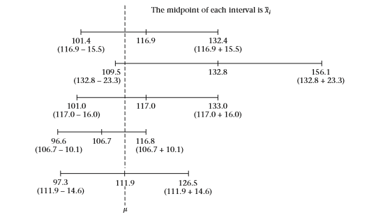
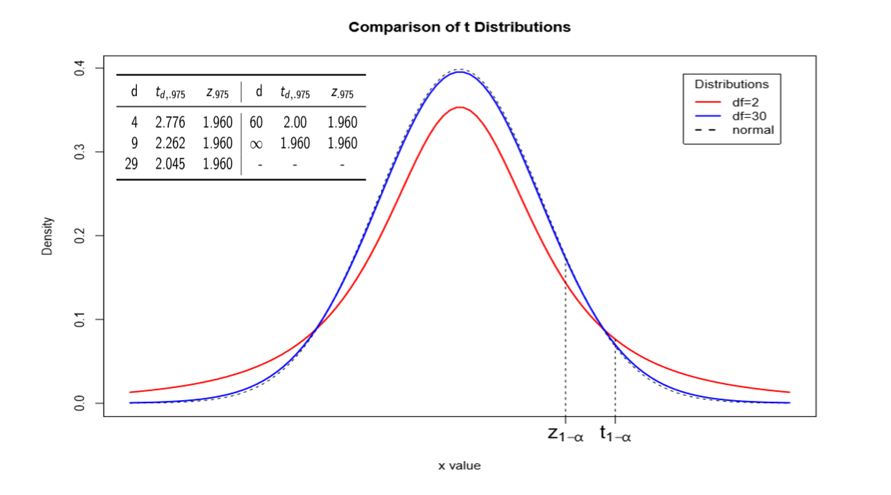
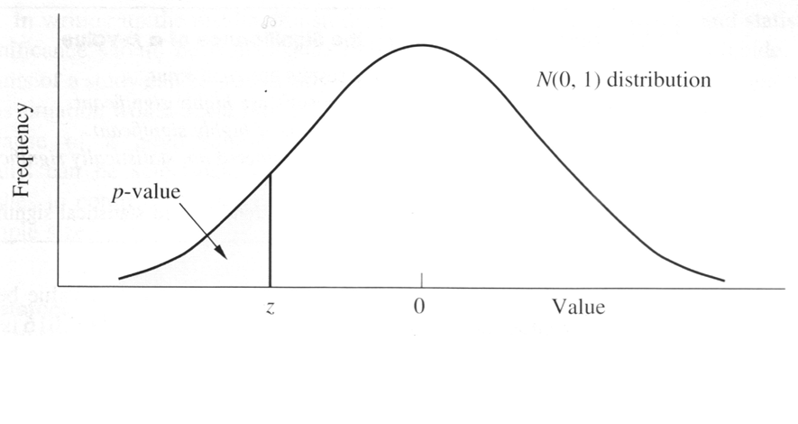
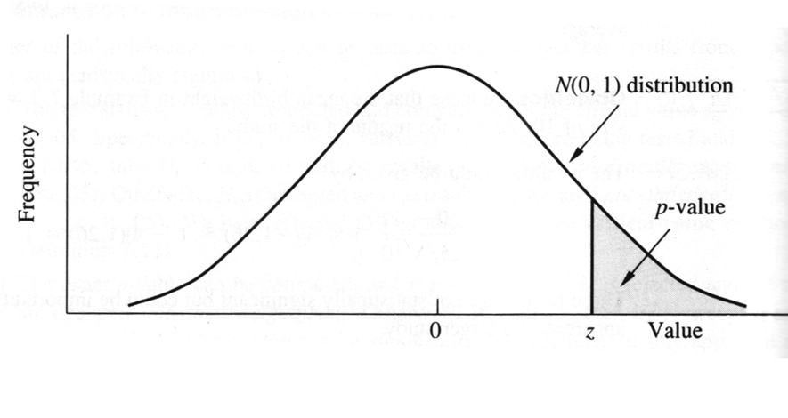
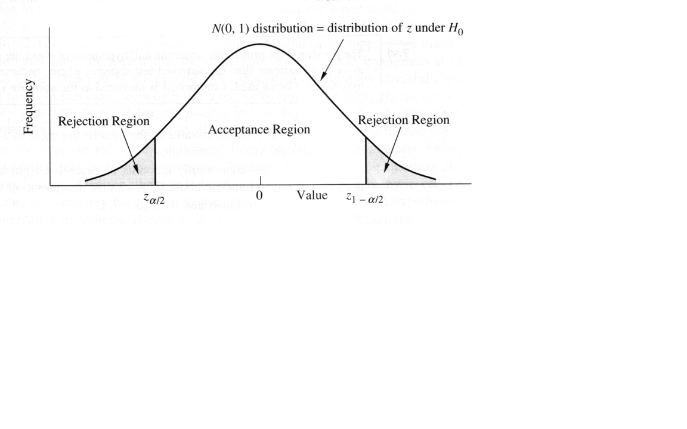
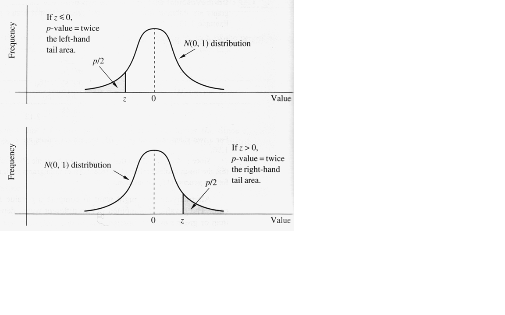
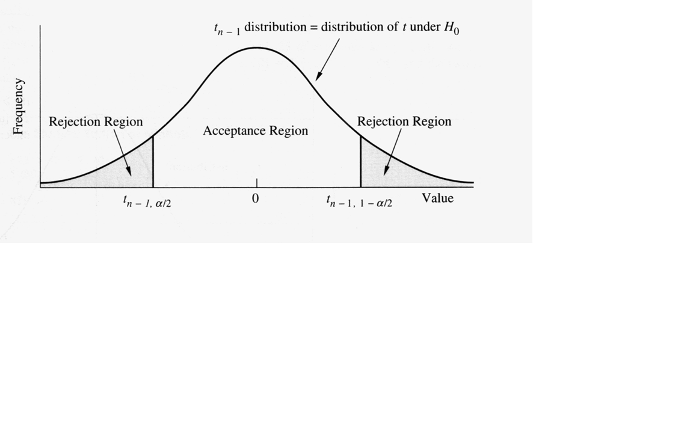

class: center, middle, bg_title, hide-count


```{r setup, include=FALSE}
options(
  htmltools.dir.version = FALSE,
  htmltools.preserve.raw = FALSE
)

knitr::opts_chunk$set(
  warning = FALSE,
  message = FALSE,
  comment = "",
  out.width = "100%"
)
library(knitr)
library(xaringanExtra)
library(xaringanthemer)

library(tidyverse)
library(here)
library(gridExtra)
library(rms)


library(countdown)
library(metathis)

options(width = 59) # fit into the right-column slides

```


```{r xaringans, echo=FALSE}
# https://github.com/gadenbuie/xaringanExtra
use_tachyons()
use_share_again()
use_panelset()
use_clipboard()
use_editable(expires = 1)
use_freezeframe()
use_extra_styles(
  hover_code_line = TRUE,         #<<
  mute_unhighlighted_code = TRUE  #<<
)
use_progress_bar(color = "#0051BA", location = "top")
```

```{r style-share-again, echo=FALSE}
style_share_again(
  share_buttons = c("twitter", "linkedin", "pocket")
)
```


```{r meta, echo=FALSE}
meta() %>%
  meta_general(
    description = "Modulo di STATISTICA MEDICA del corso in STATISTICA E SOCIOLOGIA GENERALE per il corso di laurea in TECNICHE DELLA PREVENZIONE NELL'AMBIENTE E NEI LUOGHI DI LAVORO",
    generator = "xaringan and remark.js"
  ) %>% 
  meta_name("github-repo" = "CorradoLanera/tpall") %>% 
  meta_social(
    title = "Statistica e Sociologia Generale",
    url = "https://corradolanera.github.io/tpall/#1",
    image = "https://github.com/CorradoLanera/tpall/raw/main/docs/img/cover.jpg",
    og_type = "website",
    og_author = "UBEP",
    twitter_card_type = "summary",
    twitter_creator = "@CorradoLanera"
  )
```

```{css, echo=FALSE}
.left-code {
  color: #777;
  width: 38%;
  height: 92%;
  float: left;
}
.right-code {
  color: #777;
  width: 55%;
  height: 92%;
  float: right;
  padding-top: 0.5em;
}
.left-plot {
  width: 43%;
  float: left;
}
.right-plot {
  width: 60%;
  float: right;
}
.hide-count .remark-slide-number {
  display: none;
}

.bg_title {
  position: relative;
  z-index: 1;
}

.bg_title::before {    
      content: "";
      background-image: url('img/bg1.png');
      background-size: contain;
      position: absolute;
      top: 0px;
      right: 0px;
      bottom: 0px;
      left: 0px;
      opacity: 0.3;
      z-index: -1;
}

```


```{r xaringan-themer, include=FALSE, warning=FALSE}
red <- "#f34213"
purple <- "#3e2f5b"
orange <- "#ff8811"
green <- "#136f63"
white <- "#FFFFFF"
pastel_orange <- "#F97B64"
blu_gray <- "#1F4257"
style_duo_accent(
    colors = c(
        red = red,
        purple = purple,
        orange = orange,
        green = green,
        white = white,
        pastel_orange = pastel_orange,
        blu_gray = blu_gray
    )
)
```


<br>
<br>
<br>

# **STATISTICA E SOCIOLOGIA GENERALE**<br>**.orange[STATISTICA MEDICA]**

-- Inferenza, intervalli di confidenza, introduzione ai test d'ipotesi --

<br>
<br>

C.d.L. **Tecniche della prevenzione nell'ambiente e nei luoghi di lavoro**

Feltre, a.a. 2021/2022 - 20 ore (2 crediti)

Corrado Lanera | [**Unità di Biostatistica, Epidemiologia e Salute Pubblic**](https://www.unipd-ubep.it/)


---
class: inverse, hide-count

# Cosa faremo

In questa lezione ci occuperemo di **.orange[stime]** effettuate su **.orange[campioni]** di popolazioni. In questo senso, cercheremo di  capire come **.orange[stimare la media]** e la **.orange[varianza]**  partendo da un campione. 

In seguito ci occuperemo di capire come avere una misura di **.orange[precisione]** per queste stime, introducendo gli **.orange[Intervalli di confidenza]**.

Dopo aver proposto degli esempi e fatto qualche osservazione in merito, introdurremo la distribuzione **.orange[t di Student]**, utile quando la varianza della popolazione non è nota.

Introdurremo quindi il concetto di **.orange[test d'ipotesi]** e di *p-value*.


---
class: hide-count

# .orange[Riconoscimenti]

- Le diapositive proposte sono state prodotte a partire anche da
  materiale generato da/con le seguenti persone gravitanti attorno
  l'UBEP*:
  
  + Danila Azzolina
  + Dario Gregori
  + Giulia Lorenzoni
  + Ileana Baldi
  + Luca Vedovelli
  + Matteo Martinato
  + Paola Berchialla

<br><br>
<small>
.right[\* In ordine alfabetico.]
</small>

<br><br>

> Un ringraziamento speciale a Cristiana Vettori e a Mariasole Rizzi per
l'aiuto e il supporto logistico e amministrativo che mi è stato offerto,
e ad Andrea Francavilla per avermi aiutato nella revisione del
materiale.

---
class: inverse, middle

# .center[**.orange[Panoramica]**]

Definizione e caratteristiche del **.orange[problema inferenziale]**

Stime puntuali: media e varianza... della media! **.orange[Teorema del limite centrale]**

Precisione delle stime puntuali: **.orange[Intervalli di confidenza]**

**.orange[Esempi]** e **.orange[osservazioni]**

Distribuzione **.orange[t di Student]**

**.orange[Test d'ipotesi]**: errori del I e II tipo, **p-value**


---
class: inverse, middle

# .center[**.orange[inferenza]**]

- **definizione**

- **campioni e popolazione**


---
# .orange[Inferenza]: di cosa si tratta

dato un insieme di osservazioni definito **campione**, si vuole derivare una conoscenza della distribuzione di probabilità che ha generato i dati osservati (generalmente per estrapolare informazioni sulle _non-osservazioni_ della stessa popolazione)


---
# Inferenza: .orange[campioni] e .orange[popolazioni]

- Un campione casuale è una .orange[selezione] di alcuni membri di una popolazione tale che ogni membro è scelto **indipendentemente** dagli altri ed ha una **probabilità non nulla** di essere selezionato

- Un campione casuale **semplice** è un campione casuale in cui ogni membro ha la .orange[stessa probabilità] di essere selezionato

- La .orange[popolazione target] è il gruppo di soggetti, **da cui è estratto** il campione, che si intende studiare e che .orange[si ipotizza essere infinita]


---
class: inverse, middle

# .center[Stime **.orange[puntuali]** e **.orange[teorema del limite centrale]**]

- Stimatore puntuale della **media**

- **Errore standard** della media 

- **Teorema del Limite Centrale** (TLC)


---
# Stima puntuale: .orange[media]

Lo **stimatore puntuale** .orange[della media] di una distribuzione è

$$\bar{X} = \frac{\sum_{i=1}^n X_i}{n}$$


La distribuzione campionaria di $\bar{X}$ è la distribuzione dei valori di $\bar{X}$ su **tutti i possibili campioni** di ampiezza $n$ estratti dalla popolazione target.

Se $X_1, \ldots, X_n$ è un campione casuale estratto da una popolazione con **media di popolazione** $\mu$ allora per la .orange[media campionaria] vale $E(\bar{X}) = \mu$

Si dice che la media campionaria è uno **stimatore non distorto** della media di popolazione.


---
# Stima puntuale: .orange[errore standard]

Riguardo alla **varianza** dello stimatore della media, abbiamo

$$\mbox{var}(\bar{X}) = \frac{1}{n^2} \mbox{var}\left(\sum_{i=1}^n X_i\right) = \frac{1}{n^2} \sum_{i=1}^n \mbox{var}(X_i)$$

che per definizione è $\sigma^2$!

**Allora**:

$$\mbox{var}(\bar{X}) = \frac{1}{n^2} \sum_{i=1}^n\sigma^2 = \frac{1}{n^2} n\sigma^2 = \frac{\sigma^2}{n}$$

- la quantità $\frac{\sigma}{\sqrt{n}}$ è indicata come .orange[errore standard della media] e viene stimata da $\frac{s}{\sqrt{n}}$


---
# .orange[Teorema del Limite Centrale]


**Sia**
- $X_1, \ldots, X_n$ un campione casuale semplice estratto da una popolazione qualsiasi con media $\mu$ e varianza $\sigma^2$.

**Allora**, per $n$ abbastanza grande:

$$\bar{X} \sim N \left( \mu, \frac{\sigma^2}{n} \right)$$

> ... anche se la distribuzione $X$ della popolazione non è normale!


---
class: inverse, middle

# .center[**.orange[Precisione]** delle stime]

- **Intervalli di Confidenza**

- **Ampiezza** dell'intervallo di confidenza


---
# .orange[Intervalli di Confidenza]: Obiettivo


Associare alla stima puntuale una misura della sua precisione


---
# I.C.: Derivazione

.panelset[
.panel[.panel-name[Passaggio a Z]
Data una variabile casuale normale $X$ dal T.C.L. sappiamo che

$$Z =\frac{\bar{X}-\mu}{\frac{\sigma}{\sqrt{n}}}$$

si distribuisce come una variabile casuale normale standardizzata $Z \sim N(0,1)$


In questo caso, il 95% delle osservazioni è compreso tra -1.96
e 1.96, ovvero

$$\mbox{P}(-1.96\leq Z\leq 1.96)= 0.95$$

]

.panel[.panel-name[Ritorno alle stime]
Sostituendo alla $Z$ la sua espressione estesa

$$P \left (-1.96 \leq \frac{\bar{X}-\mu}{\frac{\sigma}{\sqrt{n}}}
\leq 1.96 \right ) = 0.95$$

Moltiplicando tutti i termini per ${\frac{\sigma}{\sqrt{n}}}$

$$P \left (-1.96 {\frac{\sigma}{\sqrt{n}}} \leq
\frac{\bar{X}-\mu}{\frac{\sigma}{\sqrt{n}}}
{\frac{\sigma}{\sqrt{n}}}\leq 1.96 {\frac{\sigma}{\sqrt{n}}}\right
) = 0.95$$

Semplificando


$$P \left (-1.96 {\frac{\sigma}{\sqrt{n}}} \leq \bar{X}-\mu\leq 1.96
{\frac{\sigma}{\sqrt{n}}}\right ) = 0.95$$

]

.panel[.panel-name[Conclusione]


$$P \left (-1.96 {\frac{\sigma}{\sqrt{n}}} \leq \bar{X}-\mu\leq 1.96
{\frac{\sigma}{\sqrt{n}}}\right ) = 0.95$$


Sottraendo $\bar{X}$ da ogni termine

$$P \left (-1.96 {\frac{\sigma}{\sqrt{n}}}-\bar{X} \leq \bar{X}-\mu
-\bar{X}\leq 1.96 {\frac{\sigma}{\sqrt{n}}-\bar{X}}\right ) = 0.95$$

Moltiplicando per -1 ed invertendo il senso delle disugualianze

$$P \left (1.96 {\frac{\sigma}{\sqrt{n}}}+\bar{X} \geq \mu \geq
-1.96 {\frac{\sigma}{\sqrt{n}}+\bar{X}}\right ) = 0.95$$

Riorganizzando i termini

$$P \left (\bar{X} - 1.96 {\frac{\sigma}{\sqrt{n}}}\leq \mu \leq
\bar{X}+1.96 {\frac{\sigma}{\sqrt{n}}}\right )= 0.95$$

]


]


---
# Definizione I.C. per la media (varianza nota)

Un intervallo di confidenza al 95% per $\mu$ **quando $\sigma^2$ è noto**
è dato da

$$\left ( \bar{X} - 1.96 \frac{\sigma}{\sqrt{n}}; \bar{X} + 1.96
\frac{\sigma}{\sqrt{n}} \right )$$


---
class: middle, hide-count, inverse

# .center[.orange[Break]]

Consigli: 
- alzarsi
- sgranchirsi
- guardare _lontano_ (rilassare gli occhi)
- bere
- andare in bagno

```{r, echo = FALSE}
countdown(minutes = 15, warn_when = 3, play_sound = TRUE,
          left = "65%", bottom = "5%")
```


---
class: inverse, middle

# .center[**.orange[Esempi]** e **.orange[Osservazioni**]]

- **definizione**

- **campioni e popolazione**


---
# I.C.: Trigliceridi  

.panelset[
.panel[.panel-name[Problema]

.pull-left[

<small>

Soggetto  | 1     | 2     | 3     | 4     | 5
---------:|-------|-------|-------|-------|---
1         |  97   | 177   |  97   | 101   | 137
2         | 117   | 198   | 125   | 114   | 118
3         | 140   | 107   |  62   |  79   |  78
4         |  78   |  99   | 120   | 120   | 129
5         |  99   | 104   | 132   | 115   |  87
6         | 148   | 121   | 135   | 117   | 110
7         | 108   | 148   | 118   | 106   | 106
8         | 135   | 133   | 137   |  86   | 116
9         | 126   | 126   | 126   | 110   | 140
10        | 121   | 115   | 118   | 119   |  98
          |       |       |       |       | 
$\bar{x}$ | 116.9 | 132.8 | 117.0 | 106.7 | 111.9
$s$       | 21.70 | 32.62 | 22.44 | 14.13 | 20.46

</small>
]

.pull-right[Cinque campioni casuali di ampiezza ( $n = 10$ ) da un popolazione di soggetti afferenti al centro cardiovascolare dell'ASL 1 di Trieste, a cui è stato rilevato il livello di trigliceridi (in mg/dl, valori di riferimento 50-175).
]

]

.panel[.panel-name[IC]

Si supponga che il valore di $\sigma$ sia noto e pari a 20.

$$\begin{split}\left(\bar{X} - 1.96 \frac{\sigma}{\sqrt{n}}; \bar{X}+1.96 \frac{\sigma}{\sqrt{n}} \right)&= \left (\bar{X}-1.96\frac{20}{\sqrt{10}}; \bar{X} + 1.96 \frac{20}{\sqrt{10}} \right)\\& = (\bar{X}-12.4; \bar{X}+12.4)\end{split}$$

- Campione 1 $(116.9-12.4; 116.9+12.4) \equiv (104.5; 129.3)$
- Campione 2 $(132.8-12.4; 132.8+12.4) \equiv (120.4; 145.2)$
- Campione 3 $(117.0-12.4; 117.0+12.4) \equiv (104.6; 129.4)$
- Campione 4 $(106.7-12.4; 106.7+12.4) \equiv (106.7; 119.1)$
- Campione 5 $(111.9-12.4; 111.9+12.4) \equiv (99.5; 124.3)$

]

.panel[.panel-name[Graficamente]

```{r echo=FALSE, fig.align = 'center', out.width="90%"}

```


]

]

---
# IC osservazioni: ".orange[confidenza]"

** $\bar{X}$ è una variabile casuale**, mentre il parametro ** $\mu$ è una costante** (ignota). Quindi l'intervallo

$$\left ( \bar{X} - 1.96 \frac{\sigma}{\sqrt{n}}; \bar{X} + 1.96 \frac{\sigma}{\sqrt{n}} \right )$$

ha una probabilità del 95% di comprendere $\mu$ **prima** che il campione sia selezionato.

**Dopo aver selezionato il campione** e aver calcolato l'intervallo, invece:

- $\mu$ può essere compresa o meno nell'intervallo (non lo sappiamo)

- stimiamo che su 100 campioni estratti dalla stessa popolazione, circa 95 conterranno la media **e 5 no** (ed utilizziamo di conseguenza il termine di **confidenza**)

> NOTA: uno dei 5 **potrebbe essere il nostro**!!

In ogni caso, l'interpretazione è corretta se il campione selezionato è un campione **rappresentativo** (non distorto) della popolazione studiata


---
# IC osservazioni: .orange[unicità]

.panelset[
.panel[.panel-name[Osservazione]

L'intervallo di confidenza al 95% è quello di uso più comune,
ma non è l'unico.

In generale, un intervallo di confidenza ad un livello $(1-\alpha)$ sarà dato da

$$\left ( \bar{x} - z_{1-\frac{\alpha}{2}} \frac{\sigma}{\sqrt{n}};
\bar{x} + z_{1-\frac{\alpha}{2}} \frac{\sigma}{\sqrt{n}} \right )$$

dove $z_{1-\frac{\alpha}{2}}$ è l' $\frac{\alpha}{2}$ -esimo
percentile di una distribuzione $N(0,1)$.

$(1-\alpha)$ | $z_{1-\frac{\alpha}{2}}$ 
------------:|:-----------------------
        0.90 |                    1.644
        0.95 |                     1.96 
        0.99 |                    2.576

]
.panel[.panel-name[Trigliceridi]

Nel caso del primo campione selezionato, si ha che un intervallo al 99% è pari a

$$\begin{split} &\left(116.9 - z_{0.995} \frac{20}{\sqrt{10}}; 116.9 + z_{0.995} \frac{20}{\sqrt{10}} \right)\\ = &\left(116.9- 2.576\frac{20}{\sqrt{10}}; 116.9+2.576\frac{20}{\sqrt{10}}\right)\\ = &(100.6; 133.2)\end{split}$$

]
]


---
# IC osservazioni: .orange[ampiezza]

.panelset[
.panel[.panel-name[Constatazione]

L'**ampiezza** dell'intervallo di confidenza a un livello $(1-\alpha)$ è data da

$$\bar{X}+z_{1-\frac{\alpha}{2}} \frac{\sigma}{\sqrt{n}} - \left(\bar{X} - z_{1-\frac{\alpha}{2}} \frac{\sigma}{\sqrt{n}} \right )$$

ovvero da

$$2 z_{1-\frac{\alpha}{2}} \frac{\sigma}{\sqrt{n}}$$

Nel campione 1, l'ampiezza (al 95% e con $\sigma = 20$) è pari a

$$2 \times 1.96 \frac{20}{\sqrt{10}} = 24.8 = 129.3-104.5$$

]
.panel[.panel-name[Osservazione]

L'ampiezza dell'intervallo, data da $2 z_{1-\frac{\alpha}{2}} \frac{\sigma}{\sqrt{n}}$

**dipende da** 

- $n$:  come **cresce** il campione ( $n$ ), così **.orange[diminuisce]** l'ampiezza dell'intervallo

- $\sigma$: come **aumenta** la deviazione standard della popolazione ( $\sigma$ ), così **.orange[aumenta]** l'ampiezza dell'intervallo

- $\alpha$: come **aumenta** il livello di confidenza richiesto per l'analisi, così **.orange[aumenta]** l'ampiezzza dell'intervallo


]


.panel[.panel-name[Trigliceridi]

<small><small>

Per l'intervallo del campione 1, pari a (104.5; 129.3) con $n=10$, $\sigma=20$, $1-\alpha=0.95$

$n$ | $\sigma$ | $1-\alpha$ | Limiti | Ampiezza
----|----------|------------|--------|---------
n   | 20       | 0.95       | $\bar{X} \pm 1.96 \frac{20}{\sqrt{n}}$      | 
10  | 20       | 0.95       |    | 24.8
100 | 20       | 0.95       |    |  7.8
1000| 20       | 0.95       |    |  2.5
10  | $\sigma$ | 0.95       | $\bar{X} \pm 1.96 \frac{\sigma}{\sqrt{10}}$ |
10  | 5        | 0.95       |    | 6.2
10  | 40       | 0.95       |    | 49.6 
10  | 20       | $1-\alpha$ | $\bar{X} \pm z_{1-\frac{\alpha}{2}} \frac{20}{\sqrt{10}}$ |
10  | 20       | 0.90       |    | 20.7
10  | 20       | 0.95       |    | 24.8
10  | 20       | 0.99       |    | 32.6

</small></small>

]

]


---
# IC osservazioni: .orange[sotto controlliamo]

$n$ e $\alpha$ sono **sotto il diretto controllo** del ricercatore

$\sigma$, ovvero la variabilità a livello di popolazione, **dipende dal tipo di variabile** studiata.

In alcuni casi e con opportuni accorgimenti **.orange[può essere controllata]**, con:

- scelta di tecniche per **misurazioni più accurate**
- scelta del **timing di misurazione** ottimale per ridurre la variabilità, per es. giornaliera
- utilizzo di tecniche di **mediazione**, ottenendo varie misurazioni ripetute sulla stessa variabile e utilizzando la media di queste anziché una singola osservazione nel calcolo dell'intervallo


---
class: inverse, middle

# .center[Distribuzione **.orange[t di Student]**]

- **t di Student**

- **I.C.**


---
# Distribuzione .orange[t di Student]


.panelset[
.panel[.panel-name[Definizione]
Se $\sigma$ è **ignoto**, potremmo sostituirlo (approssimandolo/stimandolo) in $\frac{x-\mu}{\frac{\sigma}{\sqrt{n}}}$ con $s$

**Se**
- $X_1, \ldots, X_n \sim N(\mu,\sigma^2)$
- sono indipendenti

**Allora**
- $\frac{x-\mu}{\frac{s}{\sqrt{n}}}$ si distribuisce come una $t$ di Student con $(n-1)$ gradi di libertà


]
.panel[.panel-name[Percentili]
Il $p$ -esimo percentile della distribuzione $t$ con $d$ gradi di libertà si indica con $t_{d,p}$, ovvero

$$P(t_d \leq t_{d,p}) = p$$

<br><br><br><br>

> Nota: La distribuzione $t$ è simmetrica sullo $0$ ma è più dispersa rispetto alla $N(0,1)$


]
.panel[.panel-name[Grafico]
```{r echo=FALSE, fig.align = 'center', out.width="100%"}

```

]


]


---
## IC per la media: .orange[varianza non nota]


.panelset[
.panel[.panel-name[Considerazione]
Nel caso di varianza stimata $S^2$, abbiamo appena visto che

$$T=\frac{\bar{X}-\mu}{\frac{s}{\sqrt{n}}} \sim t_{n-1} \:\:\: di\:\:\: Student$$


e per questa variabile si ha che, con ( $n=10$, ovvero $d=9$ gradi di libertà )

$$\mbox{P}(-2.262\leq T\leq 2.262)= 0.95$$

ripercorrendo i passaggi del caso con varianza nota si ottiene che l'intervallo di confidenza al 95% è pari a

$$\left (\bar{X} -2.262 \frac{s}{\sqrt{10}} \leq \mu \leq \bar{X} + 2.262 \frac{s}{\sqrt{10}} \right )$$

In cui $2.262 = t_{9, 0.975} = t_{d,p}$ essendo $\alpha = 0.05$ e $p = 1-\frac{\alpha}{2} = 0.975$

]
.panel[.panel-name[Definizione]
Un intervallo di confidenza al 95% per $\mu$ quando $\sigma^2$ è ignoto
è dato da


$$\left ( \bar{X} - t_{n-1,1-\frac{\alpha}{2}} \frac{s}{\sqrt{n}}; \bar{X} + t_{n-1,1-\frac{\alpha}{2}}
\frac{s}{\sqrt{n}} \right )$$

]
.panel[.panel-name[Trigliceridi]

Nel caso del campione 1 si ha:

- $\bar{X} = 116.90$
- $n = 10$
- $s = 21.7$
- $\alpha = 0.5$

$$\left (116.90 -2.262 \frac{21.7}{\sqrt{10}} \leq \mu \leq 116.90 + 2.262 \frac{21.7}{\sqrt{10}} \right )$$

ovvero $(101.38; 132.42)$

In generale, si avrà l'intervallo

$$\left (\bar{X} - t_{\frac{\alpha}{2}; n-1} \frac{s}{\sqrt{n}} \leq \mu \leq \bar{X} + t_{\frac{\alpha}{2}; n-1} \frac{s}{\sqrt{n}} \right )$$


]
]


---
# IC: .orange[Esempio]


.panelset[
.panel[.panel-name[Quesito]

Si supponga che il livello di colesterolo (espresso in $mg\%/mL$) **medio** nei bambini di età compresa tra i 2 e i 14 anni sia noto, da ampi studi di popolazione, essere **pari a 175**, con una .orange[deviazione standard di 30].

Si vuole valutare la possibilità che vi sia un'aggregazione familiare dei
livelli di colesterolo.

Si identifica un gruppo di padri con pregresso infarto del miocardio acuto (IMA) ed elevati livelli di colesterolo, e si misura il livello di colesterolo dei figli che abbiano un'età compresa nell'intervallo in esame.

**Il livello medio stimato nel campione di 100 figli è pari a 207.2.**


]

.panel[.panel-name[Grafico]
```{r echo=FALSE, fig.align = 'center', out.width="100%"}
knitr::include_graphics("img/Rplot02.PNG")
```

]
.panel[.panel-name[Problema]
Questo valore ( $207.2 mg\%/mL$ ) è **sufficientemente lontano** da quello di $175 mg\%/mL$ da farci credere che questi bambini abbiano una distribuzione dei livelli di colesterolo con una media più elevata di quella della popolazione generale  dei  bambini nella stessa classe di età?


]
.panel[.panel-name[Risposta]

Un intervallo di confidenza al 95% può aiutare a trovare la risposta.

$$\left(207.2 - 1.96 \frac{30}{\sqrt{100}}; 207.2+1.96 \frac{30}{\sqrt{100}}\right) = (201.32; 213.08)$$

**Ni**: la media attesa non è inclusa nell'intervallo di confidenza al 95% (e sta sotto). Questo vuol dire che se i bambini considerati provenissero dalla stessa distribuzione dei bambini nella popolazione generale (ovvero non vi fosse un'aggregazione familiare dei livelli di colesterolo per loro), allora averli presi a caso proprio loro sarebbe tanto raro quanto il 5%. Se come naturalmente si ipotizza che questo sia un valore "troppo" raro, allora possiamo rifiutare l'ipotesi che le due distribuzioni di bambini (popolazione generale e quelli considerati) siano la stessa distribuzione, e che quella dei valori dei bambini in studio sia spostata verso destra su valori più elevati del normale.

]
]


---
class: inverse, middle

# .center[**.orange[Test d'ipotesi]**]

- **Definizioni**: ipotesi, accettazione, rifiuto, errori

- **Test** (con varianza nota)

---
# .orange[Ipotesi]: definizioni


- **ipotesi nulla**, $H_0$, l'ipotesi che si vuole testare

- **ipotesi alternativa**, $H_1$, l'ipotesi che **.orange[contraddice]** l'ipotesi nulla 

<br>
<br>
<br>
<br>

> In particolare, le ipotesi riguardano i parametri di una distribuzione 


---
# Ipotesi: .orange[decisioni]


.orange[Decisioni sull'ipotesi nulla] | Ipotesi nulla **vera**                 | Ipotesi nulla **falsa**
--------------------------------------|----------------------------------------|------------------------
**Accetto** (Non rifiuto!)            | Decisione corretta <br> P = $1-\alpha$ | Errore di II tipo  <br> P = $\beta$
**Rifiuto**                           | Errore di I tipo <br> P = $\alpha$     | Decisione corretta <br> P = $1-\beta$ 

- $\alpha$ è definito livello di **significatività**
- $1-\beta$ è definito **potenza**

- La probabilità di un errore di I specie ( $\alpha$, la _significatività_ ) è la probabilità di **rifiutare** l'ipotesi nulla $H_0$ quando è **vera**, si chiama .orange[livello di significatività] del test

- La probabilità di un errore di II specie ($\beta$ ) è la probabilità di **accettare** l'ipotesi nulla $H_0$ dato che è **falsa**
 


> Il criterio nella costruzione di un test è di minimizzare sia $\alpha$ che $\beta$


---
## Test: .orange[media di una Normale]
#### (varianza nota)

.panelset[
.panel[.panel-name[Analiticamente]


Obiettivo è un set di ipotesi del tipo:

- $H_0: \mu=\mu_0$; $\sigma=\sigma_0$
- $H_1: \mu=\mu_1<\mu_0$; $\sigma=\sigma_0$

Il primo passo è individuare la statistica test, che nel caso specifico $\bar{X}$


$$\alpha = P (Errore\ I\ specie|H_0)= P \left [ \bar{x}<c|\bar{x}\sim N\left ( \mu_0,\frac{\sigma^2}{n} \right ) \right ]= \Phi \left ( \frac{c-\mu_0}{\frac{\sigma}{\sqrt{n}}} \right )$$


$$z_{\alpha}=\frac{c-\mu_0}{\frac{\sigma}{\sqrt{n}}}$$

$$c=\mu_0+z_{\alpha}\frac{\sigma}{\sqrt{n}}$$

]

.panel[.panel-name[Graficamente]

```{r echo=FALSE, fig.align = 'center', out.width="70%"}
knitr::include_graphics("img/img.jpg")
```


- La regione di accettazione è l'insieme dei valori di $\bar{x}$ per cui si accetta $H_0$
- La regione di rifiuto è l'insieme dei valori di $\bar{x}$ per cui si rifiuta $H_0$ 

]

.panel[.panel-name[Procedura]

Per testare l'ipotesi:

- $H_0:\mu=\mu_0$; $\sigma=\sigma_0$
- $H_1:\mu<\mu_0$; $\sigma=\sigma_0$

il test uniformemente più potente è basato su $\bar{X}$

- se $\bar{X}<\mu_0+z_{\alpha}\frac{\sigma}{\sqrt{n}}$ si rifiuta 
- se $\bar{X}\geq\mu_0+z_{\alpha}\frac{\sigma}{\sqrt{n}}$ si accetta 
]
]


---
# Test: esempio

.panelset[
.panel[.panel-name[Caso studio]
### stato socioeconomico e peso alla nascita

Si consideri l'ipotesi per cui madri con un livello socioeconomico basso tendano a partorire figli con pesi alla nascita inferiori al normale. Per testare l'ipotesi, si considera un campione di 100 nati vivi consecutivi in un ospedale situato in una zona socioeconomica svantaggiata. Il peso normale è noto dai dati del registro nazionale, che per gli USA è pari a 120 oz, con una deviazione standard di 25 oz. 
Il peso medio dei 100 nati è di 115 oz con una deviazione standard campionaria di 24 oz. 

Ad un livello di significatività di 0.05, si ha $z_{\alpha}=-1.645$, e la regione critica è pari a 

$$\bar{X}=120-1.645\frac{25}{10}=115.89$$

quindi, poiché $\bar{X}<115.89$ si rifiuta $H_0$ ad un livello di significatività di 0.05

]
.panel[.panel-name[Maggiore significatività]

Usando un livello di significatività pari a 0.01, si avrebbe che 

$z_{\alpha}=-2.326$ e che

$$\bar{x}=120-2.326\frac{25}{10}=114.18$$

e quindi **non si rifiuterebbe** l'ipotesi nulla

]

.panel[.panel-name[Usando Z]

Per testare l'ipotesi:

- $H_0:\mu=\mu_0$; $\sigma=\sigma_0$
- $H_1:\mu<\mu_0$; $\sigma=\sigma_0$

si calcola

$$Z=\frac{\bar{X}-\mu_0}{\frac{\sigma}{\sqrt{n}}}$$

- se $Z<Z_{\alpha}$ si rifiuta $H_0$
- se $Z\geq Z_{\alpha}$ non si rifiuta $H_0$


]
]


---
# .orange[P-value]

.panelset[
.panel[.panel-name[Definizione]

Il $p-value$ è quel valore di $\alpha$ per cui il valore della statistica test è al confine tra regione di accettazione e zona di rifiuto

$$p=\Phi(z_p)=\Phi\left( \frac{\bar{x}-\mu_0}{\frac{\sigma}{\sqrt{n}}}\right)$$

Il $p-value$ è quindi la probabilità di ottenere un risultato **eguale o più estremo** di quello ottenuto **quando l'ipotesi nulla è vera**. 
]

.panel[.panel-name[Alternativa minore]

.pull-left[
- $H_0:\mu=\mu_0$; $\sigma=\sigma_0$
- $H_1:\mu<\mu_0$; $\sigma=\sigma_0$


si calcola

$$Z=\frac{\bar{X}-\mu_0}{\frac{\sigma}{\sqrt{n}}}$$

- se $z<z_{\alpha}$ si rifiuta $H_0$
- se $z\geq z_{\alpha}$ non si rifiuta $H_0$

ovvero si ha un $p-value$ pari a $p=\Phi(z)$


]
.pull-right[
```{r echo=FALSE, fig.align = 'center', out.width="100%"}

```
]
]
.panel[.panel-name[Alternativa maggiore]

.pull-left[
- $H_0:\mu=\mu_0$; $\sigma=\sigma_0$
- $H_1:\mu>\mu_0$; $\sigma=\sigma_0$

si calcola

$$z=\frac{\bar{x}-\mu_0}{\frac{\sigma}{\sqrt{n}}}$$

- se $z>z_{1-\alpha}$ si rifiuta $H_0$
- se $z\leq z_{1-\alpha}$ non si rifiuta $H_0$

ovvero si ha un $p-value$ pari a $p=1-\Phi(z)$

]
.pull-right[
```{r echo=FALSE, fig.align = 'center', out.width="100%"}

```
]
]
]


---
# p-value: esempio

Si supponga che in un campione di 10 bambini il livello di colesterolo sia pari a  $200\ mg/dL$ con una deviazione standard nota nella popolazione pari a $50\ mg/dL$. Lo studio intende verificare se il livello del colesterolo in questi bambini è più elevato del normale ($175\ mg/dL$), con un livello di significatività statistica $\alpha = 0.05$. Si testa quindi l'ipotesi 

- $H_0:\mu=175$; $\sigma=50$
- $H_1:\mu>175$; $\sigma=50$

si ha che $Z=\frac{\bar{X}-\mu_0}{\frac{\sigma}{\sqrt{n}}}=\frac{200-175}{\frac{50}{\sqrt{10}}}=1.58$

Visto che $1.58=Z<Z_{1-\alpha}=Z_{.95}=1.645$ non si rifiuta $H_0$, con un $p-value$ pari a

$$p=1-\Phi(Z)=1-\Phi(1.58)=1-0.9431=0.057$$


---
# Test: due code

.panelset[
.panel[.panel-name[Obiettivo]

Un test a due code è un test in cui i valori del parametro sotto ipotesi alternativa sono alternativamente maggiori o minori (diversi) dal valore sotto ipotesi nulla.

Obiettivo è quello di rifiutare $H_0$ se $Z$ è **troppo piccolo o troppo grande**, ovvero $H_0$ sarà accettata se $X_1\leq Z \leq X_2$


$$P(rifiutare\ H_0|H_0)=P(Z\leq X_1 \cup Z\geq X_2)=P(Z\leq X_1)+P(Z\geq X_2)=\alpha$$


Ipotizzando equiprobabilità sulle due code, si ha che

$$P(z\leq c_1|H_0)=P(Z\leq c_2)=\frac{\alpha}{2}$$

]
.panel[.panel-name[Procedura]
Si test quindi l'ipotesi

- $H_0:\mu=\mu_0$; $\sigma=\sigma_0$
- $H_1:\mu\neq\mu_0$; $\sigma=\sigma_0$

si calcola
\[
Z=\frac{\bar{X}-\mu_0}{\frac{\sigma}{\sqrt{n}}}
\]

- se $Z\leq Z_{\frac{\alpha}{2}}$ o $Z > Z_{1-\frac{\alpha}{2}}$ si rifiuta $H_0$
- se $Z_{\frac{\alpha}{2}}<Z< Z_{1-\frac{\alpha}{2}}$ non si rifiuta $H_0$


]
.panel[.panel-name[Graficamente]
```{r echo=FALSE, fig.align = 'center', out.width="100%"}

```
]
]


---
# Test a due code: esempio

#### Colesterolo negli immigrati asiatici

Si sa che i livelli di colesterolo nelle donne americane di età tra i 20 ed i 40 anni è distribuito normalmente con media $190\ mg/dL$ e deviazione standard di $40\ mg/dL$. Si vuole testare l'ipotesi che i livelli di colesterolo nelle donne asiatiche di pari età sia eguale a quello delle donne americane. 
Si considera quindi un campione di 100 donne con le caratteristiche specificate e di osserva un livello di colesterolo medio pari a $181.52\ mg/dL$. Si testa quindi l'ipotesi 

- $H_0:\mu=190$; $\sigma=40$
- $H_1:\mu\neq 190$; $\sigma=40$ 

$$Z=\frac{\bar{X}-\mu_0}{\frac{\sigma}{\sqrt{n}}}=\frac{181.5-190}{\frac{40}{\sqrt{100}}}=-2.12$$

Per un test a livello di significatività dello 0.05 i valori critici sono $Z_{0.975}=1.96$ e $Z_{0.025}=-1.96$, per cui, visto che $Z=-2.12<-1.96$ rifiuto $H_0$.

---
# Test a tue code: p-value

.panelset[
.panel[.panel-name[Derivazione]

Avendo

$$Z=\frac{\bar{X}-\mu_0}{\frac{\sigma}{\sqrt{n}}}$$

si ha che

$$p=\left\{\begin{matrix}2\Phi(z) & se & z\leq 0\\ 2[1-\Phi(z)] & se & z>0\end{matrix}\right.$$

]
.panel[.panel-name[Graficamente]
```{r echo=FALSE, fig.align = 'center', out.width="100%"}

```
]
.panel[.panel-name[Esempio]

#### Colesterolo negli immigrati asiatici
Si calcola

$$Z=\frac{\bar{X}-\mu_0}{\frac{\sigma}{\sqrt{n}}}=-2.12$$

da cui

$$p=2\Phi(-2.12)=2[1-\Phi(2.12)]=2[1-0.983]=0.034$$

]
]


---
# Test: varianza non nota

.panelset[
.panel[.panel-name[t di Student]
Se $X_1,...,X_n$ è un campione di osservazioni indipendenti distribuite normalmente $N(\mu,\sigma^2)$, allora la quantità $\frac{\bar{X}-\mu_0}{\frac{\sigma}{\sqrt{n}}}$ è distribuita seconda una $t$ di Student con $n-1$ gradi di libertà.
Da questo deriva che sotto l'ipotesi nulla $\mu=\mu_0$

$$P\left(t<t_{n-1;\frac{\alpha}{2}}\right)=P\left(t>t_{n-1;1-\frac{\alpha}{2}}\right)=\frac{\alpha}{2}$$

da cui si derivano i valori critici

]
.panel[.panel-name[Procedura]

Si test quindi l'ipotesi

- $H_0:\mu=\mu_0$; $\sigma$
- $H_1:\mu\neq\mu_0$; $\sigma$

si calcola

$$t=\frac{\bar{x}-\mu_0}{\frac{s}{\sqrt{n}}}$$

- se $t<t_{n-1;\frac{\alpha}{2}}$ o $t>t_{n-1;1-\frac{\alpha}{2}}$ si rifiuta $H_0$
- se $t_{n-1;\frac{\alpha}{2}}<t<t_{n-1;1-\frac{\alpha}{2}}$ si accetta $H_0$

Si osserva che

$$t_{n-1;\frac{\alpha}{2}}=-t_{n-1;1-\frac{\alpha}{2}}$$
]
.panel[.panel-name[Graficamente]
```{r echo=FALSE, fig.align = 'center', out.width="100%"}

```
]

.panel[.panel-name[Esempio]
Si vuole studiare l'effetto dell'attività lavorativa (con conseguente esposizione a fumi di varia natura) sui pompieri. Si considera un campione di 26 pompieri di età compresa tra i 25 ed i 34 anni e si misura il cambiamento di FEV (volume di espirazione forzata) su un periodo di 5 anni. In un gruppo generico di pari età nella popolazione, il declino è pari in media a $0.10\ L/sec.$ Nel campione osservato il declino è stato di $0.27\ L/sec$ con una deviazione standard di $0.32\ L/sec$. Rispetto alla FEV, vi è stato un effettivo rischio lavorativo dei pompieri? Supponendo che il declino in FEV sia distribuito normalmente, si ha che

- $H_0:\mu=0.10$; $\sigma$
- $H_1:\mu\neq 0.10$; $\sigma$

si calcola

$$t=\frac{\bar{X}-\mu_0}{\frac{s}{\sqrt{n}}}=\frac{0.27-0.10}{\frac{0.32}{\sqrt{26}}}=2.70$$

Sotto ipotesi nulla, si ha che $p(t_{25}>2.70)=0.0061$, per cui $p-value=0.012$


]
]


---
# .orange[P-value] e .orange[CI]

.panelset[
.panel[.panel-name[Relazione]

Per un test del tipo

- $H_0:\mu=\mu_0$; $\sigma=\sigma_0$
- $H_1:\mu\neq\mu_0$; $\sigma=\sigma_0$

$H_0$ può essere rifiutata solo se IC per $\mu$ non contiene $\mu_0$
]
.panel[.panel-name[Esempio]

## Colesterolo nei bambini

Un intervallo di confidenza a livello 0.95 per la media $\mu$ è pari a 

$$\bar{x}-z_{1-\frac{\alpha}{2}}\frac{\sigma}{\sqrt{n}};  \bar{x}+z_{1-\frac{\alpha}{2}}\frac{\sigma}{\sqrt{n}}$$

ovvero

$$200-z_{0.975}\frac{50}{\sqrt{10}};  200+z_{0.975}\frac{50}{\sqrt{10}}=[169.01;230.99]$$

che contiene il valore $\mu_0=175$ usato precedentemente nei test di ipotesi, per cui non rifiuto $H_0$

]
]

---
class: middle, center, hide-count, inverse

# .orange[Vediamolo...<br>...sul _vostro_ cloud!]

[https://bit.ly/tpall22-feltre-rscloud](https://bit.ly/tpall22-feltre-rscloud)

---
class: inverse

# Risorse utili

- [**RStudio Cloud**](https://bit.ly/tpall22-feltre-rscloud): [https://bit.ly/tpall22-feltre-rscloud](https://bit.ly/tpall22-feltre-rscloud) gratis per voi per esplorare RStudio, le sue funzionalità, e allenarvi con R (link di iscrizione valido fino alla fine del corso). NOTA: a vostra scelta, è utilizzabile anche come _supporto_ durante l'esame.

- [**RStudio primers**](https://rstudio.cloud/learn/primers) ambiente gratuito dentro RStudio Cloud per l'apprendimento delle basi di analisi di dati con R tramite tutorial interattivi. Una volta registrati, oltre all'accesso al _nostro_ spazio di lavoro, avete accesso libero anche ai _Primers_.

- [**R 4 Data Science**](https://r4ds.had.co.nz/): libro gratuito (on-line) di [**Hadley Wickham**](http://hadley.nz/) e [**Garrett Grolemund**](https://rstudio.com/speakers/garrett-grolemund/)

- [**GGplot2 cheatsheet**](https://raw.githubusercontent.com/rstudio/cheatsheets/main/data-visualization.pdf) schema dei possibili grafici di base rappresentabili in R con il pacchetto `{ggplot2}`, molto utile anche per conoscere le tipologie di grafico, e il loro utilizzo.

- [An Introduction to Medical Statistics](https://global.oup.com/academic/product/an-introduction-to-medical-statistics-9780199589920) di [**Martin Bland**](https://www.york.ac.uk/healthsciences/our-staff/honoraryemeritus/martin-bland/), suggeriti capitoli 4 e 5.

---
class: inverse, center, middle, hide-count


.bg-washed-green.b--dark-green.ba.bw2.br3.shadow-5.ph4.mt5[
.left[
_Mathematical conventions are just that, conventions. They differ by field of mathematics. Don’t ask us why **matrix rows** **.orange[are numbered down]** but **graphs** **.orange[are numbered up]** the **y axis**, nor why **x .orange[comes before] y** but **row .orange[before] column**. But the matrix layout has always seemed illogical to me._
]

.tr[
—Brian D. Ripley<br>08/2004 - R-help<br>
]
]

<br>


# **.orange[Grazie]** per l'attenzione!

... e buona settimana.

<br>
<br>


Diapositive: [https://corradolanera.github.io/tpall](https://corradolanera.github.io/tpall)


[`r fontawesome::fa("link")`](https://www.unipd-ubep.it/) [**www.unipd-ubep.it**](https://www.unipd-ubep.it/) | 
[`r fontawesome::fa("mail-bulk")`](mailto:Corrado.Lanera@ubep.unipd.it) [**Corrado.Lanera@ubep.unipd.it**](mailto:Corrado.Lanera@ubep.unipd.it)

[`r fontawesome::fa("github")`](https://github.com/corradolanera)
[`r fontawesome::fa("twitter")`](https://twitter.com/corradolanera)
[`r fontawesome::fa("telegram-plane")`](https://telegram.me/CorradoLanera)
**@CorradoLanera** |
[`r fontawesome::fa("calendar-check")` ](https://calendly.com/corradolanera) [**calendly.com/corradolanera**](https://calendly.com/corradolanera)


